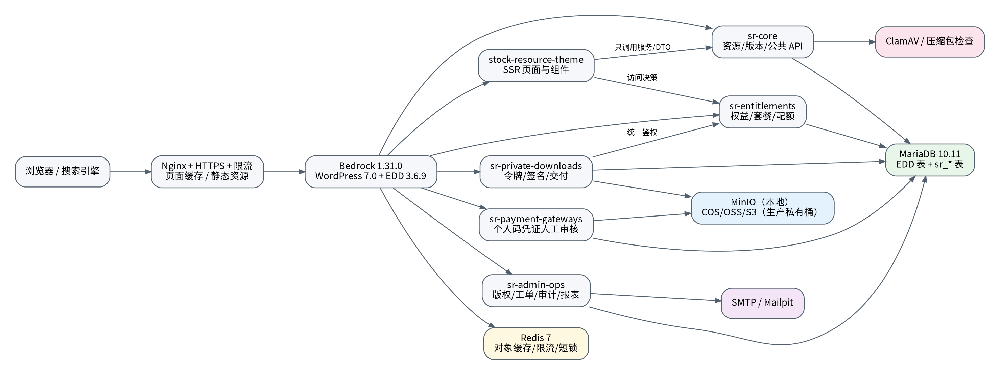
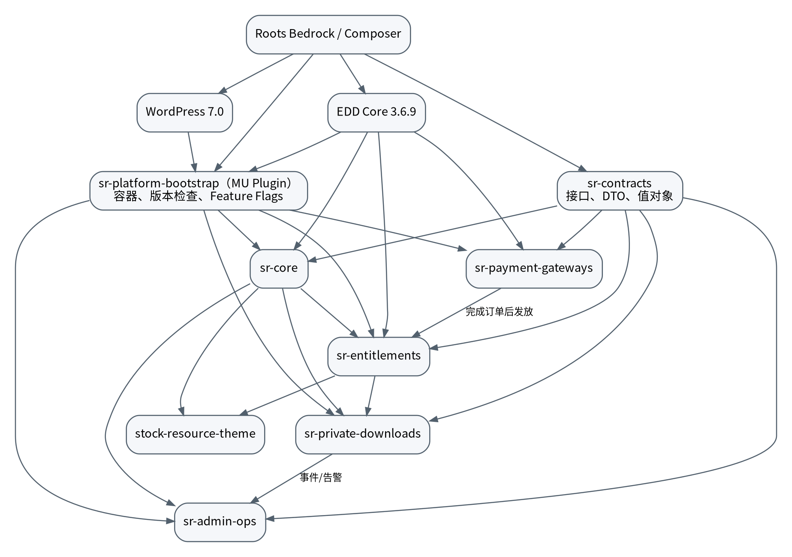
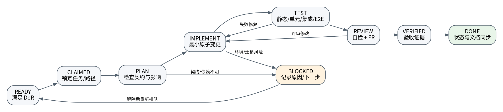
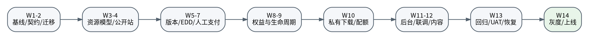

# 股票指标资源下载平台：AI Agent 执行开发手册

**文档版本：** V1.0  
**生成日期：** 2026-06-24  
**适用 Agent：** OpenAI Codex、Claude Code、GitHub Copilot Coding Agent及具备仓库读写、命令执行和测试能力的同类 Agent  
**产品基线：** 《股票指标资源下载平台_产品与技术开发文档 V1.0 / V1.1》  
**工程基线：** Roots Bedrock 1.31.0 + WordPress 7.0 + Easy Digital Downloads 3.6.9 + 自研五插件与主题

> 本手册不是概念方案，而是代码仓库的执行规范。Agent 必须按任务 ID、依赖、路径所有权、验收命令和证据要求逐项实施。任何未在本文、PRD 基线、ADR 或 API/数据契约中明确的业务规则，不得由 Agent 自行猜测后直接上线。




## 0. 文档地位、规范词与使用方式


### 0.1 文档目的

本手册把产品文档中的“做什么”，转换为 Agent 可执行的“从哪里开始、改哪些目录、以什么顺序实施、每一步如何验证、失败如何恢复、多人/多 Agent 如何避免冲突”。它同时承担以下作用：

- 根级工程实施规范；
- 架构与模块边界说明；
- 数据字典和接口契约摘要；
- 任务依赖图与 14 周执行计划；
- Agent 的工作协议、交接协议和停止条件；
- CI/CD、测试、发布、回滚和运行手册入口。

### 0.2 规范词

- **MUST / 必须：** 不满足不得合并或发布。
- **MUST NOT / 禁止：** 发现即退回；涉及安全或数据完整性时视为阻断缺陷。
- **SHOULD / 应当：** 默认执行；偏离时必须提交 ADR 或在任务卡中记录理由。
- **MAY / 可以：** 在不破坏契约和进度的前提下选择。

### 0.3 规则优先级

出现冲突时按以下顺序解释，前者优先：

1. 已批准的合规/Gate 0 结论；
2. 已批准 ADR；
3. 本手册的数据、接口、状态机与安全约束；
4. 产品文档 V1.1；
5. OpenAPI、SQL 迁移、自动化验收测试；
6. 单个任务卡；
7. 现有代码行为。

若“现有代码行为”与上层文档不同，Agent 不得默认为代码正确，必须创建 `BLOCKED` 记录并请求决策。

### 0.4 Agent 每次启动必须读取的文件

按顺序读取：

1. `AGENTS.md`；
2. `docs/status/project-status.yaml` 与 `docs/status/task-status.yaml`；
3. 当前任务 `docs/tasks/SR-xxx.md` 及 `backlog.yaml` 对应定义；
4. 任务依赖的 ADR、OpenAPI 和数据契约；
5. 目标模块最近 20 个 Git 提交；
6. 目标模块测试与现有实现。

Agent 不得在未读取当前状态和任务依赖前直接搜索/修改全仓库。

### 0.5 Agent 的停止条件

遇到以下任一情况，停止编码，将任务标为 `BLOCKED`，记录证据和建议，不得自行扩大范围：

- 需要改变订单、权益、退款、价格或配额规则；
- 需要删除/重命名已上线字段或表；
- 发现 EDD 当前版本公开 API 与本文假设不一致；
- 需要引入新第三方插件、商业依赖或闭源 SDK；
- 需要使用普通个人码监听、Cookie、挂机或猜单自动化；
- 发现版权、证券业务边界、个人信息或支付合规风险；
- 测试环境无法复现，或迁移可能破坏现有数据；
- 需要同时修改另一个 Agent 已锁定的路径。


## 1. 基础项目、版本与不可变约束


### 1.1 必须采用的基础项目

以 **Roots Bedrock 1.31.0** 创建项目，不直接下载 WordPress 压缩包作为 Git 根目录，也不 fork WordPress 或 EDD。Bedrock 负责 Composer 依赖、环境配置和更清晰的 Web 根目录；WordPress、EDD 和第三方依赖均视为可替换依赖，而非本项目源码。

当前工程基线：

| 对象 | 基线 | 锁定方式 | 升级规则 |
| --- | --- | --- | --- |
| Roots Bedrock | 1.31.0 | create-project 后生成并提交 composer.lock | 升级必须单独任务和回归 |
| WordPress | 7.0.x，首次实现锁定已验证补丁版本 | Composer lock | 安全补丁先 staging |
| EDD Core | 3.6.9 | Composer lock | 不得直接改插件文件 |
| PHP | 8.3+ | Dockerfile/生产镜像 | 季度兼容预演 |
| MariaDB | 10.11 LTS | Compose/基础设施 | InnoDB + utf8mb4 |
| Redis | 7.x | Compose/托管服务 | 只作缓存、限流、短锁 |
| Node.js | 项目批准的 Active LTS | `.nvmrc` + lockfile | 前端任务不得顺手升级 |
| 对象存储 | MinIO 本地；COS/OSS/S3 生产 | StorageService 适配器 | 私有桶，短时签名 |

### 1.2 明确禁止

- 禁止修改 `web/wp/`、EDD 安装目录或 WordPress Core；
- 禁止把业务逻辑写入主题 `functions.php`；
- 禁止采购或依赖 EDD All Access；
- 禁止引入 Elementor、WPBakery 等页面构建器；
- 禁止把受限文件放入公开媒体目录；
- 禁止使用 CSS/JavaScript 隐藏来代替服务端鉴权；
- 禁止直接使用浮点数处理金额；
- 禁止在生产后台自动更新 WordPress、EDD 或插件；
- 禁止将个人收款码监听、通知读取、Cookie 获取或“免签”接口纳入实现；
- 禁止复制参考网站的代码、品牌、图片、文案或资源。

### 1.3 初始化命令

```bash
# 1. 创建项目；版本必须固定为评审通过的基线
composer create-project roots/bedrock:1.31.0 stock-indicator-platform
cd stock-indicator-platform

# 2. 立即初始化自己的 Git 历史，不保留上游仓库历史
rm -rf .git
git init
git branch -M main

# 3. 安装并固定 EDD Core；若 WP Packages 临时不可用，使用正式发布包建立 Composer artifact 仓库
composer require wp-plugin/easy-digital-downloads:3.6.9

# 4. 创建本项目目录、复制 Agent 执行包、生成 lock file 并提交
composer install
npm ci
cp .env.example .env
make bootstrap
make test-smoke

# 5. 首次基线提交
# git add . && git commit -m "chore: bootstrap Bedrock, WordPress and EDD baseline [SR-002]"
```

Agent 完成 SR-002 后必须保存：`composer.lock`、`package-lock.json`、PHP/Node 版本、EDD 插件散列、Docker 镜像标签和 `make doctor` 输出。Bedrock 1.31.0 上游取消了默认 lock file，因此本项目必须重新生成并提交自己的 lock file。


## 2. 仓库结构、包边界与依赖方向


### 2.1 目标目录结构

```text
stock-indicator-platform/
├── AGENTS.md
├── CLAUDE.md
├── README.md
├── Makefile
├── composer.json
├── composer.lock
├── package.json
├── package-lock.json
├── .env.example
├── .github/
│   ├── CODEOWNERS
│   ├── pull_request_template.md
│   ├── copilot-instructions.md
│   └── workflows/
│       ├── ci.yml
│       ├── e2e.yml
│       ├── security.yml
│       └── release.yml
├── config/                       # Bedrock 环境配置；不放真实密钥
├── web/                          # Nginx DocumentRoot
│   └── app/
│       ├── mu-plugins/
│       └── themes/
│           └── stock-resource-theme/
├── packages/
│   ├── sr-contracts/             # 纯 PHP 契约、DTO、值对象
│   ├── sr-platform-bootstrap/    # MU Plugin，容器/版本/Feature Flags
│   ├── sr-core/                  # 资源、版本、公共 API、SEO
│   ├── sr-entitlements/          # VIP、权益、范围、配额、内容限制
│   ├── sr-payment-gateways/      # 人工支付凭证和未来网关适配
│   ├── sr-private-downloads/     # 私有存储、令牌、签名、交付
│   └── sr-admin-ops/             # 版权、工单、审计、报表、运营后台
├── infra/
│   ├── docker/
│   ├── nginx/
│   ├── php/
│   ├── monitoring/
│   ├── backup/
│   └── deploy/
├── tests/
│   ├── unit/
│   ├── integration/
│   ├── contract/
│   ├── e2e/
│   ├── concurrency/
│   ├── performance/
│   ├── security/
│   └── fixtures/
├── tools/
│   ├── content-import/
│   └── qa/
└── docs/
    ├── baseline/
    ├── adr/
    ├── architecture/
    ├── contracts/
    ├── data/
    ├── tasks/
    ├── status/
    ├── runbooks/
    ├── releases/
    └── postmortems/
```

### 2.2 依赖方向



依赖只能沿图中箭头方向。尤其注意：

- `sr-contracts` 是纯 PHP 包，不调用 WordPress 函数；
- `sr-platform-bootstrap` 只负责启动、容器、版本检查、环境特性和全局横切能力；
- `sr-core` 可以依赖 EDD 公共 API，但不得依赖支付或私有下载实现；
- `sr-entitlements` 依赖 `sr-core` 的资源 DTO/接口，不反向修改资源；
- `sr-private-downloads` 必须调用 `EntitlementService`，不得自己重新实现一套权限规则；
- 主题只能调用服务、Presenter 或 REST/DTO，不得直接 SQL 查询 `sr_*` 表；
- `sr-admin-ops` 可以聚合只读数据，但变更动作必须调用领域服务。

### 2.3 Composer 包规范

每个 `packages/sr-*` 目录有独立 `composer.json`：

- `type`：插件为 `wordpress-plugin`，契约包为 `library`；
- 命名空间：`SR\Core\`、`SR\Entitlements\` 等；
- PSR-4；
- `require` 只声明真实依赖；
- 禁止 `dev-main` 进入生产 lock；
- 路径仓库开发时使用 symlink，CI/制品使用 dist/copy；
- 插件主文件只做版本常量、依赖检查、加载 Composer 和注册 ServiceProvider。

### 2.4 服务容器

使用一个小型、显式、无反射自动装配的容器：

- 服务 ID 优先使用接口类名；
- 所有服务必须在 Provider 中注册；
- 单例只用于无请求状态服务；
- 不将 `$wpdb`、当前用户或 HTTP 请求存入长生命周期单例；
- 领域层依赖 `Clock`、`UuidGenerator`、`TransactionManager`、`Logger` 等接口，测试注入 fake；
- 禁止在构造函数中注册 WordPress Hook。

### 2.5 路径所有权

| 路径 | 主要所有者 | 允许协作 | 禁止 |
| --- | --- | --- | --- |
| packages/sr-contracts | 架构/后端负责人 | 所有模块评审 | 单一功能 Agent 私自改接口 |
| packages/sr-core | 资源域 Agent | 主题、运营只提交契约需求 | 写支付/权益规则 |
| packages/sr-entitlements | 权益 Agent | 下载、支付通过接口协作 | 查询前端表单决定权限 |
| packages/sr-payment-gateways | 支付 Agent | 权益监听订单完成 | 直接发放文件 URL |
| packages/sr-private-downloads | 下载 Agent | 权益/基础设施协作 | 绕过 EntitlementService |
| packages/sr-admin-ops | 运营后台 Agent | 各域提供只读 Presenter | 复制业务判断 |
| stock-resource-theme | 前端 Agent | 只消费服务契约 | 直接 SQL/写订单 |
| infra/** | DevOps Agent | 后端提供运行需求 | 在功能 PR 顺手改生产配置 |
| docs/contracts/** | 架构负责人 | 模块 Agent 提 PR | 代码先变、契约后补 |


## 3. Agent 执行协议与多 Agent 协作


### 3.1 标准工作循环



每个任务只允许一个主 Agent。标准步骤：

1. **Claim：** 运行 `python tools/agent/taskctl.py claim SR-xxx --agent <name>`，原子更新任务状态和 `agent-locks.yaml`；
2. **Inspect：** 阅读契约、依赖、现有代码和测试；
3. **Plan：** 在任务卡追加 5～15 条实现步骤、风险和验证命令；
4. **Implement：** 只修改任务声明的路径，保持原子变更；
5. **Test：** 先最小测试，再模块测试，最后受影响全链路测试；
6. **Self-review：** 查看 `git diff --check`、安全、日志、迁移和向后兼容；
7. **Commit/PR：** 一项任务一个 PR，提交信息带任务 ID；
8. **Evidence：** 把命令、结果、截图/trace/性能报告写入任务卡；
9. **Handoff：** 更新状态、解除路径锁，写清下一任务可依赖的契约。

### 3.2 Agent 不得做的“顺手优化”

- 未经任务授权大规模重命名、格式化或目录移动；
- 更新 WordPress、EDD、Composer、Node 或 Docker 基础镜像；
- 添加新插件解决本可在现有模块实现的问题；
- 修改与任务无关的数据库迁移；
- 改写已通过的测试以迎合错误实现；
- 删除失败日志、审计或安全校验来让测试通过；
- 将 TODO 作为 P0 功能完成证据。

### 3.3 分支、提交和 PR

- 分支：`feat/SR-046-access-decision`、`fix/SR-055-token-replay`；
- 提交：`feat(entitlements): implement access decision [SR-046]`；
- 一个任务可有多个小提交，但 PR 合并前应保持可审查；
- PR 描述必须含：目的、范围、契约变化、迁移、风险、测试命令、回滚、截图/证据；
- 不允许 Agent 自己批准并合并高风险 PR；支付、权益、迁移、下载、安全至少需要一名人工或独立 Agent 复核。

### 3.4 任务状态

| 状态 | 进入条件 | 离开条件 |
| --- | --- | --- |
| BACKLOG | 已登记但依赖未满足 | 依赖完成并满足 DoR |
| READY | 范围、契约、验收、路径明确 | Agent 成功 Claim |
| IN_PROGRESS | 已锁定任务和路径 | 提交 PR 或遇到阻塞 |
| BLOCKED | 有明确阻塞、证据、责任人 | 阻塞解除后回 READY |
| REVIEW | 实现和自动测试完成 | 评审通过或退回 |
| VERIFIED | QA/契约/验收证据通过 | 状态文件和文档已同步 |
| DONE | 合并、部署到目标环境、证据归档 | 不可回退；后续缺陷开新任务 |

### 3.5 WIP 和冲突控制

- 每个 Agent 同时最多一个 `IN_PROGRESS` 任务；
- 每个模块最多两个并行 Agent，且路径不得重叠；
- 修改 `sr-contracts`、根 Composer、OpenAPI 或迁移框架时，全仓库视为共享锁；
- 锁超时不代表可直接抢占，必须先查看最后提交和 handoff；
- 多 Agent 并行优先组合：主题/基础设施/资源域；支付和权益不得在未稳定订单契约时并行。

### 3.6 每次任务完成必须输出的摘要

```markdown
## Agent Completion Report
- Task: SR-xxx
- Status: REVIEW | VERIFIED
- Files changed:
- Contract changes:
- Database migrations:
- Commands executed:
- Test results:
- Security/permission checks:
- Known limitations:
- Rollback:
- Next safe task(s):
- Commit/PR:
```


## 4. 系统架构与关键业务流


### 4.1 架构原则

- WordPress/EDD 是内容、用户、商品、客户和订单事实来源；
- 自定义表承载高频、强一致、多行和审计型数据；
- 权益判定只有一个入口：`EntitlementService::evaluate()`；
- 下载权限和配额在服务端事务内判断；
- 对象存储只保存随机 Key，不在页面或数据库公开 DTO 中暴露；
- 付款审核、订单完成、权益发放分别有幂等键；
- 业务事务和通知解耦，事务内写 Outbox，后台重试发送；
- Redis 不是订单、权益、配额的最终事实来源。

### 4.2 核心请求流：资源详情

1. Theme 调用 `ResourceService` 获取公开 DTO；
2. 若用户登录，调用 `EntitlementService::evaluate(user, resource, currentVersion)`；
3. Presenter 将 `AccessDecision` 映射为 CTA；
4. 服务端决定隐藏内容是否输出；
5. 页面缓存不得把 A 用户权益渲染给 B 用户。公开内容可缓存，个性化区域通过不缓存片段或小接口获取。

### 4.3 核心请求流：单品或 VIP 购买

1. EDD 创建 `pending` 订单并写订单项业务快照；
2. 人工支付 Gateway 展示受控付款说明；
3. 用户上传凭证，生成 `submission_key`；
4. 财务领取后核对真实账单，录入外部参考号；
5. `PaymentReviewService` 在事务中验证状态、金额、指纹和锁版本；
6. EDD 订单进入 complete；
7. `EddOrderListener` 在 mission-critical 完成 Hook 中幂等创建权益；
8. 通知和统计通过 Outbox 异步处理。

### 4.4 核心请求流：下载

1. 前端提交 `request_id + resource_id + version_id`；
2. `EntitlementService` 返回访问来源；
3. VIP 来源时，`QuotaService` 锁定周期计数并预占 1 次；
4. 创建只保存哈希的一次性令牌；
5. 用户 GET 站内令牌端点；
6. 生成 120 秒签名 URL；成功后在同一事务中原子标记令牌 consumed，并将预占配额结算为 used；
7. 签名生成失败时释放预占；302 发出后视为一次交付，平台不声称已验证客户端完整接收全部字节；
8. 所有结果写 `sr_download_events`，异常进入告警。

### 4.5 核心请求流：退款/撤权

1. EDD 订单或订单项进入退款状态；
2. 适配器解析受影响订单项；
3. `RevocationService` 按 `source_order_item_id` 撤销权益；
4. 清除用户权益缓存；
5. 撤销尚未消费的下载令牌；
6. 不删除历史下载事件；
7. 记录审计、Outbox 和用户通知。

### 4.6 事务边界

| 事务 | 同一事务内必须完成 | 事务外 |
| --- | --- | --- |
| 付款批准 | 锁定提交记录、验证唯一交易指纹、持久化可恢复批准状态、完成 EDD 订单、写审计/Outbox | 邮件、报表、非关键通知 |
| 订单授权 | 读取订单项快照、插入唯一权益分段、写审计/Outbox | 通知、统计、缓存预热 |
| 令牌签发 | 再次鉴权、锁配额计数、预占配额、插入令牌与初始事件 | 对象存储真实传输 |
| 令牌消费 | 锁令牌、验证所有权/状态、生成签名 URL、标记 consumed、将预占结算为 used | 302 后浏览器到对象存储的网络传输 |
| 失败补偿 | 锁计数和事件、释放 reserved、写失败原因 | 聚合报表与告警 |
| 撤权 | 锁权益、标记 revoked、撤销未用令牌、清缓存、写审计/Outbox | 用户通知 |


## 5. 领域模型、状态机与业务规则


### 5.1 核心实体

- **Resource：** EDD Download 主对象，`_sr_product_type=resource`；
- **MembershipPlan：** EDD Download 特殊商品，`_sr_product_type=membership_plan`；
- **ResourceVersion：** 资源的不可覆盖版本及私有文件；
- **PaymentSubmission：** 用户凭证的一次提交记录；
- **Entitlement：** 由订单项或人工操作产生的访问权；
- **QuotaCounter：** 某权益在业务周期内的已用/预占计数；
- **DownloadToken：** 短时、一次性、与用户/资源/版本绑定的交付凭证；
- **DownloadEvent：** 下载请求最终结果事实；
- **RightsRecord：** 版权来源和授权证据；
- **SupportTicket：** 关联订单、资源或下载事件的售后记录。

### 5.2 资源访问模式

| access_mode | 含义 | CTA 基线 |
| --- | --- | --- |
| free | 登录用户免费；P0 不开放游客受限文件下载 | 登录 / 免费下载 |
| purchase | 必须持有该资源的已完成订单权益 | 购买 / 已购下载 |
| vip | 仅在有效 VIP 范围覆盖且配额充足时下载 | 开通 VIP / VIP 下载 |
| purchase_or_vip | 单品购买或有效 VIP 均可 | 购买 / 开通 VIP / 下载 |
| unavailable | 不可购买且不可签发新令牌 | 下架说明 / 创建工单 |

### 5.3 权益判定顺序

固定为：

1. 资源、版本是否可用；
2. 免费资源；
3. 是否登录；
4. 永久单品购买权益；
5. 管理员人工授权；
6. 有效 VIP 权益；
7. 范围包含且不在排除项；
8. 配额是否足够；
9. 否则拒绝并返回稳定 `reason_code`。

单品购买重新下载不消耗 VIP 配额。不同 VIP 同时覆盖时，先按能否覆盖、剩余额度、优先级、到期时间排序，结果必须稳定。

### 5.4 AccessDecision 规范

```php
final readonly class AccessDecision
{
    public function __construct(
        public bool $allowed,
        public string $source,          // FREE|PURCHASE|MANUAL|VIP|NONE
        public string $reasonCode,
        public ?int $entitlementId,
        public bool $consumeQuota,
        public ?int $remainingQuota,
        public ?DateTimeImmutable $resetAt,
        public ?DateTimeImmutable $expiresAt,
        public string $cta,             // DOWNLOAD|PURCHASE|LOGIN|JOIN_VIP|WAIT|UNAVAILABLE
        public string $traceId,
    ) {}
}
```

禁止只返回 `true/false`，否则前端、日志和客服无法解释决策。

### 5.5 会员续期规则

- 每个已完成订单项创建一条不可变权益分段，不修改历史订单产生的权益；
- 同套餐仍有效：新分段 `starts_at = latest_expires_at`，`expires_at = starts_at + duration`；
- 同套餐已过期：新分段 `starts_at = now`，从当前时间起算；
- 不同套餐：P0 不做余额折算，保留多条权益并择优；
- 数据模型预留永久会员（`expires_at=NULL`），但 P0 默认不售卖永久套餐；若以后启用，仍必须有每日配额并单独通过 ADR；
- 套餐后续修改不追溯存量权益，权益使用购买时快照；
- 规则变更必须增加 `rules_version`。

### 5.6 配额规则

- 业务时区固定 `Asia/Shanghai`，数据库时间 UTC；
- `period_key` 对日配额为 `YYYY-MM-DD`；
- `used_count + reserved_count < limit_snapshot` 才能预占；
- 同一资源重复下载是否计数由权益快照的 `redownload_policy` 决定；
- 默认策略：同一用户、同一资源、同一版本、同一天的成功下载只计一次；
- 令牌在消费前过期、签名生成失败或对象不存在时须释放预占；302 成功返回后计为已使用；
- DB 是权威，Redis 只做限流或短锁。

### 5.7 状态机

**ResourceVersion**：`draft → scanning → review → active → suspended → archived`。任何扫描失败进入 `quarantine` 或回 `draft`，不能直接 active。

**PaymentSubmission**：`submitted → under_review → approved | needs_more_info | rejected | cancelled`。approved 是终态；重新补充材料创建新提交或新版本记录，不覆盖历史证据。

**Entitlement**：`pending → active → expired | revoked | suspended`。请求时必须用时间兜底判断，不只依赖定时任务改变状态。

**DownloadToken**：`issued → consumed | expired | revoked | failed`。只允许一次终态转换，重复请求返回原结果或稳定错误。


## 6. 字段、分类法与数据模型


### 6.1 资源分类法

| Taxonomy | 用途 | 示例 |
| --- | --- | --- |
| download_category | 站点主分类 | 免费公式、会员公式、教程、软件 |
| sr_platform | 适用软件 | 通达信、同花顺、大智慧、文华财经 |
| sr_indicator_type | 指标形态 | 主图、副图、选股、预警、排序 |
| sr_strategy_tag | 策略标签 | 趋势、波段、量价、突破 |
| sr_content_type | 内容形态 | 指标、源码、教程、工具 |

所有词表使用稳定 slug；显示名称可改，slug 改动必须有迁移和重定向。

### 6.2 Resource 元数据

| Meta Key | 类型/枚举 | 说明 |
| --- | --- | --- |
| _sr_product_type | resource\|membership_plan | 区分资源与套餐 |
| _sr_access_mode | free\|purchase\|vip\|purchase_or_vip\|unavailable | 访问模式 |
| _sr_software_versions | JSON array | 兼容软件版本 |
| _sr_device | desktop\|mobile\|both\|unknown | 设备 |
| _sr_os | windows\|macos\|mobile\|multiple\|unknown | 操作系统 |
| _sr_file_format | tn6\|tni\|tne\|txt\|zip\|other | 资源格式 |
| _sr_charset | utf8\|gbk\|other\|unknown | 字符集 |
| _sr_source_included | yes\|no\|unknown | 是否含源码 |
| _sr_future_function_status | none\|contains\|unknown\|na | 未来函数核验状态 |
| _sr_l2_required | yes\|no\|unknown | 是否需 Level-2 数据 |
| _sr_parameters_json | JSON object | 参数及默认值 |
| _sr_install_steps | HTML/Blocks | 安装步骤，服务端清洗 |
| _sr_usage_scenarios | HTML/Blocks | 使用场景 |
| _sr_limitations | HTML/Blocks | 限制和已知问题 |
| _sr_faq_json | JSON array | 结构化 FAQ |
| _sr_current_version_id | BIGINT | 当前版本引用 |
| _sr_rights_status | pending\|approved\|rejected\|expired | 版权 Gate |
| _sr_rights_record_id | BIGINT | 版权记录 |
| _sr_risk_level | low\|medium\|high\|blocked | 合规风险 |
| _sr_disclaimer_version | string | 购买时声明版本 |
| _sr_featured | bool | 首页推荐 |
| _sr_sort_weight | int | 运营排序，不覆盖相关性 |
| _sr_related_resource_ids | JSON array | 相关推荐 |

标题、摘要和正文分别使用 WordPress `post_title`、`post_excerpt`、`post_content`，避免重复存储。价格使用 EDD 原生价格 API。

### 6.3 MembershipPlan 元数据

| Meta Key | 类型 | 规则 |
| --- | --- | --- |
| _sr_plan_code | string unique | 如 vip_monthly |
| _sr_duration_value | positive int | 30/90/365 |
| _sr_duration_unit | day\|month\|year\|lifetime | P0 只启用 day/month/year；lifetime 需 ADR |
| _sr_scope_type | all\|taxonomies\|resources | 范围类型 |
| _sr_scope_rules_json | JSON | 包含分类/词表/资源 |
| _sr_excluded_resource_ids | JSON array | 排除资源优先 |
| _sr_quota_period | day\|week\|month\|total | P0 默认 day |
| _sr_quota_limit | positive int | 永久会员也必须有限额 |
| _sr_redownload_policy | count_each\|same_resource_once_per_period | 重复下载策略 |
| _sr_priority | int | 多套餐择优辅助 |
| _sr_rules_version | string | 变更时递增 |
| _sr_plan_active | bool | 不可售与已购权益分离 |

### 6.4 自定义表

| 表 | 事实所有者 | 主要唯一键/索引 |
| --- | --- | --- |
| sr_schema_migrations | sr-core / platform | migration_id、batch+applied_at |
| sr_idempotency_keys | platform | scope+key_hash、expiry+status |
| sr_resource_versions | sr-core | resource+status、resource+current、sha256 |
| sr_payment_submissions | sr-payment-gateways | submission_key、transaction_fingerprint |
| sr_entitlements | sr-entitlements | source_order_item_id、user+status+expires |
| sr_entitlement_counters | sr-entitlements | entitlement+period_type+period_key |
| sr_download_tokens | sr-private-downloads | request_id、token_hash |
| sr_download_events | sr-private-downloads | request_id、token_id |
| sr_rights_records | sr-admin-ops | resource+status、expires |
| sr_favorites | sr-admin-ops | user+resource |
| sr_support_tickets/messages | sr-admin-ops | ticket_no、ticket+created |
| sr_audit_logs | sr-admin-ops | actor/object/action/request |
| sr_outbox_events | sr-admin-ops | event_key、status+available |

### 6.5 DDL 规范草案

以下 DDL 是迁移实现的字段基线，实际代码必须动态使用 `$wpdb->prefix`，不得把 `wp_` 写死。MariaDB 的 JSON 兼容差异由 Repository 统一编码/校验。

```sql
-- 规范草案：迁移代码必须通过 $wpdb->prefix 动态生成表名。
-- MariaDB 10.11 / InnoDB / utf8mb4。所有 DATETIME 保存 UTC。
-- 枚举值由应用层受控；DDL 中的 wp_ 仅为展示，迁移不得写死。

CREATE TABLE wp_sr_schema_migrations (
  migration_id VARCHAR(64) NOT NULL,
  checksum CHAR(64) NOT NULL,
  batch_no INT UNSIGNED NOT NULL,
  execution_ms INT UNSIGNED NOT NULL DEFAULT 0,
  applied_at DATETIME NOT NULL,
  PRIMARY KEY (migration_id),
  KEY idx_batch (batch_no, applied_at)
) ENGINE=InnoDB DEFAULT CHARSET=utf8mb4 COLLATE=utf8mb4_unicode_520_ci;

CREATE TABLE wp_sr_idempotency_keys (
  id BIGINT UNSIGNED NOT NULL AUTO_INCREMENT,
  scope VARCHAR(64) NOT NULL,
  key_hash CHAR(64) NOT NULL,
  request_hash CHAR(64) NOT NULL,
  actor_type VARCHAR(16) NOT NULL,
  actor_id BIGINT UNSIGNED NULL,
  status VARCHAR(24) NOT NULL DEFAULT 'processing',
  response_code SMALLINT UNSIGNED NULL,
  response_json LONGTEXT NULL,
  resource_type VARCHAR(64) NULL,
  resource_id VARCHAR(64) NULL,
  expires_at DATETIME NOT NULL,
  created_at DATETIME NOT NULL,
  updated_at DATETIME NOT NULL,
  PRIMARY KEY (id),
  UNIQUE KEY uq_scope_key (scope, key_hash),
  KEY idx_expiry_status (expires_at, status),
  KEY idx_actor (actor_type, actor_id, created_at)
) ENGINE=InnoDB DEFAULT CHARSET=utf8mb4 COLLATE=utf8mb4_unicode_520_ci;

CREATE TABLE wp_sr_resource_versions (
  id BIGINT UNSIGNED NOT NULL AUTO_INCREMENT,
  resource_id BIGINT UNSIGNED NOT NULL,
  version_label VARCHAR(64) NOT NULL,
  status VARCHAR(24) NOT NULL DEFAULT 'draft',
  is_current TINYINT(1) NOT NULL DEFAULT 0,
  storage_provider VARCHAR(24) NULL,
  storage_bucket VARCHAR(128) NULL,
  storage_key VARCHAR(512) NULL,
  original_filename VARCHAR(255) NULL,
  mime_type VARCHAR(128) NULL,
  file_size BIGINT UNSIGNED NULL,
  sha256 CHAR(64) NULL,
  compatibility_json LONGTEXT NULL,
  scan_status VARCHAR(24) NOT NULL DEFAULT 'pending',
  scan_result_json LONGTEXT NULL,
  release_notes LONGTEXT NULL,
  created_by BIGINT UNSIGNED NOT NULL,
  approved_by BIGINT UNSIGNED NULL,
  activated_at DATETIME NULL,
  suspended_at DATETIME NULL,
  created_at DATETIME NOT NULL,
  updated_at DATETIME NOT NULL,
  PRIMARY KEY (id),
  KEY idx_resource_status (resource_id, status),
  KEY idx_resource_current (resource_id, is_current),
  KEY idx_sha256 (sha256)
) ENGINE=InnoDB DEFAULT CHARSET=utf8mb4 COLLATE=utf8mb4_unicode_520_ci;

CREATE TABLE wp_sr_payment_submissions (
  id BIGINT UNSIGNED NOT NULL AUTO_INCREMENT,
  submission_key CHAR(36) NOT NULL,
  order_id BIGINT UNSIGNED NOT NULL,
  user_id BIGINT UNSIGNED NOT NULL,
  state VARCHAR(24) NOT NULL DEFAULT 'submitted',
  channel VARCHAR(32) NOT NULL,
  account_key VARCHAR(64) NULL,
  currency CHAR(3) NOT NULL DEFAULT 'CNY',
  expected_amount DECIMAL(12,2) NOT NULL,
  reported_amount DECIMAL(12,2) NOT NULL,
  reported_paid_at DATETIME NOT NULL,
  payer_note VARCHAR(255) NULL,
  proof_storage_key VARCHAR(512) NOT NULL,
  proof_sha256 CHAR(64) NOT NULL,
  proof_mime_type VARCHAR(128) NOT NULL,
  proof_file_size BIGINT UNSIGNED NOT NULL,
  proof_deleted_at DATETIME NULL,
  external_reference VARCHAR(128) NULL,
  transaction_fingerprint CHAR(64) NULL,
  verified_amount DECIMAL(12,2) NULL,
  verified_paid_at DATETIME NULL,
  approval_idempotency_key_hash CHAR(64) NULL,
  reviewer_id BIGINT UNSIGNED NULL,
  claimed_at DATETIME NULL,
  decision_code VARCHAR(64) NULL,
  internal_note TEXT NULL,
  user_message TEXT NULL,
  lock_version INT UNSIGNED NOT NULL DEFAULT 0,
  submitted_at DATETIME NOT NULL,
  reviewed_at DATETIME NULL,
  created_at DATETIME NOT NULL,
  updated_at DATETIME NOT NULL,
  PRIMARY KEY (id),
  UNIQUE KEY uq_submission_key (submission_key),
  UNIQUE KEY uq_transaction_fingerprint (transaction_fingerprint),
  KEY idx_order (order_id),
  KEY idx_order_state (order_id, state),
  KEY idx_user (user_id),
  KEY idx_state_created (state, created_at)
) ENGINE=InnoDB DEFAULT CHARSET=utf8mb4 COLLATE=utf8mb4_unicode_520_ci;

CREATE TABLE wp_sr_entitlements (
  id BIGINT UNSIGNED NOT NULL AUTO_INCREMENT,
  user_id BIGINT UNSIGNED NOT NULL,
  edd_customer_id BIGINT UNSIGNED NULL,
  grant_type VARCHAR(24) NOT NULL,
  source_type VARCHAR(24) NOT NULL,
  source_order_id BIGINT UNSIGNED NULL,
  source_order_item_id BIGINT UNSIGNED NULL,
  plan_download_id BIGINT UNSIGNED NULL,
  parent_entitlement_id BIGINT UNSIGNED NULL,
  resource_id BIGINT UNSIGNED NULL,
  status VARCHAR(24) NOT NULL DEFAULT 'active',
  starts_at DATETIME NOT NULL,
  expires_at DATETIME NULL,
  scope_type VARCHAR(24) NOT NULL,
  scope_snapshot_json LONGTEXT NOT NULL,
  quota_snapshot_json LONGTEXT NULL,
  rules_version VARCHAR(32) NOT NULL,
  priority INT NOT NULL DEFAULT 100,
  created_by BIGINT UNSIGNED NULL,
  revoked_at DATETIME NULL,
  revoked_by BIGINT UNSIGNED NULL,
  revoke_reason VARCHAR(255) NULL,
  created_at DATETIME NOT NULL,
  updated_at DATETIME NOT NULL,
  PRIMARY KEY (id),
  UNIQUE KEY uq_source_order_item (source_order_item_id),
  KEY idx_user_active (user_id, status, expires_at),
  KEY idx_order (source_order_id),
  KEY idx_parent (parent_entitlement_id),
  KEY idx_resource (resource_id)
) ENGINE=InnoDB DEFAULT CHARSET=utf8mb4 COLLATE=utf8mb4_unicode_520_ci;

CREATE TABLE wp_sr_entitlement_counters (
  id BIGINT UNSIGNED NOT NULL AUTO_INCREMENT,
  entitlement_id BIGINT UNSIGNED NOT NULL,
  user_id BIGINT UNSIGNED NOT NULL,
  period_type VARCHAR(16) NOT NULL,
  period_key VARCHAR(32) NOT NULL,
  limit_snapshot INT UNSIGNED NOT NULL,
  used_count INT UNSIGNED NOT NULL DEFAULT 0,
  reserved_count INT UNSIGNED NOT NULL DEFAULT 0,
  lock_version INT UNSIGNED NOT NULL DEFAULT 0,
  created_at DATETIME NOT NULL,
  updated_at DATETIME NOT NULL,
  PRIMARY KEY (id),
  UNIQUE KEY uq_counter_period (entitlement_id, period_type, period_key),
  KEY idx_user_period (user_id, period_type, period_key)
) ENGINE=InnoDB DEFAULT CHARSET=utf8mb4 COLLATE=utf8mb4_unicode_520_ci;

CREATE TABLE wp_sr_download_tokens (
  id BIGINT UNSIGNED NOT NULL AUTO_INCREMENT,
  request_id CHAR(36) NOT NULL,
  idempotency_key_hash CHAR(64) NULL,
  request_hash CHAR(64) NULL,
  token_hash CHAR(64) NOT NULL,
  user_id BIGINT UNSIGNED NOT NULL,
  resource_id BIGINT UNSIGNED NOT NULL,
  version_id BIGINT UNSIGNED NOT NULL,
  grant_type VARCHAR(24) NOT NULL,
  grant_id BIGINT UNSIGNED NULL,
  entitlement_id BIGINT UNSIGNED NULL,
  counter_id BIGINT UNSIGNED NULL,
  quota_units INT UNSIGNED NOT NULL DEFAULT 0,
  status VARCHAR(24) NOT NULL DEFAULT 'issued',
  max_uses SMALLINT UNSIGNED NOT NULL DEFAULT 1,
  use_count SMALLINT UNSIGNED NOT NULL DEFAULT 0,
  expires_at DATETIME NOT NULL,
  consumed_at DATETIME NULL,
  redirected_at DATETIME NULL,
  failure_code VARCHAR(64) NULL,
  ip_hash CHAR(64) NULL,
  ua_hash CHAR(64) NULL,
  created_at DATETIME NOT NULL,
  updated_at DATETIME NOT NULL,
  PRIMARY KEY (id),
  UNIQUE KEY uq_request_id (request_id),
  UNIQUE KEY uq_token_hash (token_hash),
  KEY idx_user_status (user_id, status),
  KEY idx_idempotency (idempotency_key_hash),
  KEY idx_expiry_status (expires_at, status),
  KEY idx_resource_version (resource_id, version_id)
) ENGINE=InnoDB DEFAULT CHARSET=utf8mb4 COLLATE=utf8mb4_unicode_520_ci;

CREATE TABLE wp_sr_download_events (
  id BIGINT UNSIGNED NOT NULL AUTO_INCREMENT,
  request_id CHAR(36) NOT NULL,
  token_id BIGINT UNSIGNED NOT NULL,
  user_id BIGINT UNSIGNED NOT NULL,
  entitlement_id BIGINT UNSIGNED NULL,
  resource_id BIGINT UNSIGNED NOT NULL,
  version_id BIGINT UNSIGNED NOT NULL,
  access_source VARCHAR(24) NOT NULL,
  counted TINYINT(1) NOT NULL DEFAULT 0,
  result VARCHAR(24) NOT NULL,
  error_code VARCHAR(64) NULL,
  bytes_expected BIGINT UNSIGNED NULL,
  ip_hash CHAR(64) NULL,
  ua_hash CHAR(64) NULL,
  started_at DATETIME NOT NULL,
  redirected_at DATETIME NULL,
  created_at DATETIME NOT NULL,
  updated_at DATETIME NOT NULL,
  PRIMARY KEY (id),
  UNIQUE KEY uq_event_request (request_id),
  UNIQUE KEY uq_event_token (token_id),
  KEY idx_user_date (user_id, created_at),
  KEY idx_resource_result (resource_id, result, created_at)
) ENGINE=InnoDB DEFAULT CHARSET=utf8mb4 COLLATE=utf8mb4_unicode_520_ci;

CREATE TABLE wp_sr_rights_records (
  id BIGINT UNSIGNED NOT NULL AUTO_INCREMENT,
  resource_id BIGINT UNSIGNED NOT NULL,
  status VARCHAR(24) NOT NULL DEFAULT 'pending',
  source_type VARCHAR(32) NOT NULL,
  rights_holder VARCHAR(255) NULL,
  license_scope TEXT NULL,
  license_reference VARCHAR(255) NULL,
  evidence_storage_key VARCHAR(512) NULL,
  starts_at DATETIME NULL,
  expires_at DATETIME NULL,
  reviewer_id BIGINT UNSIGNED NULL,
  reviewed_at DATETIME NULL,
  internal_note TEXT NULL,
  created_at DATETIME NOT NULL,
  updated_at DATETIME NOT NULL,
  PRIMARY KEY (id),
  KEY idx_resource_status (resource_id, status),
  KEY idx_expiry (expires_at)
) ENGINE=InnoDB DEFAULT CHARSET=utf8mb4 COLLATE=utf8mb4_unicode_520_ci;

CREATE TABLE wp_sr_favorites (
  id BIGINT UNSIGNED NOT NULL AUTO_INCREMENT,
  user_id BIGINT UNSIGNED NOT NULL,
  resource_id BIGINT UNSIGNED NOT NULL,
  created_at DATETIME NOT NULL,
  PRIMARY KEY (id),
  UNIQUE KEY uq_user_resource (user_id, resource_id)
) ENGINE=InnoDB DEFAULT CHARSET=utf8mb4 COLLATE=utf8mb4_unicode_520_ci;

CREATE TABLE wp_sr_support_tickets (
  id BIGINT UNSIGNED NOT NULL AUTO_INCREMENT,
  ticket_no VARCHAR(32) NOT NULL,
  user_id BIGINT UNSIGNED NOT NULL,
  type VARCHAR(32) NOT NULL,
  status VARCHAR(24) NOT NULL DEFAULT 'open',
  priority VARCHAR(16) NOT NULL DEFAULT 'normal',
  subject VARCHAR(255) NOT NULL,
  order_id BIGINT UNSIGNED NULL,
  resource_id BIGINT UNSIGNED NULL,
  download_event_id BIGINT UNSIGNED NULL,
  assignee_id BIGINT UNSIGNED NULL,
  first_response_at DATETIME NULL,
  resolved_at DATETIME NULL,
  created_at DATETIME NOT NULL,
  updated_at DATETIME NOT NULL,
  PRIMARY KEY (id),
  UNIQUE KEY uq_ticket_no (ticket_no),
  KEY idx_user (user_id),
  KEY idx_status_priority (status, priority, created_at)
) ENGINE=InnoDB DEFAULT CHARSET=utf8mb4 COLLATE=utf8mb4_unicode_520_ci;

CREATE TABLE wp_sr_support_messages (
  id BIGINT UNSIGNED NOT NULL AUTO_INCREMENT,
  ticket_id BIGINT UNSIGNED NOT NULL,
  actor_type VARCHAR(16) NOT NULL,
  actor_id BIGINT UNSIGNED NULL,
  visibility VARCHAR(16) NOT NULL DEFAULT 'customer',
  body LONGTEXT NOT NULL,
  attachment_storage_key VARCHAR(512) NULL,
  created_at DATETIME NOT NULL,
  PRIMARY KEY (id),
  KEY idx_ticket_created (ticket_id, created_at)
) ENGINE=InnoDB DEFAULT CHARSET=utf8mb4 COLLATE=utf8mb4_unicode_520_ci;

CREATE TABLE wp_sr_audit_logs (
  id BIGINT UNSIGNED NOT NULL AUTO_INCREMENT,
  actor_type VARCHAR(16) NOT NULL,
  actor_id BIGINT UNSIGNED NULL,
  actor_role VARCHAR(64) NULL,
  action VARCHAR(96) NOT NULL,
  object_type VARCHAR(64) NOT NULL,
  object_id VARCHAR(64) NOT NULL,
  before_json LONGTEXT NULL,
  after_json LONGTEXT NULL,
  reason_code VARCHAR(64) NULL,
  note TEXT NULL,
  request_id CHAR(36) NOT NULL,
  idempotency_key VARCHAR(128) NULL,
  ip_hash CHAR(64) NULL,
  ua_hash CHAR(64) NULL,
  created_at DATETIME NOT NULL,
  PRIMARY KEY (id),
  KEY idx_actor (actor_type, actor_id, created_at),
  KEY idx_object (object_type, object_id, created_at),
  KEY idx_action_time (action, created_at),
  KEY idx_request (request_id)
) ENGINE=InnoDB DEFAULT CHARSET=utf8mb4 COLLATE=utf8mb4_unicode_520_ci;

CREATE TABLE wp_sr_outbox_events (
  id BIGINT UNSIGNED NOT NULL AUTO_INCREMENT,
  event_key VARCHAR(128) NOT NULL,
  event_name VARCHAR(96) NOT NULL,
  aggregate_type VARCHAR(64) NOT NULL,
  aggregate_id VARCHAR(64) NOT NULL,
  payload_json LONGTEXT NOT NULL,
  status VARCHAR(24) NOT NULL DEFAULT 'pending',
  attempts SMALLINT UNSIGNED NOT NULL DEFAULT 0,
  available_at DATETIME NOT NULL,
  processed_at DATETIME NULL,
  last_error TEXT NULL,
  created_at DATETIME NOT NULL,
  updated_at DATETIME NOT NULL,
  PRIMARY KEY (id),
  UNIQUE KEY uq_event_key (event_key),
  KEY idx_status_available (status, available_at)
) ENGINE=InnoDB DEFAULT CHARSET=utf8mb4 COLLATE=utf8mb4_unicode_520_ci;
```

### 6.6 迁移规则

- 迁移文件：`YYYYMMDDHHMMSS_description.php`；
- 已进入 staging 的迁移禁止修改，只能新增后续迁移；
- Schema 版本保存在 `sr_schema_version` option；
- 激活 Hook 只做轻量检查和调度，不做长时间迁移；
- 支持 `wp sr migrate --dry-run`、`wp sr migrate --to=` 和 `wp sr schema:verify`；
- 大表迁移分批并可恢复；
- 生产采用 forward-only 迁移，回滚依赖应用版本回退 + 数据备份恢复；
- 删除字段至少经历“停止写入→停止读取→观察一个版本→删除”四阶段。


## 7. 各插件与主题的实施规格


### 7.1 `sr-contracts`

包含接口、DTO、枚举和值对象，不注册任何 WordPress Hook。最低内容：

- `ResourceServiceInterface`、`EntitlementServiceInterface`、`QuotaServiceInterface`；
- `StorageServiceInterface`、`AuditServiceInterface`、`OutboxInterface`；
- `AccessDecision`、`ResourceView`、`VersionView`、`OrderItemSnapshot`；
- `Money`（整数分或十进制定点）、`BusinessDate`、`RequestId`；
- 领域错误：`AuthorizationDenied`、`StateConflict`、`QuotaExhausted`、`StorageUnavailable`。

所有 DTO 只读、可序列化、字段稳定。禁止把 `WP_Post`、`EDD\Orders\Order` 等第三方对象跨模块传递。

### 7.2 `sr-platform-bootstrap`

职责：

- 检查 PHP、WordPress、EDD 和插件版本；
- 加载 root Composer autoload；
- 注册显式 Service Container；
- 读取环境 Feature Flags；
- 注册 Request ID、Clock、Logger、TransactionManager；
- 在依赖缺失时显示管理员错误并阻止相关功能；
- 禁止放资源、支付、权益等可变业务逻辑。

建议 Feature Flags：

```dotenv
SR_PAYMENTS_ENABLED=false
SR_MANUAL_PAYMENT_ENABLED=false
SR_PRIVATE_DOWNLOADS_ENABLED=true
SR_STRICT_RIGHTS_GATE=true
SR_BUSINESS_TIMEZONE=Asia/Shanghai
SR_DOWNLOAD_TOKEN_TTL=120
SR_PAYMENT_PROOF_MAX_MB=8
SR_RESOURCE_MAX_MB=500
SR_STORAGE_PROVIDER=minio
SR_STORAGE_BUCKET=sr-private
```

### 7.3 `sr-core`

#### 子目录

```text
src/
├── Application/
├── Content/
│   ├── Meta/
│   ├── Taxonomy/
│   └── Publishing/
├── Version/
├── Commerce/
├── Integration/Edd/
├── Rest/Public/
├── Seo/
├── Infrastructure/
│   ├── Migration/
│   └── Repository/
├── Admin/
└── Support/
```

#### 核心要求

- EDD Download 是资源主对象；
- `ResourceService` 只返回公开 DTO；
- 发布前执行标题、摘要、分类、兼容、版本、版权、风险、价格和声明 Gate；
- 版本文件不可覆盖，更新必须新建版本；
- 激活版本事务内将旧 current 取消；
- 所有 REST 输出按上下文转义，内部字段永不序列化。

### 7.4 `sr-entitlements`

#### 子目录

```text
src/
├── Domain/
├── Application/
│   ├── EntitlementService.php
│   ├── MembershipService.php
│   ├── QuotaService.php
│   └── RevocationService.php
├── Plan/
├── ContentRestriction/
├── Integration/
├── Infrastructure/
│   ├── Migration/
│   └── Repository/
├── Rest/Me/
└── Admin/
```

#### 必须实现

- 套餐规则验证和购买快照；
- 订单项幂等授权；
- 单购、人工、VIP 的统一决策；
- 到期、续期、多套餐、排除项；
- DB 原子配额预占/结算/释放；
- 服务端内容限制；
- 会员中心 API；
- 退款/纠错撤权和缓存失效。

订单完成授权属于用户必须立即获得的能力，应在 EDD 的 mission-critical 完成链路中执行；邮件、统计等放到延迟任务。

### 7.5 `sr-payment-gateways`

#### P0 网关

Gateway ID 固定 `sr_manual_qr`。其本质是“创建待核验订单”，不是自动支付：

- 受 Feature Flag 与 Gate 0 双重控制；
- 页面展示订单号、应付金额、收款说明和条款；
- 用户上传凭证后，订单仍 pending；
- 财务必须核对真实账单；
- 批准后调用 EDD 公共 API 完成订单；
- 未来支付宝/微信接口实现同一 `PaymentGatewayAdapter`，不得改变订单/权益契约。

#### 审核状态与原因码

- `AMOUNT_MISMATCH`、`TRANSACTION_NOT_FOUND`、`DUPLICATE_TRANSACTION`；
- `PROOF_UNREADABLE`、`ORDER_EXPIRED`、`WRONG_ACCOUNT`；
- `NEEDS_MORE_INFO`、`RISK_REVIEW`、`APPROVED`。

凭证附件使用独立私有前缀，后台预览 URL 最多 60 秒，不进入媒体库。

### 7.6 `sr-private-downloads`

#### StorageService

```php
interface StorageServiceInterface
{
    public function put(UploadSource $source, StorageTarget $target): StoredObject;
    public function head(StorageObjectId $id): ObjectMetadata;
    public function signDownload(StorageObjectId $id, DateInterval $ttl): SignedUrl;
    public function delete(StorageObjectId $id): void;
}
```

#### 令牌签发

- 原始 token 使用 32 字节 CSPRNG，Base64URL 编码；
- DB 只保存 `hash_hmac('sha256', token, app_secret)`；
- token 与 user/resource/version 绑定；
- 浏览器只拿站内消费 URL；
- 令牌消费必须再次验证登录用户；
- 签名 URL TTL 默认 120 秒；
- 对象桶拒绝公共 ACL。

### 7.7 `sr-admin-ops`

- 角色/能力和管理员最小权限；
- 版权证据、技术审核、下架；
- 付款、会员、下载异常任务工作台；
- 工单与 SLA；
- Audit/Outbox；
- 报表只读查询；
- 高风险动作必须原因码、二次确认和审计。

### 7.8 `stock-resource-theme`

采用服务端渲染的轻量混合主题：PHP 模板 + `theme.json` + TypeScript/Vite 的少量增强。禁止 SPA 和页面构建器。

#### 页面模板

- 首页；
- 资源分类/标签/搜索；
- 资源详情；
- VIP 套餐；
- 教程/专题；
- 登录/注册；
- 用户中心、订单、会员、下载、收藏、工单；
- 付款凭证和审核时间线；
- 404、410、无权、配额耗尽、存储失败。

#### 前端组件

`ResourceCard`、`ResourceMeta`、`PricePanel`、`EntitlementBadge`、`QuotaMeter`、`PaymentTimeline`、`DownloadButton`、`VersionSelector`、`RiskNotice`、`SupportEntry`。

所有 CTA 由后端 Presenter 映射。前端不得根据 CSS class、cookie 或本地存储自行推断“已购买”。


## 8. REST API、错误码与契约管理


### 8.1 通用约定

- Namespace：`/wp-json/sr/v1`；
- 浏览器写操作：WordPress Cookie 登录 + REST nonce + capability/ownership；
- `X-Request-ID`：客户端可传 UUID，服务端验证后使用，否则生成；
- `Idempotency-Key`：付款凭证、批准、令牌签发等写请求必须支持；
- 时间：ISO 8601 UTC；
- 金额：字符串十进制或整数分，禁止 JSON float；
- 分页：`page/per_page`，上限 100；
- 生产错误不返回堆栈、SQL 或对象存储 Key；
- OpenAPI 是接口字段的源码，接口变更必须先改契约和契约测试。

### 8.2 Endpoint 基线

| 方法 | 路径 | 权限 | 说明 |
|---|---|---|---|
| GET | `/resources` | 公开 | 已发布资源列表和筛选 |
| GET | `/resources/{idOrSlug}` | 公开 | 公开详情和版本摘要 |
| GET | `/taxonomies` | 公开 | 受控词表 |
| GET | `/vip/plans` | 公开 | 可售套餐和透明规则 |
| GET | `/me/entitlements` | 用户 | 当前权益摘要 |
| GET | `/me/quota` | 用户 | 当前周期配额 |
| GET | `/me/orders` | 用户 | 本人订单 |
| POST | `/orders/{id}/payment-proof` | 订单所有者 | 提交凭证 |
| GET | `/orders/{id}/payment-status` | 订单所有者 | 审核状态 |
| POST | `/download-tokens` | 用户 | 签发令牌 |
| GET | `/download/{token}` | 令牌所有者 | 消费令牌并跳转 |
| POST/DELETE | `/resources/{id}/favorite` | 用户 | 收藏 |
| POST | `/tickets` | 用户 | 创建工单 |
| POST | `/admin/payment-submissions/{id}/claim` | 财务 | 领取 |
| POST | `/admin/payment-submissions/{id}/approve` | 财务 | 批准 |
| POST | `/admin/payment-submissions/{id}/reject` | 财务 | 驳回 |
| POST | `/admin/resources/{id}/versions` | 技术审核 | 创建版本 |
| POST | `/admin/resources/{id}/publish` | 发布角色 | Gate 后发布 |

### 8.3 创建下载令牌示例

```http
POST /wp-json/sr/v1/download-tokens
X-WP-Nonce: ...
X-Request-ID: 7c72b607-df1a-4ee8-8f58-54a03bc10ea8
Idempotency-Key: dl-7c72b607-df1a-4ee8-8f58-54a03bc10ea8
Content-Type: application/json

{"resource_id":1024,"version_id":37}
```

```json
{
  "request_id": "7c72b607-df1a-4ee8-8f58-54a03bc10ea8",
  "download_url": "/wp-json/sr/v1/download/eyJ...",
  "expires_at": "2026-06-24T10:02:00Z",
  "access_source": "VIP",
  "remaining_quota": 9
}
```

### 8.4 错误码

| HTTP | error_code | 行为 |
|---|---|---|
| 400 | `VALIDATION_ERROR` | 返回字段错误 |
| 401 | `AUTH_REQUIRED` | 登录后回原页面 |
| 403 | `FORBIDDEN` | 不泄露对象是否存在 |
| 404 | `RESOURCE_UNAVAILABLE` | 不存在/未发布/不可见 |
| 409 | `ORDER_STATE_CONFLICT` | 刷新订单状态 |
| 409 | `DUPLICATE_TRANSACTION` | 转人工处理 |
| 409 | `IDEMPOTENCY_CONFLICT` | 同 Key 不同请求体 |
| 410 | `TOKEN_EXPIRED` | 重新签发；说明配额状态 |
| 410 | `TOKEN_USED` | 不重复交付 |
| 422 | `PURCHASE_REQUIRED` | 引导单品购买 |
| 422 | `VIP_REQUIRED` | 引导会员页 |
| 422 | `QUOTA_EXHAUSTED` | 展示重置时间 |
| 429 | `RATE_LIMITED` | 有限重试 |
| 503 | `STORAGE_UNAVAILABLE` | 本次不计成功下载 |

### 8.5 契约变更规则

- 新增可选字段：可向后兼容；
- 删除、改名、改类型：必须 `/sr/v2` 或过渡期双写/双读；
- Error code 一旦发布不得复用为其他含义；
- Agent 不能只改 Controller，不改 OpenAPI 和契约测试；
- DTO 和 JSON 字段使用 snake_case，PHP 类属性可 camelCase，但映射集中处理。


## 9. 安全、隐私、版权与合规实现约束


### 9.1 身份与授权

- 管理员和财务/合规角色启用 2FA；
- 禁止共享后台账号；
- 每个 REST route 都有 `permission_callback`；
- nonce 只防 CSRF，不替代 capability 和所有权；
- 后台列表和导出同样做行级权限；
- 所有用户输入先 validate、normalize、sanitize，输出按上下文 escape。

### 9.2 文件和上传

- 白名单 MIME 由服务端嗅探，不信任扩展名；
- 资源包限制嵌套层级、文件数、解压后体积和压缩比；
- 拒绝无法扫描的密码压缩包，除非人工隔离流程批准；
- 所有 storage key 随机生成；
- 付款凭证移除 EXIF，并提示用户遮盖无关隐私；
- 对象存储凭证最小权限、定期轮换、不进 Git。

### 9.3 人工支付边界

P0 只能实现“凭证提交 + 人工核对真实账单”。不得声称普通个人收款码具备官方异步回调。支付功能生产默认关闭；Gate 0 未通过时仅上线免费内容。

### 9.4 股票内容边界

- 不提供个股买卖建议、收益承诺、代客理财、自动跟单；
- 资源详情必须有工具属性、适用范围、限制和风险提示；
- “无未来函数”等技术结论若未核实，显示 `unknown`；
- 付费资源必须具有版权证据；
- 破解、解密、绕授权、来源不明课程/软件不得发布。

### 9.5 日志与个人信息

- 不记录原始 token、Cookie、密码、完整银行卡/支付账号；
- IP 和 User-Agent 仅保存带轮换盐的哈希，按保留策略删除；
- 付款凭证、版权附件和工单附件均私有；
- Audit 记录必要前后值摘要，不复制完整敏感对象；
- 生产日志集中存储，应用用户无删除权限。

### 9.6 安全检查清单

每个写操作 PR 必须自检：IDOR、CSRF、XSS、SQL 注入、SSRF、路径遍历、文件上传、重放、并发、金额篡改、日志泄露、权限提升。涉及下载还需检查对象 ACL、签名 TTL、令牌重放和配额原子性。


## 10. 编码规范、测试与质量门禁


### 10.1 PHP

- PHP 8.3，类文件 `declare(strict_types=1);`；
- WordPress 集成层遵循 WordPress Coding Standards；领域/应用类使用命名空间和强类型；
- 新代码不使用全局可变单例；
- SQL 只在 Repository，使用 `$wpdb->prepare`；
- 时间通过 `Clock`，不得散落 `time()`；
- 金额通过 `Money`；
- 枚举/状态不使用魔法字符串；
- 捕获异常后必须保留 request_id 和领域错误码，不吞错。

### 10.2 前端

- TypeScript strict；
- 新代码不依赖 jQuery，除非 EDD 集成点无法避免且封装；
- CSS 使用 design token 和组件作用域；
- JS 增强失败时，核心浏览/表单仍有服务端降级；
- 所有按钮有 loading/disabled/error 状态；
- 图片 alt、表单 label、焦点、键盘和对比度必须通过。

### 10.3 测试分层

| 层级 | 工具/目标 | 必测内容 |
|---|---|---|
| Unit | Pest/PHPUnit + fake/Brain Monkey | 值对象、规则、状态机、Presenter |
| Integration | 真实 WP/EDD/MariaDB/MinIO | Repository、Hook、迁移、权限、事务 |
| Contract | OpenAPI/DTO/EDD Adapter | 字段、错误码、EDD 版本兼容 |
| E2E | Playwright | 浏览→订单→凭证→批准→权益→下载 |
| Concurrency | 并发脚本/k6 | 配额、令牌、审核领取 |
| Performance | k6/Lighthouse | API p95、LCP、查询数 |
| Security | 自动+手工脚本 | IDOR、CSRF、XSS、上传、重放、SSRF |
| Recovery | 备份恢复演练 | 空环境恢复与一致性 |

### 10.4 必备命令

```bash
make doctor
make lint
make analyse
make test-unit
make test-integration
make test-contract
make test-e2e
make test-concurrency
make test-security
make test-all
make schema-verify
make fresh-install-test
```

### 10.5 覆盖率与门禁

- 领域规则和状态机行覆盖率 ≥90%；
- 插件整体行覆盖率基线 ≥75%，不得下降；
- P0 E2E 100% 通过；
- 无 P0/P1 缺陷；
- PHPStan 不允许新增 baseline 忽略；
- PHPCS/ESLint/TypeScript 零错误；
- 依赖扫描无未批准高危；
- 数据迁移必须完成 fresh install + upgrade path 两种测试。

### 10.6 权益专项矩阵

至少覆盖：免费、未登录、单品已购、单品退款、有效 VIP、过期 VIP、范围外、排除项、配额剩余 1、配额耗尽、多套餐、人工授权、人工撤销、资源下架、版本暂停、重复订单完成、重复令牌、存储失败。

### 10.7 Definition of Done

任务只有同时满足以下条件才可 DONE：

- 代码、测试、契约、迁移和文档同步；
- 正常/空/错误/无权/移动状态完成；
- 权限、CSRF、输入、输出、审计检查通过；
- CI 绿；
- staging 验收证据归档；
- 回滚路径明确；
- `project-status.yaml`、任务卡、handoff 更新；
- 不存在未登记 TODO 或临时绕过。


## 11. CI/CD、部署、监控与运行


### 11.1 CI 工作流

- `ci.yml`：Composer/NPM 安装、lint、PHPStan、单元、契约、迁移 smoke；
- `integration.yml`：MariaDB/Redis/MinIO 服务，真实 WordPress/EDD；
- `e2e.yml`：构建完整站点、seed、Playwright；
- `security.yml`：依赖审计、Secret scan、SAST、镜像扫描；
- `release.yml`：生成不可变制品、SBOM、散列、变更日志，人工批准部署。

PR 不得依赖开发者本机生成未提交文件。CI 从空缓存也必须成功。

### 11.2 制品

制品包含：项目代码、Composer vendor、前端 build、迁移清单、版本清单、SBOM 和 SHA-256。生产服务器不运行 `npm install` 或不受控 `composer update`。

### 11.3 环境

- Development：可重置、Fixture、Mailpit、MinIO；
- Staging：与生产版本/配置接近，使用独立私有桶和测试收款流程；
- Production：真实密钥、最小权限、后台文件编辑关闭、Debug 关闭；
- 数据不得从生产原样复制到开发；若需问题复现，先脱敏。

### 11.4 Cron 与任务

禁用基于访问量的不确定 WP-Cron，生产用系统 Cron 每分钟触发 `wp cron event run --due-now`。监控最后成功时间。

计划任务：

- 每分钟：释放过期配额预占、消费 Outbox；
- 每 5 分钟：订单/凭证超时扫描；
- 每小时：VIP 到期兜底、扫描队列健康；
- 每日：授权/版权到期提醒、聚合报表、备份校验；
- 每周：孤儿对象、死信、审计抽查；
- 每月：WordPress/EDD 升级预演。

### 11.5 可观测性

必须关联 `request_id`、`order_id`、`user_id`（必要时哈希）、`resource_id`、`entitlement_id`、`token_id`。关键告警：

- complete 订单 1 分钟后无权益；
- 重复 transaction_fingerprint；
- 下载成功率 <98%；
- token/Storage 5xx 激增；
- Cron/Outbox 积压；
- 数据库连接、磁盘、备份失败；
- 单账号短时间大量不同资源；
- 权益/配额不一致对账。

### 11.6 备份和恢复

- 数据库：小时增量/日志 + 每日全量；
- 私有对象：版本化、跨区域或第二存储复制；
- 配置/密钥：加密备份；
- 每月至少一次自动恢复验证，每季度人工完整演练；
- 目标 RPO ≤1 小时、RTO ≤4 小时。


## 12. 14 周执行路线、任务依赖与并行方式




### 12.1 里程碑退出条件

| 周 | 里程碑 | 退出条件 |
| --- | --- | --- |
| W1 | 基线与风险 | 版本/EDD Hook/事务/存储 Spike 完成，ADR 批准 |
| W2 | 工程底座 | 空库一键安装、五插件骨架、迁移和 CI 可运行 |
| W3 | 资源模型 | 可创建、校验、审核资源草稿和版本 |
| W4 | 公开内容站 | 首页/列表/搜索/详情/SEO 响应式通过 |
| W5 | 账号与文件 | 角色、私有存储、隔离上传和版本激活通过 |
| W6 | EDD 订单 | 金额/订单快照/结算/用户订单闭环 |
| W7 | 人工付款 | 提交、领取、批准、驳回、幂等闭环 |
| W8 | 权益基础 | 套餐、表、快照、Repository 完成 |
| W9 | 权益生命周期 | 授权、续期、撤权、内容限制、原子配额通过 |
| W10 | 私有下载 | 令牌、签名、结算、失败补偿、直链/并发测试通过 |
| W11 | 运营后台 | 版权、审计、工单、工作台、报表可用 |
| W12 | Release Candidate 1 | 全链路、100 条内容、性能基础通过 |
| W13 | Release Candidate 2 | 安全、并发、恢复、UAT、升级回归通过 |
| W14 | 生产发布 | 灰度、回滚演练、监控和复盘完成 |

### 12.2 Master Backlog

以下任务均应拆成独立任务卡和 PR。Points 用于进度权重，不代表 Agent 自动完成时间。

| ID | 周 | 模块 | 任务 | 依赖 | Points |
| --- | --- | --- | --- | --- | --- |
| SR-001 | W1 | governance | 建立仓库与受控文档基线 | - | 2 |
| SR-002 | W1 | foundation | 从 Roots Bedrock 1.31.0 初始化工程 | SR-001 | 3 |
| SR-003 | W1 | infra | 建立 Docker Compose 本地环境 | SR-002 | 5 |
| SR-004 | W1 | tooling | 建立 Makefile 与开发命令 | SR-003 | 2 |
| SR-005 | W1 | ci | 建立 CI 最小门禁 | SR-002 | 5 |
| SR-006 | W1 | architecture | 完成技术 Spike 与 ADR-001～006 | SR-002, SR-003 | 5 |
| SR-007 | W2 | contracts | 创建 sr-contracts 共享契约包 | SR-006 | 5 |
| SR-008 | W2 | bootstrap | 创建 sr-platform-bootstrap MU Plugin | SR-007 | 5 |
| SR-009 | W2 | plugins | 创建五个插件骨架与激活依赖 | SR-008 | 5 |
| SR-010 | W2 | theme | 创建 stock-resource-theme 骨架 | SR-008 | 3 |
| SR-011 | W2 | migration | 实现数据库迁移框架与 WP-CLI | SR-009 | 8 |
| SR-012 | W2 | observability | 建立 Request ID、结构化日志与审计接口 | SR-007, SR-008 | 5 |
| SR-013 | W3 | core | 注册资源分类法与受控词表 | SR-009 | 5 |
| SR-014 | W3 | core | 注册 EDD Download 资源元数据 Schema | SR-013 | 8 |
| SR-015 | W3 | core | 实现资源编辑工作台与发布检查 | SR-014 | 8 |
| SR-016 | W3 | versions | 创建 sr_resource_versions 表与仓储 | SR-011, SR-014 | 8 |
| SR-017 | W3 | core | 实现 ResourceService 与公开 DTO | SR-014, SR-016 | 8 |
| SR-018 | W4 | api | 实现公开资源与词表 REST API | SR-017 | 8 |
| SR-019 | W4 | seo | 实现 SEO 元信息、结构化数据与站点地图扩展 | SR-017 | 5 |
| SR-020 | W4 | fixtures | 建立 20 条代表性资源 Fixture | SR-014, SR-016 | 3 |
| SR-021 | W3 | theme | 实现设计令牌与基础组件 | SR-010 | 8 |
| SR-022 | W4 | theme | 实现首页、导航、页脚与专题区 | SR-017, SR-021 | 8 |
| SR-023 | W4 | theme | 实现分类、筛选、搜索与分页页面 | SR-018, SR-021 | 8 |
| SR-024 | W4 | theme | 实现资源详情与版本信息页面 | SR-017, SR-021 | 8 |
| SR-025 | W4 | theme | 实现 VIP 营销页与套餐对比壳 | SR-021 | 5 |
| SR-026 | W5 | theme | 实现登录、用户中心、订单与下载中心壳 | SR-021 | 8 |
| SR-027 | W5 | accounts | 配置角色、能力与最小权限 | SR-009 | 8 |
| SR-028 | W5 | storage | 实现 StorageService 接口与 MinIO 适配器 | SR-007, SR-003 | 8 |
| SR-029 | W5 | versions | 实现版本隔离上传与扫描状态机 | SR-016, SR-028 | 13 |
| SR-030 | W5 | storage | 实现 COS/OSS/S3 生产适配器契约 | SR-028 | 8 |
| SR-031 | W6 | edd | 建立 EddOrderAdapter 与兼容测试 | SR-006, SR-007 | 8 |
| SR-032 | W6 | commerce | 实现资源访问模式与价格校验 | SR-014, SR-031 | 8 |
| SR-033 | W6 | checkout | 定制 EDD 结算与数字内容条款 | SR-031, SR-032 | 8 |
| SR-034 | W6 | orders | 实现订单项业务快照 | SR-031, SR-033 | 8 |
| SR-035 | W6 | account | 实现用户订单列表与详情适配 | SR-031, SR-026 | 5 |
| SR-036 | W7 | payment | 实现个人码人工支付 Gateway | SR-033 | 8 |
| SR-037 | W7 | payment | 创建 sr_payment_submissions 表与仓储 | SR-011, SR-036 | 8 |
| SR-038 | W7 | payment | 实现付款凭证提交 API 与隐私处理 | SR-028, SR-037 | 8 |
| SR-039 | W7 | payment | 实现财务审核队列、领取与并发锁 | SR-027, SR-037 | 8 |
| SR-040 | W7 | payment | 实现批准事务与订单幂等完成 | SR-031, SR-039 | 13 |
| SR-041 | W7 | payment | 实现补充材料、驳回与用户时间线 | SR-038, SR-039 | 5 |
| SR-042 | W7 | notification | 实现付款审核通知 Outbox | SR-012, SR-040 | 5 |
| SR-043 | W8 | entitlements | 创建权益、计数、下载事件三张核心表 | SR-011 | 13 |
| SR-044 | W8 | plans | 实现会员套餐元数据与后台编辑 | SR-014, SR-043 | 8 |
| SR-045 | W8 | entitlements | 实现规则快照与 EntitlementRepository | SR-043, SR-044 | 8 |
| SR-046 | W9 | entitlements | 实现 AccessDecision 与 EntitlementService | SR-017, SR-045 | 13 |
| SR-047 | W9 | entitlements | 实现订单完成授权监听器 | SR-034, SR-040, SR-045 | 13 |
| SR-048 | W9 | entitlements | 实现续期、过期与多套餐并存择优 | SR-046, SR-047 | 8 |
| SR-049 | W9 | entitlements | 实现退款撤权与人工授予/撤销 | SR-047 | 8 |
| SR-050 | W9 | quota | 实现 QuotaService 原子预占/结算/释放 | SR-043, SR-046 | 13 |
| SR-051 | W9 | content | 实现服务端内容限制区块/短代码 | SR-046 | 8 |
| SR-052 | W9 | account | 实现会员中心、权益与配额 API | SR-046, SR-050, SR-026 | 8 |
| SR-053 | W10 | downloads | 创建 sr_download_tokens 表与令牌服务 | SR-011, SR-028 | 8 |
| SR-054 | W10 | downloads | 实现创建下载令牌 API | SR-046, SR-050, SR-053 | 13 |
| SR-055 | W10 | downloads | 实现令牌消费、签名与 302 交付 | SR-028, SR-053, SR-054 | 13 |
| SR-056 | W10 | downloads | 实现下载事件结算与失败补偿 | SR-050, SR-055 | 8 |
| SR-057 | W10 | security | 实现下载限流、防重放与异常规则 | SR-012, SR-055 | 8 |
| SR-058 | W10 | infra | 配置 Nginx 防直链与动态页面缓存例外 | SR-055 | 5 |
| SR-059 | W11 | rights | 创建版权记录与发布 Gate | SR-011, SR-015 | 8 |
| SR-060 | W11 | audit | 创建审计日志持久化与查询界面 | SR-012, SR-027 | 8 |
| SR-061 | W11 | support | 实现工单与消息模块 | SR-011, SR-027 | 8 |
| SR-062 | W11 | favorites | 实现收藏模块 | SR-011, SR-017 | 3 |
| SR-063 | W11 | admin | 实现付款/会员/下载/版权任务工作台 | SR-039, SR-049, SR-056, SR-059, SR-060 | 13 |
| SR-064 | W11 | reports | 实现 MVP 业务报表与健康检查 | SR-042, SR-056, SR-060 | 8 |
| SR-065 | W12 | integration | 完成跨插件契约测试与全链路 Fixture | SR-052, SR-058, SR-063 | 13 |
| SR-066 | W12 | e2e | 实现 Playwright P0 E2E 套件 | SR-065 | 13 |
| SR-067 | W12 | content | 建立 100 条内容迁移与校验流程 | SR-020, SR-059 | 8 |
| SR-068 | W12 | performance | 性能基线、缓存与慢查询治理 | SR-065 | 8 |
| SR-069 | W13 | security | 执行安全测试与修复闭环 | SR-066 | 13 |
| SR-070 | W13 | concurrency | 执行权益与下载并发专项测试 | SR-050, SR-056 | 8 |
| SR-071 | W13 | upgrade | 执行 WordPress/EDD 升级回归演练 | SR-065 | 8 |
| SR-072 | W13 | backup | 完成备份、恢复与灾备演练 | SR-003, SR-067 | 8 |
| SR-073 | W13 | uat | 完成 UAT、角色培训与 Gate 2 | SR-066, SR-069, SR-072 | 8 |
| SR-074 | W14 | release | 建立发布制品、版本号与变更日志 | SR-073 | 5 |
| SR-075 | W14 | release | 执行内部与 5% 灰度发布 | SR-074 | 8 |
| SR-076 | W14 | release | 执行 25% 与 100% 发布及复盘 | SR-075 | 5 |

### 12.3 安全并行建议

- W1：基础设施 Agent 与架构/Spike Agent 可并行；
- W2：契约/Bootstrap 完成后，主题骨架、迁移框架、CI 可并行；
- W3～W4：资源域与主题并行，主题只依赖已冻结 DTO；
- W5：存储/版本与角色权限并行；
- W6～W7：EDD 订单适配先稳定，再做人工支付；
- W8～W10：权益是关键路径，下载 Agent 只能先做 Storage/Token 框架，不能先复制鉴权；
- W11：版权/工单/报表可并行；
- W12～W14：功能冻结，除阻断缺陷外不加新 P0。


## 13. 进度追踪、证据与项目治理


### 13.1 进度事实来源

进度只以仓库中的以下文件和 Git/CI 证据为准：

- `docs/tasks/backlog.yaml`：任务定义和依赖，不在执行中改写任务语义；
- `docs/status/task-status.yaml`：每个任务的状态、所有者、分支和证据索引；
- `docs/status/project-status.yaml`：项目汇总状态；
- `docs/status/agent-locks.yaml`：并行锁；
- `docs/tasks/SR-xxx.md`：任务实施记录；
- GitHub Issue/PR/Actions；
- `docs/releases/`：环境部署证据。

聊天记录、Agent 口头声明或“代码看起来完成”不能作为进度。状态更新优先使用 `taskctl.py`，直接编辑 YAML 后必须运行 `validate_docs.py`。

### 13.2 进度计算

- 完成度 = DONE Points / 总 Points；
- VERIFIED 可计 90%，REVIEW 计 70%，IN_PROGRESS 计 30%，BLOCKED/BACKLOG 计 0%；
- 关键路径任务单独显示；
- 每周记录计划 Points、完成 Points、返工 Points、缺陷数、阻塞时间；
- 不用“提交行数”衡量进度。

### 13.3 状态文件最小字段

```yaml
project: stock-indicator-platform
baseline: v1.0
current_milestone: W2
updated_at: 2026-06-24T10:00:00Z
summary:
  total_points: 0
  done_points: 0
  verified_points: 0
  blocked_tasks: []
quality:
  ci: green
  p0_open: 0
  p1_open: 0
  coverage: null
  schema_version: null
next_safe_tasks: [SR-001]
risks: []
```

### 13.4 周报

每周五自动/人工生成：

- 本周 DONE/VERIFIED 任务；
- 未完成和阻塞原因；
- 关键路径偏差；
- 新增 ADR/风险；
- CI、覆盖率、性能、安全趋势；
- 下周 READY 任务；
- 是否需要范围、资源或发布日期调整。

### 13.5 Gate

- **Gate 0：** 经营主体、收款、证券边界、版权、隐私、消费者规则；未通过则支付关闭；
- **Gate 1：** W2 架构、数据和原型基线；
- **Gate 2：** W13 UAT/安全/恢复/内容就绪；
- **Gate 3：** W14 灰度指标满足，批准全量。


## 14. 发布、回滚与故障恢复


### 14.1 发布前检查

- Git tag、制品、SBOM 和散列一致；
- staging 从空库和升级库均通过；
- 数据库备份可恢复；
- Feature Flags 默认安全；
- 支付 Gate、收款说明、二维码和审核人员已确认；
- 100 条资源版权/技术/版本检查通过；
- 监控、告警、值班和事故联系人可用；
- 回滚命令和上一制品已准备。

### 14.2 灰度

顺序：内部白名单 → 5% → 25% → 100%。每阶段至少观察约定窗口，并检查：5xx、订单、权益、审核时长、下载成功率、配额异常、工单、资源消耗。支付开关与下载开关分离，可只降级交易而保留免费内容。

### 14.3 回滚

- 代码问题：切换上一不可变制品；
- 迁移问题：优先停止写入、回退应用兼容层；必要时恢复数据库；
- 对象存储问题：关闭新令牌，保留内容浏览和工单；
- 权益异常：暂停付款批准和新令牌，运行对账/修复 CLI；
- EDD 不兼容：回退 EDD/WordPress lock 和应用制品，恢复缓存；
- 任何回滚都记录时间、影响、数据修复和复盘。

### 14.4 Agent 中断后的恢复

新 Agent 接手时：

1. 查看 `git status`、未推送提交和锁；
2. 阅读 handoff、任务计划和最近测试结果；
3. 不信任未提交构建产物；
4. 先运行最小测试确认当前分支；
5. 若工作树无法解释，创建备份分支，禁止直接 reset；
6. 更新锁的 Agent 和 TTL 后继续；
7. 完成后补齐原 Agent 未写的证据。


## 15. 可直接交给 Codex / Claude Code 的提示词


### 15.1 单任务实现提示词

```text
请读取仓库根目录 AGENTS.md、docs/status/project-status.yaml、
docs/tasks/backlog.yaml 中的任务 SR-XXX，以及其依赖 ADR/OpenAPI/数据契约。
只执行 SR-XXX，不实施后续任务，也不更新依赖版本。

开始前：
1. 检查依赖任务是否 DONE/VERIFIED；
2. 在 agent-locks.yaml 锁定任务和允许修改的路径；
3. 在任务卡中写实现计划、风险和验证命令。

实施时：
- 遵守插件边界；不得修改 WordPress/EDD Core；
- 所有权限在服务端校验；
- 数据变更必须有迁移和测试；
- 不得以删除安全检查或修改测试来让 CI 通过。

完成后：
- 运行任务要求的最小测试、模块测试和受影响回归；
- 更新 OpenAPI/字段/运行文档；
- 输出 Agent Completion Report；
- 将任务置为 REVIEW，不要自行标 DONE，除非验收证据和审批已齐全。
```

### 15.2 代码评审提示词

```text
请作为独立评审 Agent，只评审 PR 对应任务，不直接重写整个模块。
按以下顺序检查：业务契约、权限/所有权、幂等、事务、并发、数据迁移、
错误码、日志脱敏、测试真实性、回滚、模块边界、无关改动。
列出 blocking / major / minor，并给出文件与行号证据。
涉及支付、权益、下载或迁移时，默认高风险，不因 CI 绿色而降低审查。
```

### 15.3 故障修复提示词

```text
先复现并保存 request_id、环境、版本、日志和最小测试。
不要直接改生产数据。创建回归测试后实施最小修复。
若需要数据修复，提供 dry-run、影响数量、幂等键、备份和回滚方案。
修复完成后运行相关模块、P0 E2E 和升级兼容测试。
```


## 16. 首批 48 小时执行顺序


按以下顺序启动，不要同时让多个 Agent 随意创建不同架构：

1. 人工确认本手册、产品 V1.1 和 Gate 0 当前状态；
2. 执行 SR-001，放入 Agent 包；
3. 执行 SR-002/003，建立可重建环境；
4. 执行 SR-005，让任何后续 PR 都有 CI；
5. 执行 SR-006，用真实 EDD 3.6.9 验证订单/订单项/完成 Hook/退款；
6. 冻结 ADR 后执行 SR-007/008；
7. 创建五插件和主题骨架；
8. 执行迁移框架；
9. 只有上述任务 VERIFIED 后，才允许进入资源字段和页面开发。

第一个可展示里程碑不是“首页长得像参考站”，而是“空仓库可以一键安装、CI 通过、插件边界稳定、迁移可重复”。这会显著降低后期 Agent 返工。


## 17. 参考与版本事实


- Roots Bedrock：Composer/Git 管理的 WordPress 项目骨架，1.31.0 将 WordPress 基线提升到 7；
- WordPress 7.0 “Armstrong”：2026-05 发布；
- WordPress 官方推荐运行环境：PHP 8.3+、MariaDB 10.6+ 或 MySQL 8.0+、HTTPS；
- Easy Digital Downloads 官方 GitHub：当前基线 3.6.9；
- EDD `edd_complete_purchase` 用于用户必须立即获得的 mission-critical 行为，延迟的 `edd_after_order_actions` 依赖 WP-Cron，适合通知/统计；
- WordPress Plugin Handbook、REST API、Nonce、数据验证和 Bedrock 文档是实现参考。

参考链接：

1. https://github.com/roots/bedrock/releases/tag/1.31.0
2. https://roots.io/bedrock/docs/installation/
3. https://wordpress.org/news/2026/05/armstrong/
4. https://wordpress.org/about/requirements/
5. https://github.com/awesomemotive/easy-digital-downloads/releases/tag/3.6.9
6. https://easydigitaldownloads.com/docs/adding-custom-code-after-an-order-is-completed/
7. https://developer.wordpress.org/plugins/
8. https://developer.wordpress.org/apis/security/nonces/
9. https://developer.wordpress.org/apis/security/data-validation/

## 18. Agent 可直接落地的代码蓝图

### 18.1 每个自研包的最小文件结构

```text
packages/sr-contracts/
├── composer.json
├── src/
│   ├── Contract/{ResourceServiceInterface,EntitlementServiceInterface,QuotaServiceInterface}.php
│   ├── Contract/{StorageServiceInterface,AuditServiceInterface,OutboxInterface}.php
│   ├── Dto/{ResourceView,VersionView,AccessDecision,OrderItemSnapshot}.php
│   ├── Value/{Money,RequestId,BusinessDate,ResourceId,UserId}.php
│   └── Exception/{AuthorizationDenied,StateConflict,QuotaExhausted,StorageUnavailable}.php
└── tests/Unit/

packages/sr-core/
├── sr-core.php
├── composer.json
├── migrations/
├── src/{Plugin.php,ServiceProvider.php}
├── src/Application/
├── src/Content/{Meta,Taxonomy,Publishing}/
├── src/Version/
├── src/Commerce/{OrderSnapshot,AccessMode}/
├── src/Integration/Edd/
├── src/Infrastructure/{Migration,Repository}/
├── src/Rest/Public/
├── src/Seo/
├── src/Admin/
└── tests/{Unit,Integration,Contract}/

packages/sr-entitlements/
├── sr-entitlements.php
├── migrations/
├── src/Domain/
├── src/Application/{EntitlementService,MembershipService,QuotaService,RevocationService}.php
├── src/Plan/
├── src/ContentRestriction/
├── src/Integration/EddOrderListener.php
├── src/Infrastructure/Repository/
├── src/Rest/Me/
├── src/Admin/
└── tests/{Unit,Integration,Concurrency}/

packages/sr-payment-gateways/
├── sr-payment-gateways.php
├── migrations/
├── src/Gateway/ManualQr/
├── src/Application/PaymentReviewService.php
├── src/Domain/{PaymentSubmission,ReviewDecision}.php
├── src/Infrastructure/Repository/
├── src/Rest/{PaymentProofController,PaymentStatusController}.php
├── src/Admin/ReviewQueue/
└── tests/{Unit,Integration,Concurrency,Security}/

packages/sr-private-downloads/
├── sr-private-downloads.php
├── migrations/
├── src/Application/{DownloadTokenService,DownloadDeliveryService}.php
├── src/Storage/{StorageService,Adapters}/
├── src/Scan/
├── src/Domain/{DownloadToken,DownloadEvent,QuotaReservation}.php
├── src/Infrastructure/Repository/
├── src/Rest/{CreateTokenController,ConsumeTokenController}.php
└── tests/{Unit,Integration,Concurrency,Security}/

packages/sr-admin-ops/
├── sr-admin-ops.php
├── migrations/
├── src/Auth/
├── src/Rights/
├── src/Audit/
├── src/Outbox/
├── src/Support/
├── src/Favorites/
├── src/Reports/
├── src/Admin/Dashboard/
└── tests/{Unit,Integration,Permissions}/
```

插件入口文件只做常量、依赖检查和 `Plugin::boot()`；Hook 在专用 Integration/Provider 中注册。不得把控制器、SQL 或业务规则塞入插件入口文件。

### 18.2 必须先冻结的核心接口

```php
interface EntitlementServiceInterface
{
    public function evaluate(
        UserId $userId,
        ResourceId $resourceId,
        VersionId $versionId,
        AccessContext $context,
    ): AccessDecision;

    /** @return list<EntitlementId> */
    public function grantFromCompletedOrder(OrderId $orderId): array;
    public function revokeByOrder(OrderId $orderId, RevokeReason $reason): void;
    /** @return list<EntitlementView> */
    public function listActive(UserId $userId, ClockInstant $at): array;
}

interface QuotaServiceInterface
{
    public function reserve(QuotaRequest $request): QuotaReservation;
    public function commit(ReservationId $reservationId, RequestId $requestId): void;
    public function release(ReservationId $reservationId, FailureReason $reason): void;
}

interface PaymentReviewServiceInterface
{
    public function claim(SubmissionId $id, AdminId $reviewer, int $expectedLockVersion): PaymentSubmissionView;
    public function approve(ApprovePaymentCommand $command): ApprovalResult;
    public function reject(RejectPaymentCommand $command): PaymentSubmissionView;
}

interface EddOrderAdapterInterface
{
    public function getOrder(OrderId $id): OrderView;
    /** @return list<OrderItemSnapshot> */
    public function getItems(OrderId $id): array;
    public function complete(OrderId $id, IdempotencyKey $key): void;
    public function listRefundedItems(OrderId $id): array;
}
```

接口变更顺序固定为：更新 ADR/契约 → 契约测试失败 → 实现 → 全部消费者回归。任何 Agent 不得在自己的插件中定义一个“差不多”的第二套接口。

### 18.3 EDD 商品建模

- `download` Post Type 同时承载资源和会员套餐；通过 `_sr_product_type` 严格区分。
- 资源价格只读取 EDD 价格 API；订单创建、折扣和总额只由服务端重新计算。
- 订单项必须保存不可变业务快照：商品类型、资源/套餐 ID、价格 ID、金额、访问模式、套餐规则版本、范围、配额、声明版本、资源当前版本 ID。
- 订单完成后，`sr-entitlements` 只消费订单项快照，不读取可能已被运营修改的当前商品 Meta。
- 单品权益原则上不设到期；退款或纠错通过状态撤销，不删除历史。

### 18.4 数据库和迁移落地规则

- 所有表名通过 `$wpdb->prefix` 生成，DDL 文档中的 `wp_` 仅为展示。
- 每个迁移文件包含 `id()`、`up()`、`verify()`；生产不依赖自动 `down()`。
- 增加 `sr_schema_migrations` 记录迁移 ID、checksum、batch、applied_at、duration_ms。
- 增加 `sr_idempotency_keys` 记录 scope、key_hash、request_hash、response_code、response_json、status、expires_at；同 Key 不同请求体返回 `IDEMPOTENCY_CONFLICT`。
- 迁移测试矩阵：空库安装、当前 schema 重复运行、N-1 升级、异常中断后重试、10 万行代表数据。
- 任何 `ALTER/DROP` 必须先提供兼容读取、备份和 forward-fix 方案；Agent 不得直接在生产回滚破坏性迁移。

### 18.5 下载交付的可实现语义

对象存储 302 模式无法证明浏览器已完整下载全部字节，因此 P0 的“成功下载”定义为：令牌合法消费、对象存在、签名 URL 成功生成且 302 已返回。平台记录 `redirected_at`，不记录虚假的 `bytes_completed`。

- 签名生成前失败：释放配额预占；
- 302 返回后：配额结算为 used；
- 同用户、同资源、同版本在 30 分钟内重试：默认不重复计数，但签发新 token；
- Range/断点续传由对象存储处理，签名有效期和响应头需专项验证；
- 若未来必须证明字节完成，需要切换 CDN 回调或后端代理流式交付，并单独提交 ADR。

### 18.6 Agent 证据目录

```text
docs/evidence/SR-XXX/
├── commands.log
├── test-results.xml
├── coverage.xml
├── screenshots/
├── traces/
├── performance.json
├── migration-dry-run.txt
└── HANDOFF.md
```

`task-status.yaml` 的 `evidence` 字段只保存相对路径或 PR/CI URL。严禁把真实付款凭证、访问 Token、Cookie、对象存储密钥或生产个人信息放进证据目录。

### 18.7 Definition of Done

任务标记 VERIFIED 前必须同时满足：

1. 验收项全部有自动化或可复核证据；
2. 目标模块 lint、单测、集成测试和受影响回归通过；
3. 新增/变更 API 已更新 OpenAPI；
4. 数据变更有迁移、fresh install 和 N-1 upgrade 测试；
5. 权限、所有权、Nonce、幂等、并发、日志脱敏和回滚已检查；
6. 代码没有修改 WordPress/EDD Core，也没有新增未经批准的依赖；
7. 任务卡、状态、证据、ADR/运行手册已同步；
8. 独立评审者确认没有越界改动和隐藏 TODO；
9. 高风险任务经过并发/安全或故障注入验证；
10. 合并后目标环境 smoke 通过，才可从 VERIFIED 进入 DONE。

## 19. 执行包与机器可读文件

执行文档配套目录即为仓库初始治理层：

- `AGENTS.md` / `CLAUDE.md`：Agent 启动规则；
- `docs/tasks/backlog.yaml`：76 个任务的不可变定义、依赖、范围与 Points；
- `docs/tasks/SR-xxx.md`：每项任务的实施卡和证据；
- `docs/status/task-status.yaml`：状态、所有者、分支、证据与阻塞；
- `docs/status/agent-locks.yaml`：多 Agent 路径锁；
- `tools/agent/taskctl.py`：查询、领取、变更状态、释放锁；
- `tools/agent/validate_docs.py`：依赖图、状态和任务卡一致性验证；
- `tools/agent/progress_report.py`：按 Points 与状态权重计算进度；
- `docs/contracts/`：OpenAPI、错误码、DDL 和数据字典；
- `docs/qa/acceptance-matrix.yaml`：跨模块 P0 验收矩阵；
- `docs/runbooks/`：付款审核、下载事故和发布回滚；
- `manifest.json`：执行包文件散列，便于确认 Agent 使用的基线未漂移。

首个 Agent 不应立刻写业务功能。它必须先执行 `SR-001`，验证本执行包、来源 PRD 的 SHA-256、任务依赖图和 Gate 0 开关；随后才进入 Bedrock 初始化与技术 Spike。
