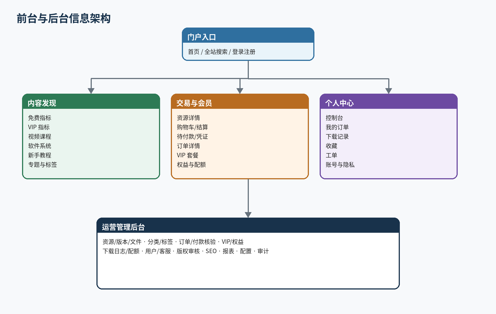
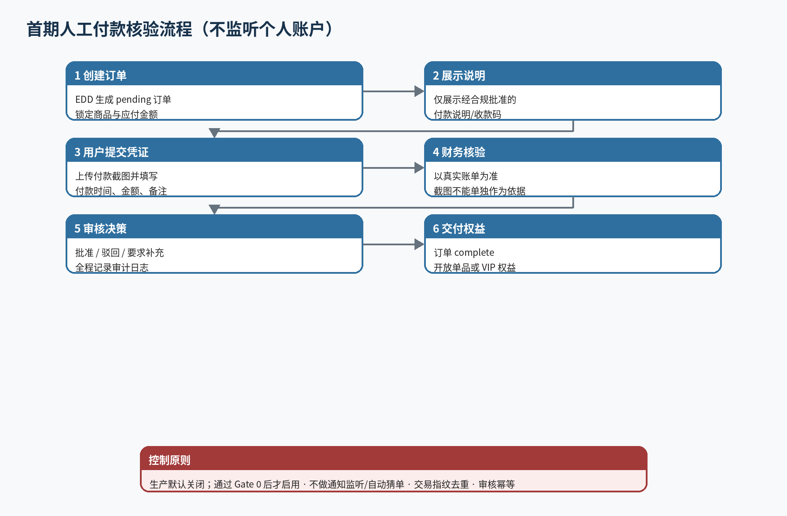
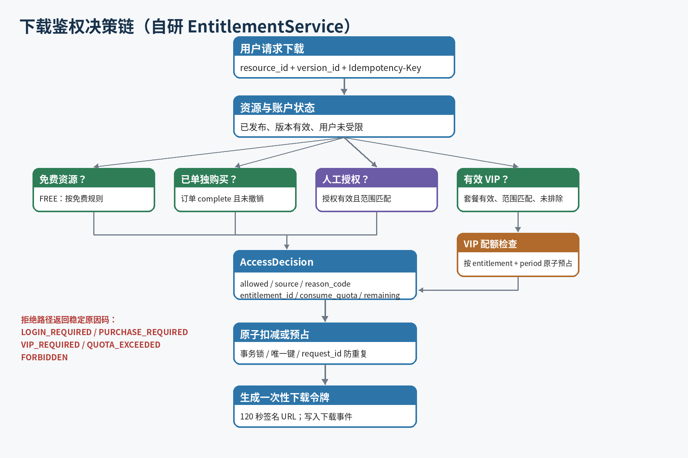
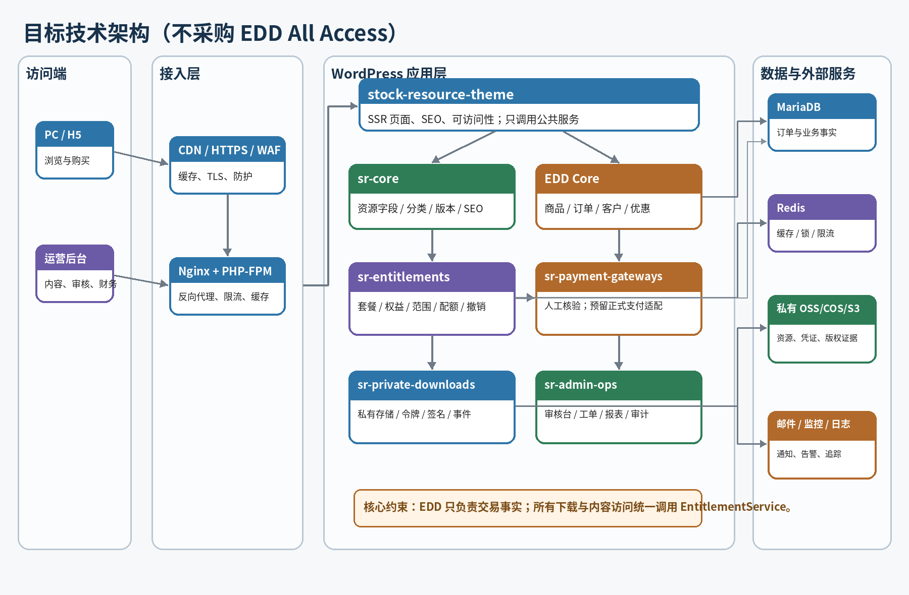
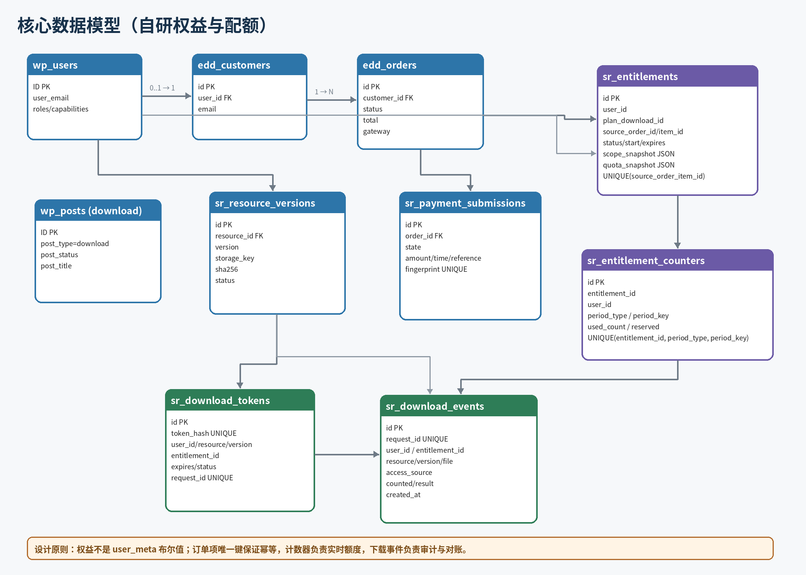
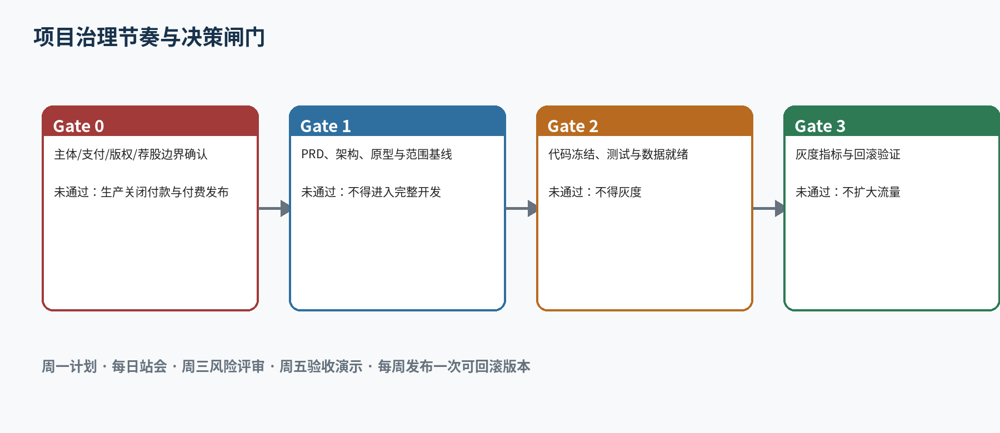
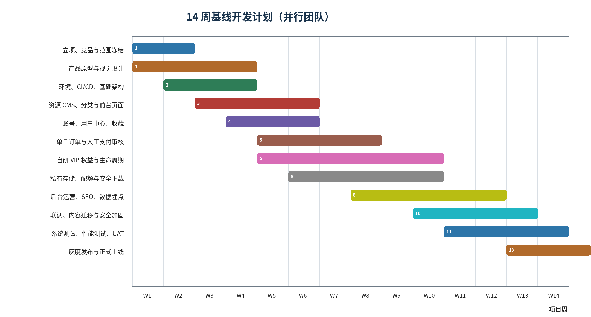

**股票指标资源下载平台**

**产品需求、技术架构与研发实施文档**

WordPress + Easy Digital Downloads + 自研权益引擎实施蓝图 · V1.1

| **文档性质** | **立项 / 产品 / 设计 / 研发 / 测试 / 上线共同执行依据**                        |
|--------------|--------------------------------------------------------------------------------|
| **目标版本** | MVP 1.0（PC + 移动 H5 响应式）                                                 |
| **基准周期** | 14 周并行交付；单人全栈约 23–30 周                                             |
| **基准团队** | 产品 1、设计 0.5、前端 1、WordPress 后端 1–1.5、测试 0.5–1、运维 0.2、内容 0.5 |
| **发布日期** | 2026-06-24                                                                     |

<table>
<colgroup>
<col style="width: 100%" />
</colgroup>
<thead>
<tr class="header">
<th>
<strong>重要使用说明</strong>

本文档借鉴目标资源站的业务形态与交互链路，不复制其品牌、页面代码、文案、图片或资源。首期支付按“用户提交付款凭证
+
后台人工核验”设计，生产环境默认关闭，只有在经营主体、收款方式、消费者权益与内容版权完成
Gate 0 审核后才允许启用。
</th>
</tr>
</thead>
<tbody>
</tbody>
</table>

# **0 文档控制与阅读指南**

本章定义版本、决策边界、执行方式与范围变更规则。

## **0.1 文档目的**

本文件用于将“股票技术指标内容与资源下载站”的商业设想，转化为产品、设计、开发、测试、运营和上线团队可以共同执行的基线。它同时承担
PRD、业务规则说明书、概要设计、实施计划、测试验收清单和上线运行手册的作用。

所有 P0
功能、状态机、数据字段、接口、验收指标和里程碑，均视为首期交付范围；任何影响支付、权益、下载、版权、证券业务边界或个人信息处理的变更，必须经过产品负责人、技术负责人及合规负责人共同批准。

## **0.2 版本记录**

| **版本** | **日期**   | **状态** | **主要内容**                                                                                | **审批角色**        |
|----------|------------|----------|---------------------------------------------------------------------------------------------|---------------------|
| V0.1     | 2026-06-24 | 草案     | 完成业务目标、范围、模块、技术架构与里程碑初稿                                              | 产品/技术           |
| V0.9     | 计划 W2    | 评审版   | 补充原型、UI 规范、数据字典、合规结论与估算                                                 | 产品/设计/技术/合规 |
| V1.0     | 计划 W3    | 基线版   | 需求冻结，作为开发与验收依据                                                                | 项目委员会          |
| V1.1     | 2026-06-24 | 受控修订 | 移除 EDD All Access 采购依赖；新增自研 sr-entitlements、权益数据表、14 周排期及专项验收基线 | 产品/技术           |
| V1.2+    | 按变更     | 受控修订 | 仅记录已审批的范围、规则、接口与合规变化                                                    | 变更委员会          |

## **0.3 阅读对象与关注重点**

| **角色**          | **重点章节**    | **应输出的结果**                             |
|-------------------|-----------------|----------------------------------------------|
| 发起人/业务负责人 | 1、2、3、15、18 | 确认目标、预算、合规闸门与范围优先级         |
| 产品经理          | 2–10、14–17     | 原型、需求拆分、验收标准、版本计划与运营规则 |
| UX/UI 设计        | 4–8、11         | 设计系统、页面状态、响应式稿、空态/异常态    |
| 研发负责人        | 9–14、16–18     | 架构决策、任务拆分、代码规范、上线与回滚     |
| 测试负责人        | 6–10、14、17    | 测试计划、用例、数据、性能与安全验收         |
| 内容/运营         | 5、7、8、12、15 | 资源规范、发布流程、客服、版权证据与报表     |
| 财务/审核         | 7、12、15、18   | 付款核验、退款、审计、对账与异常处置         |

## **0.4 需求优先级定义**

| **优先级** | **定义**          | **准入标准**                                                 |
|------------|-------------------|--------------------------------------------------------------|
| P0         | 首期上线不可缺失  | 缺失会导致核心链路不可用、无法安全交付或无法满足基本合规要求 |
| P1         | 上线后 1–2 个迭代 | 可显著提升转化、效率或留存，但不阻断首期交易与下载           |
| P2         | 增长与多端阶段    | 需在数据验证、正式支付资质或业务规模达到阈值后启动           |
| Out        | 明确排除          | 不在当前架构或风险承受范围内，不得私自开发上线               |

## **0.5 目录**

- 1 项目概述与产品战略

- 2 用户、场景与需求洞察

- 3 范围、版本与商业规则

- 4 信息架构与页面清单

- 5 内容与资源中心

- 6 账号、订单与个人中心

- 7 支付、人工核验与退款

- 8 VIP、权益与下载配额

- 9 私有文件与下载安全

- 10 运营后台与流程

- 11 UX/UI 与前端规范

- 12 合规、版权与风控

- 13 技术架构与工程规范

- 14 数据模型与接口设计

- 15 运营、客服与数据指标

- 16 研发流程、组织与排期

- 17 测试、验收与发布

- 18 风险、预算与后续路线

- 附录 A–F：状态机、权限矩阵、数据字典、API、用例与参考资料

# **执行摘要 立项结论**

给决策者的两页版本：做什么、怎么做、何时上线、什么条件下可以收款。

<table>
<colgroup>
<col style="width: 100%" />
</colgroup>
<thead>
<tr class="header">
<th>
<strong>产品定位</strong>

面向国内股票技术分析爱好者的“内容型数字资源平台”：以图文讲解、分类检索和真实可验证的资源版本为入口，支持免费资源、单品购买、VIP
范围内下载、下载配额与售后。平台不提供个股买卖建议，不承诺收益，不经营破解或无授权资源。
</th>
</tr>
</thead>
<tbody>
</tbody>
</table>

## **决策结论**

- 采用 WordPress + Easy Digital
  Downloads（EDD）作为首期核心，利用成熟的内容管理、订单与客户能力；通过五个独立自研插件承载资源、权益、支付核验、私有下载和运营后台，避免业务逻辑写入主题。

- 前台采用服务端渲染的轻量自定义主题，不做
  SPA；优先保证百度/搜索引擎可抓取、首屏速度、移动端阅读与长图文资源详情。

- 首期不接普通个人码“自动监听、自动猜单或免签回调”。订单创建后由用户提交凭证，后台财务以真实收款账单人工核验；该功能生产默认关闭，必须通过
  Gate 0。

- 下载文件进入私有对象存储；任何可下载行为必须先经过权益、配额、版本状态和风控判断，再生成
  120 秒有效的一次性签名链接。

- 14 周并行团队完成 MVP；预计净工作量约 243 人日，另预留 15%
  风险缓冲。单人全栈实施按 23–30
  周规划，且不建议一人同时承担财务审核与上线审批。

## **首期成功标准**

| **维度** | **上线验收阈值**                                                                |
|----------|---------------------------------------------------------------------------------|
| 业务闭环 | 注册/登录、浏览、搜索、下单、提交凭证、审核、下载、VIP、退款/撤销均可闭环       |
| 内容就绪 | 至少 100 个经过版权与技术审核的资源；每个资源具备完整属性、截图、版本、风险提示 |
| 质量     | P0 用例 100% 通过；无阻断/严重缺陷；核心接口错误率 \<0.5%                       |
| 性能     | 移动端 LCP p75 ≤2.5s；未命中页面 TTFB p95 ≤800ms；搜索 p95 ≤1.5s                |
| 安全     | 越权、直链、重放、金额篡改、重复审核、恶意上传等关键攻击用例全部阻断            |
| 运行     | 可观测、可备份、可恢复；RPO ≤1 小时，RTO ≤4 小时；完成一次恢复演练              |
| 合规     | Gate 0 书面结论通过；付费资源具备授权/来源证据；高风险文案与内容规则上线        |

# **1 项目概述与产品战略**

将参考站的“内容发现—付费/VIP—下载交付”模型，重构为可运营、可审计、可持续迭代的产品。

## **1.1 背景与机会**

目标用户通常通过搜索引擎、社群或内容分享寻找通达信、同花顺、大智慧等软件的技术指标、选股公式、预警公式、教程和辅助工具。现有站点常见问题包括资源描述不完整、版本兼容性不透明、下载链接失效、版权来源不清、付款后交付不稳定，以及“VIP
权益与下载次数”规则不一致。

本项目的产品机会不是简单复制页面，而是用标准化的资源元数据、版本管理、权限引擎、私有交付和审核证据，将一个“下载站”升级为可信的数字资源目录。

## **1.2 产品愿景**

<table>
<colgroup>
<col style="width: 100%" />
</colgroup>
<thead>
<tr class="header">
<th>
<strong>愿景陈述</strong>

让用户在 3
分钟内判断一个指标是否适合自己的软件与使用场景，并在具备合法权益后安全、稳定地获得正确版本；让运营人员在
15 分钟内完成一条合格资源的发布与后续更新。
</th>
</tr>
</thead>
<tbody>
</tbody>
</table>

## **1.3 产品目标与非目标**

| **类型**  | **内容**                                                           |
|-----------|--------------------------------------------------------------------|
| 目标 G1   | 建立可被搜索、筛选、比较和持续更新的股票指标资源库。               |
| 目标 G2   | 支持免费、单品购买、VIP 包含、VIP 折扣和人工授权等多种访问模式。   |
| 目标 G3   | 形成可审计的付款核验、权益授予、下载、退款与下架链路。             |
| 目标 G4   | 在首期不依赖高风险个人码自动化的前提下完成真实业务闭环。           |
| 目标 G5   | 为未来正式支付宝/微信/服务商支付、批量导入和多端扩展保留适配层。   |
| 非目标 N1 | 不提供实时行情、交易终端、自动跟单、个股荐股、收益保证或代客理财。 |
| 非目标 N2 | 不建立用户自由上传并分成的开放市场；首期资源均由内部编辑发布。     |
| 非目标 N3 | 不提供破解、解密、绕过授权、盗版课程或来源不明的软件。             |
| 非目标 N4 | 首期不开发 App、小程序、直播、社区、复杂分销与多商户。             |

## **1.4 北极星指标与阶段目标**

| **阶段**     | **核心指标**         | **目标/说明**                                                |
|--------------|----------------------|--------------------------------------------------------------|
| MVP 0–3 月   | 有效资源交付率       | 完成支付/授权后成功取得正确文件的订单占比 ≥98%               |
| MVP 0–3 月   | 搜索到详情转化率     | 站内搜索后进入资源详情的会话占比 ≥35%                        |
| 运营 3–6 月  | 7 日有效下载用户留存 | 至少完成一次有效下载的用户，7 日内再次访问占比 ≥20%          |
| 运营 3–6 月  | 资源问题率           | 兼容性、缺文件、链接或说明问题工单 / 下载次数 ≤2%            |
| 增长 6–12 月 | 内容自然流量占比     | 来自搜索引擎的合规内容访问占比持续提升；不以误导标题获取流量 |

## **1.5 关键原则**

| **原则**         | **执行要求**                                                                       |
|------------------|------------------------------------------------------------------------------------|
| 内容先于交易     | 用户必须先看清适用平台、功能、限制、版本、示例和风险，再进入付费。                 |
| 权益统一判断     | 页面展示、购买、VIP、下载、售后都调用同一 EntitlementService，禁止各模块自写判断。 |
| 订单与资金分离   | EDD 管理订单，人工核验插件管理付款凭证；审核通过后以幂等方式驱动订单完成。         |
| 文件永不公开     | 下载资源不进入公开媒体库，不返回长期永久 URL。                                     |
| 证据随内容走     | 来源、授权、技术审核、版本散列与下架记录均与资源关联。                             |
| 可替换而非硬编码 | VIP、支付、存储、搜索通过接口/适配器接入，为后续升级保留空间。                     |

# **2 用户、场景与需求洞察**

围绕“判断是否适用、获得合法权益、正确安装使用、出现问题可追溯”设计完整体验。

## **2.1 角色与用户画像**

| **角色**     | **主要目标**                   | **典型痛点**                   | **产品响应**                                     |
|--------------|--------------------------------|--------------------------------|--------------------------------------------------|
| 新手投资者   | 找到可安装、易理解的基础指标   | 不会判断格式/版本；安装失败    | 兼容性字段、安装教程、免费试用资源、明确风险提示 |
| 经验型用户   | 快速筛选某类主图/副图/选股公式 | 搜索噪音大；描述夸张；版本不清 | 多维筛选、真实截图、技术说明、版本变更记录       |
| 高频下载用户 | 通过 VIP 持续获取资源          | 权益范围与每日次数不透明       | 实时权益卡、剩余配额、适用分类和排除项           |
| 单品购买用户 | 只购买一个明确资源             | 担心付款后无交付或文件失效     | 订单状态、人工审核进度、下载记录、售后入口       |
| 内容编辑     | 高效发布并持续更新资源         | 字段散乱、重复录入、审核缺证据 | 资源模板、必填校验、版本/文件/版权工作台         |
| 财务审核     | 准确匹配付款并避免重复授权     | 同额订单、凭证伪造、重复审核   | 账单核验、交易指纹、双重确认、幂等与审计         |
| 客服/合规    | 快速定位问题并下架风险内容     | 无法关联用户/订单/下载/证据    | 统一时间线、工单、封禁/撤销、版权与文案审核      |

## **2.2 核心用户旅程**

| **阶段** | **用户动作**                         | **系统响应**                              | **关键指标**                 |
|----------|--------------------------------------|-------------------------------------------|------------------------------|
| 发现     | 通过搜索、分类、标签或推荐进入资源页 | 输出完整 HTML、面包屑、筛选、相关推荐     | 自然访问、搜索成功率         |
| 判断     | 查看截图、属性、安装方法、版本与限制 | 突出兼容性、文件清单、权益模式与风险提示  | 详情停留、购买/收藏率        |
| 获取权益 | 登录后免费领用、购买单品或购买 VIP   | 生成 EDD 订单；展示受控付款说明；接收凭证 | 结算成功率、凭证提交率       |
| 核验     | 等待人工审核或补充材料               | 状态通知；审核通过后完成订单并授予权益    | 审核时长、驳回率、重复匹配率 |
| 下载     | 选择版本并点击下载                   | 检查权益/配额/风控，生成短时签名链接      | 成功率、平均交付时间         |
| 使用     | 按教程导入指标                       | 提供安装指南、FAQ、版本说明与工单         | 安装问题率、工单解决时长     |
| 复访     | 查看更新、收藏、VIP 到期和配额       | 更新提醒、历史版本、续期提示              | 留存、复购、VIP 使用率       |

## **2.3 关键 JTBD**

- 当我从搜索引擎进入一个指标页面时，我想快速确认它适用于哪款软件、哪个版本、手机还是电脑，以免买错。

- 当我看到宣传截图时，我想知道截图只是演示、是否使用未来函数、是否依赖收费行情，以免被不真实效果误导。

- 当我付款后，我想看到明确的审核状态和预计处理规则，并能证明我已获得下载权。

- 当我下载失败或重新安装时，我想在合理次数内重新下载同一版本，而不会被重复扣除配额。

- 当资源更新或被下架时，我想知道原因、可用版本与售后安排。

- 当我购买 VIP
  时，我想在付款前清楚知道哪些资源包含、每日能下载多少、何时到期以及哪些不包含。

## **2.4 需求优先级评分方法**

迭代评审采用 RICE 的简化版本：Score = Reach × Impact × Confidence ÷
Effort。所有涉及监管、支付、版权、越权或文件泄露的需求，无论商业分数高低，优先按风险等级处理。

| **评分项**    | **定义**                               | **取值**         |
|---------------|----------------------------------------|------------------|
| Reach         | 一个季度覆盖的活跃用户或运营人员比例   | 1–5              |
| Impact        | 对交付成功、转化、留存或风险降低的影响 | 0.5 / 1 / 2 / 3  |
| Confidence    | 证据充分程度                           | 50% / 80% / 100% |
| Effort        | 产品+设计+研发+测试净人周              | ≥0.5             |
| Risk override | 高风险缺陷或合规要求                   | 直接进入 P0/P1   |

# **3 范围、版本与商业规则**

通过清晰的 P0/P1/P2 边界，避免首期被商城、社区或支付自动化拖垮。

## **3.1 MVP P0 范围**

- 响应式门户：首页、免费资源、VIP
  资源、视频/教程、软件、专题、分类、标签、搜索与资源详情。

- 用户体系：注册、登录、密码重置、个人资料、隐私设置、角色与能力。

- EDD 单品：价格、优惠价、结算、订单、客户、退款/撤销状态与订单时间线。

- 人工付款：付款说明、凭证提交、审核队列、补充/驳回/批准、交易指纹、审计和通知。

- VIP：套餐、期限、适用分类/资源、下载次数、到期、人工授予与撤销。

- 下载：版本选择、私有对象存储、一次性令牌、签名
  URL、配额、防直链、下载日志。

- 后台：资源/版本/文件、审核、订单/付款、VIP、用户、工单、报表、SEO、配置、审计。

- 运营基础：收藏、工单、站内通知/邮件、FAQ、风险与版权声明、下架处理。

- 工程与运行：CI/CD、缓存、队列/定时任务、日志、告警、备份、恢复、安全加固。

## **3.2 P1 与 P2 路线**

| **阶段**    | **候选能力**                                                                    | **启动条件**                          |
|-------------|---------------------------------------------------------------------------------|---------------------------------------|
| P1 迭代 1   | 批量导入、资源更新通知、VIP 升级补差、优惠券、收藏增强、失效反馈、审核 SLA 看板 | MVP 稳定运行 2–4 周                   |
| P1 迭代 2   | 更强筛选、专题聚合、相似资源、历史版本、运营自动化、内容质量评分                | 资源 ≥500 或自然流量形成              |
| P2 支付升级 | 支付宝/微信官方接口或正规服务商、自动回调、退款与对账                           | 取得合适主体与产品权限；完成安全评审  |
| P2 搜索升级 | OpenSearch/Elasticsearch、同义词、拼音、聚合筛选                                | 资源 ≥10,000 或 MySQL 搜索 p95 \>1.5s |
| P2 多端     | 微信小程序、App、独立 API 网关                                                  | 移动端复购与业务价值经数据验证        |

## **3.3 明确排除项**

- 个人收款码消息监听、APP
  挂机、Cookie/通知读取、自动猜单、来源不明的“免签”支付。

- 用户自由上传并自动出售、资源分成、多商户入驻。

- 实时荐股、个股买卖点推送、收益排行、胜率承诺、跟单或交易接口。

- 破解软件、解密指标、绕过授权、付费课程盗录、未经授权的第三方源码。

- 首期积分商城、复杂分销、拼团、砍价、直播、社区、即时聊天。

## **3.4 商品与访问模式**

| **模式代码**  | **业务含义**       | **是否生成订单**           | **下载/查看规则**               |
|---------------|--------------------|----------------------------|---------------------------------|
| FREE          | 免费资源           | 可不生成；登录后记授权可选 | 通过基础限额与风控后下载        |
| PURCHASE_ONLY | 仅单品购买         | 是                         | 订单完成后获得该资源/版本下载权 |
| VIP_INCLUDED  | VIP 范围内免费     | 购买 VIP 时生成            | VIP 有效、范围匹配且配额充足    |
| VIP_DISCOUNT  | VIP 享折扣但不免费 | 单品订单                   | 按套餐折扣结算，订单完成后下载  |
| VIP_EXCLUDED  | 所有 VIP 均不包含  | 单品订单                   | 必须单独购买                    |
| MANUAL_GRANT  | 运营人工授权       | 可关联服务单/补偿单        | 在授权期限与范围内下载          |

## **3.5 首期定价与套餐占位规则**

<table>
<colgroup>
<col style="width: 100%" />
</colgroup>
<thead>
<tr class="header">
<th>
<strong>注意</strong>

以下仅用于系统设计和测试数据，不构成最终商业定价。正式价格必须由业务负责人结合内容成本、版权许可、税务及支付方案审批。
</th>
</tr>
</thead>
<tbody>
</tbody>
</table>

| **套餐** | **有效期** | **范围**          | **每日唯一资源下载数** | **建议状态**               |
|----------|------------|-------------------|------------------------|----------------------------|
| 注册用户 | 长期       | 免费资源          | 3                      | 上线                       |
| 月度 VIP | 30 天      | 指定 VIP 分类     | 10                     | 上线                       |
| 年度 VIP | 365 天     | 指定 VIP 分类     | 15                     | 上线                       |
| 高级 VIP | 365 天     | 更广范围/部分课程 | 20                     | 可选 P1                    |
| 永久 VIP | 永久       | 待定              | 待定                   | 首期禁用，避免长期履约风险 |

## **3.6 关键业务规则总表**

| **规则 ID** | **规则**                                                                     |
|-------------|------------------------------------------------------------------------------|
| BR-001      | 任何付费资源必须处于 published 且 rights_status=approved 才能进入结算。      |
| BR-002      | 页面显示价格、提交订单金额与服务端订单金额必须一致；客户端金额不可信。       |
| BR-003      | 审核付款时必须基于真实账单核验；截图仅为线索，不能单独证明入账。             |
| BR-004      | 同一外部交易参考号/时间/金额/收款账户组合只允许完成一个订单。                |
| BR-005      | 审核批准接口必须幂等；重复调用不得重复授予权益或重复通知。                   |
| BR-006      | 单品购买不消耗 VIP 每日配额；VIP_INCLUDED 下载消耗对应套餐配额。             |
| BR-007      | 同一用户同一资源同一版本在 30 分钟内重试，不重复计入每日唯一下载。           |
| BR-008      | 资源下架后停止生成新下载令牌；已购买用户的售后方案按下架类型决定。           |
| BR-009      | 退款/撤销成功后，新下载令牌立即禁止；历史下载日志永久保留审计记录。          |
| BR-010      | 访问权限一律由 EntitlementService 判定，主题模板不得直接读取订单表自行推断。 |

# **4 信息架构与页面清单**

参考内容资源站的分类导航与详情结构，建立前台、用户中心和管理后台三层信息架构。

图 4-1 前台、交易/会员、个人中心与运营后台的信息架构

## **4.1 全局导航**

| **一级入口** | **二级入口/筛选**                               | **目标**                 |
|--------------|-------------------------------------------------|--------------------------|
| 首页         | 热门、最新、免费、VIP、教程、软件、专题         | 建立信任并引导到资源发现 |
| 免费指标     | 平台、类型、设备、格式、是否源码                | 降低首次体验门槛         |
| VIP 指标     | 套餐范围、平台、类型、热度、更新时间            | 解释 VIP 价值与使用边界  |
| 课程/教程    | 入门、安装、策略基础、平台操作                  | 以教育内容支撑资源使用   |
| 软件系统     | 通达信工具、辅助软件、安装包/补丁（仅合法来源） | 独立展示兼容与安全信息   |
| 搜索         | 关键词、同义词、筛选、排序                      | 让用户从需求直接到资源   |
| VIP          | 套餐、对比、权益、配额、FAQ                     | 促进透明决策             |
| 用户中心     | 订单、下载、VIP、收藏、工单、资料               | 承接交易后服务           |

## **4.2 页面清单与优先级**

| **ID** | **页面**       | **优先级** | **主要用户** | **关键内容**                                 |
|--------|----------------|------------|--------------|----------------------------------------------|
| FE-001 | 首页           | P0         | 访客         | 推荐模块、分类入口、搜索、合规声明           |
| FE-002 | 资源列表/分类  | P0         | 全部         | 筛选、排序、分页、卡片状态                   |
| FE-003 | 搜索结果       | P0         | 全部         | 关键词、筛选、无结果建议、搜索日志           |
| FE-004 | 资源详情       | P0         | 全部         | 富文本、属性、截图、版本、价格/VIP、相关推荐 |
| FE-005 | VIP 套餐       | P0         | 全部         | 套餐对比、范围、下载数、到期、FAQ            |
| FE-006 | 结算页         | P0         | 登录用户     | 订单摘要、应付金额、条款确认                 |
| FE-007 | 付款说明/凭证  | P0         | 下单用户     | 受控说明、上传凭证、状态时间线               |
| FE-008 | 登录/注册/找回 | P0         | 访客         | 账号认证、防滥用                             |
| UC-001 | 用户控制台     | P0         | 用户         | 权益、配额、待办、近期下载                   |
| UC-002 | 订单列表/详情  | P0         | 用户         | 状态、商品、金额、审核、售后                 |
| UC-003 | 下载中心       | P0         | 用户         | 版本、次数、更新、下载按钮                   |
| UC-004 | VIP 中心       | P0         | 用户         | 当前套餐、范围、到期、用量                   |
| UC-005 | 收藏           | P1         | 用户         | 收藏资源与更新                               |
| UC-006 | 工单           | P0         | 用户         | 创建、回复、附件、关联订单/资源              |
| AD-001 | 资源编辑工作台 | P0         | 编辑/审核    | 字段、版本、文件、版权、预览、发布           |
| AD-002 | 付款核验工作台 | P0         | 财务         | 筛选、比对、批准/驳回、审计                  |
| AD-003 | 订单/客户/VIP  | P0         | 运营/客服    | 订单、权益、补偿、撤销、时间线               |
| AD-004 | 下载/风控      | P0         | 运营/审计    | 事件、配额、异常、封禁                       |
| AD-005 | 配置/报表/日志 | P0         | 管理员/审计  | 业务配置、指标、审计导出                     |

## **4.3 资源详情页结构**

- 首屏：标题、摘要、平台/类型/兼容性标签、更新时间、版本、价格/VIP
  状态、主 CTA。

- 证据区：真实截图/演示视频、效果说明、数据周期、参数、是否依赖
  Level-2、未来函数声明。

- 正文：策略思路、使用场景、安装步骤、参数解释、限制条件、常见问题。

- 文件区：当前版本、格式、大小、SHA-256
  摘要（可部分显示）、发布日期、变更记录。

- 权益区：免费/单买/VIP 的可用方式、VIP
  是否包含、今日剩余次数、登录提示。

- 信任区：来源/授权类型、风险提示、举报/下架入口、售后范围。

- 发现区：同平台、同类型、同标签资源和教程；避免仅按销量形成误导性推荐。

## **4.4 页面状态规范**

| **状态**     | **前台表现**                       | **允许操作**                |
|--------------|------------------------------------|-----------------------------|
| draft/review | 不公开；预览带水印                 | 编辑、审核、预览            |
| published    | 正常索引与访问                     | 购买/授权/下载              |
| suspended    | 显示暂停说明或 404/410，视原因而定 | 联系客服，不允许新购买/下载 |
| takedown     | 版权/合规下架页；noindex           | 售后按策略处理              |
| archived     | 历史页面可保留，明确不可购买       | 查看说明/替代资源           |
| out_of_scope | VIP 不包含或软件不兼容             | 允许单购或推荐替代          |

# **5 内容与资源中心**

以“资源主记录 + 多版本 + 私有文件 + 版权证据”替代简单文章附件。

## **5.1 内容对象模型**

| **对象**   | **WordPress/自定义实现**      | **说明**                                           |
|------------|-------------------------------|----------------------------------------------------|
| 资源主记录 | EDD Download 自定义文章类型   | 承载标题、正文、价格、分类、标签和公开元数据       |
| 资源版本   | sr_resource_versions 自定义表 | 一个资源可有多个版本；绑定兼容性、文件、散列和状态 |
| 下载文件   | 私有对象存储对象              | 禁止放公开媒体库；通过 storage_key 关联            |
| 版权证据   | sr_rights_records 自定义表    | 来源、授权人、授权范围、凭证、到期、审核记录       |
| 教程/资讯  | WordPress Post/Page           | 长图文、SEO 与内部链接；可与资源建立关系           |
| 截图/封面  | WordPress Media，公开静态资源 | 只存展示图片；自动压缩、WebP/AVIF 与水印可选       |

## **5.2 分类与属性体系**

| **维度** | **建议值**                                                   | **用途**                                 |
|----------|--------------------------------------------------------------|------------------------------------------|
| 内容类型 | 指标公式、选股公式、预警公式、排序公式、教程、课程、软件工具 | 一级内容边界                             |
| 适用平台 | 通达信、同花顺、大智慧、文华财经、其他                       | 筛选与兼容性                             |
| 图表位置 | 主图、副图、选股、预警、排序、组合                           | 描述使用方式                             |
| 交易周期 | 分时、日内、日线、周线、多周期                               | 避免错误使用                             |
| 设备     | Windows、macOS、Android、iOS、未知                           | 兼容提示                                 |
| 文件格式 | TN6/TNI/TNE/TXT/ZIP/PDF/MP4 等                               | 安装说明与安全扫描                       |
| 源码状态 | 包含源码、加密公式、仅安装包、不适用                         | 透明说明                                 |
| 未来函数 | 未检测、检测无、检测有、未知                                 | 高风险披露；不得以“绝对无未来”作不实承诺 |
| 数据依赖 | 免费行情、Level-2、第三方数据、未知                          | 成本与效果预期                           |
| 访问模式 | FREE/PURCHASE_ONLY/VIP_INCLUDED/VIP_DISCOUNT/VIP_EXCLUDED    | 权限引擎输入                             |

## **5.3 资源字段清单**

| **分组** | **字段示例**                                                     | **说明**                           |
|----------|------------------------------------------------------------------|------------------------------------|
| 基础     | title, slug, summary, description, cover, gallery, author/editor | 标题、摘要、详情、封面与负责人     |
| 分类     | content_type, platform, indicator_type, strategy_tags            | 内容类型、平台、指标类型、策略标签 |
| 兼容     | software_versions, device, os, format, charset                   | 兼容版本、设备、系统、格式与字符集 |
| 技术     | source_included, future_function_status, l2_required, parameters | 源码、未来函数、数据依赖和参数     |
| 商业     | access_mode, list_price, sale_price, vip_scope, vip_discount     | 访问模式、价格、VIP 范围与折扣     |
| 版本     | current_version_id, release_notes, file_size, sha256             | 当前版本与文件信息                 |
| 内容质量 | install_steps, usage_scenarios, limitations, faq                 | 安装、场景、限制、FAQ              |
| 合规     | rights_status, rights_record_id, risk_level, disclaimer_version  | 版权、风险与声明版本               |
| 运营     | featured, sort_weight, publish_at, update_at, related_resources  | 推荐、排序、发布时间与关联         |

## **5.4 资源生命周期**

draft → editor_review → rights_review → technical_review → approved →
published  
↓  
suspended / takedown / archived

| **状态**         | **进入条件**               | **可执行人** | **退出条件**               |
|------------------|----------------------------|--------------|----------------------------|
| draft            | 新建或导入                 | 编辑         | 必填字段完整，提交编辑审核 |
| editor_review    | 内容与元数据完整           | 高级编辑     | 文案/截图/分类通过         |
| rights_review    | 已上传版权证据             | 合规审核     | 授权范围、期限和销售权通过 |
| technical_review | 文件已扫描并安装验证       | 技术审核     | 兼容性、文件散列、教程通过 |
| approved         | 全部审核通过               | 系统         | 可计划发布                 |
| published        | 到达发布时间且商业配置有效 | 系统/发布人  | 正常销售与下载             |
| suspended        | 临时风险、文件故障或调查   | 合规/管理员  | 修复后恢复或转下架         |
| takedown         | 侵权、违规或严重问题       | 合规/管理员  | 不可恢复或重新取得授权     |
| archived         | 被新资源替代或长期不维护   | 编辑/管理员  | 历史保留，不再销售         |

## **5.5 发布质量门槛**

- 标题不含“稳赚、必涨、百分百、抓牛股”等收益承诺或误导性表述。

- 至少 1
  张真实界面截图；截图标注软件版本、周期与演示性质，不伪造回测或收益。

- 明确平台、版本、设备、格式、是否源码、是否依赖付费行情、未来函数状态与限制。

- 完成沙箱环境安装验证，记录测试人员、日期、软件版本、样本文件散列。

- 付费资源已上传授权/创作/采购证明，且授权范围明确包含网络展示、销售或下载交付。

- 压缩包经病毒扫描、解压层级/大小检查，不含可疑可执行文件、密码或外部广告植入。

- 正文包含安装步骤、使用场景、风险提示、售后边界与举报入口。

- 价格、VIP 范围、文件版本和下载权限在预发布环境完成至少一次端到端验证。

## **5.6 版本与文件规则**

| **规则**     | **设计**                                                                         |
|--------------|----------------------------------------------------------------------------------|
| 版本不可覆盖 | 上传新文件必须创建新版本记录；旧版本散列和日志保留。                             |
| 当前版本     | 每个资源最多一个 current；切换时事务更新，避免前端读取不一致。                   |
| 兼容矩阵     | 每个版本独立记录适用软件版本/设备，而非只继承主资源。                            |
| 文件散列     | 上传后计算 SHA-256；相同散列可提示重复，但不自动跨资源授权。                     |
| 历史下载     | 单品购买用户原则上可下载购买时版本及其兼容更新；重大重制是否收费由运营规则决定。 |
| 恶意文件     | 扫描失败、加密无法检查、压缩炸弹或高风险格式自动隔离，禁止发布。                 |
| 文件下架     | 先禁用新令牌，再通知受影响订单并决定替换、退款或说明。                           |

# **6 账号、订单与个人中心**

让用户从注册到下载后的每一步，都能看到清晰状态、可追踪证据和下一步行动。

## **6.1 账号体系**

| **能力** | **P0 设计**                                         | **安全/体验要求**                          |
|----------|-----------------------------------------------------|--------------------------------------------|
| 注册     | 邮箱 + 密码；可选手机仅作资料字段，不作为首期强依赖 | 邮箱验证、验证码/限流、密码强度、隐私同意  |
| 登录     | 邮箱/用户名 + 密码                                  | 失败限流、可疑 IP 告警、管理员强制 2FA     |
| 找回密码 | 一次性邮件链接                                      | 短时有效、使用后失效、不可泄露账号是否存在 |
| 会话     | WordPress 安全 Cookie                               | HTTPS、SameSite、退出全部设备（P1）        |
| 资料     | 昵称、头像、联系邮箱、软件偏好                      | 最小化收集；敏感变更重新验证               |
| 账号状态 | active/limited/suspended/deleted_pending            | 限制购买/下载可独立控制，操作需审计        |
| 注销     | 提交申请，完成未结订单/售后后处理                   | 保留法定订单与审计记录，去标识化非必要资料 |

## **6.2 角色与权限**

| **角色**           | **典型能力**                             | **限制**                               |
|--------------------|------------------------------------------|----------------------------------------|
| visitor            | 浏览公开页面、搜索、查看套餐             | 不能下单、提交凭证或下载受限资源       |
| registered         | 免费资源、收藏、工单、下单               | 受免费配额与风控限制                   |
| buyer              | 下载已购资源、查看订单、申请售后         | 仅可访问自己的订单与权益               |
| vip_member         | 下载套餐范围内资源                       | 受有效期、范围与每日配额限制           |
| editor             | 创建/编辑资源、上传展示图                | 不能批准版权、付款或直接发布高风险内容 |
| technical_reviewer | 检查版本、文件与兼容性                   | 不能修改价格/付款状态                  |
| rights_reviewer    | 审核版权、合规文案、下架                 | 不能批准付款或修改资金信息             |
| finance_reviewer   | 核验付款、退款建议                       | 不能编辑资源内容或系统配置             |
| support_agent      | 查看必要的用户/订单/下载时间线、处理工单 | 敏感字段脱敏；不能完成付款             |
| administrator      | 系统配置、用户与插件管理                 | 强制 2FA；高风险操作二次确认           |
| auditor            | 只读查看审计、订单、付款、下载和配置变更 | 不得执行任何业务写操作                 |

## **6.3 订单状态机**

draft → pending_payment → proof_submitted → under_review → complete  
│ │ ├→ proof_rejected → proof_submitted  
├→ cancelled └→ expired └→ cancelled  
complete → refund_requested → refunded / refund_rejected  
complete → revoked（欺诈、侵权下架或人工纠正，需审计）

| **状态**        | **用户可见文案**  | **允许动作**                    | **系统动作**                       |
|-----------------|-------------------|---------------------------------|------------------------------------|
| draft           | 订单尚未提交      | 返回购物车/提交                 | 不保留权益                         |
| pending_payment | 待付款/待提交凭证 | 查看说明、提交凭证、取消        | 锁定订单价格与商品快照             |
| proof_submitted | 凭证已提交        | 查看、补充材料                  | 进入审核队列，禁止重复创建同单凭证 |
| under_review    | 正在核验          | 等待或回应补充请求              | 记录审核人和开始时间               |
| proof_rejected  | 凭证未通过        | 查看原因、重新提交              | 保留历史凭证，不授权               |
| complete        | 已完成            | 下载、开工单、查看发票/凭证说明 | 授予单品或 VIP 权益                |
| expired         | 订单已过期        | 重新下单                        | 冻结旧付款流程                     |
| cancelled       | 已取消            | 重新下单                        | 释放待处理任务                     |
| refunded        | 已退款            | 查看结果                        | 撤销可撤销权益，阻止新令牌         |
| revoked         | 权益已撤销        | 联系客服/申诉                   | 立即失效并写审计原因               |

## **6.4 订单快照**

订单必须保存下单时的商品标题、资源
ID、版本/权益范围、访问模式、原价、成交价、优惠、应付金额、条款版本和风险提示版本。之后即使资源标题或价格修改，历史订单仍按快照展示和审计。

| **字段**            | **示例/说明**                                                    |
|---------------------|------------------------------------------------------------------|
| order_item_snapshot | resource_id、title、access_mode、version_policy、vip_scope       |
| price_snapshot      | list_price、sale_price、discount、tax、total、currency=CNY       |
| terms_snapshot      | 服务条款版本、数字内容交付确认版本、隐私政策版本                 |
| channel_snapshot    | manual_review / alipay_official / wechat_official / official_isv |
| risk_snapshot       | 用户 IP 哈希、设备标识摘要、提交频率、风险结果                   |

## **6.5 用户中心模块**

| **模块**   | **展示内容**                                             | **关键 CTA**                     |
|------------|----------------------------------------------------------|----------------------------------|
| 概览       | VIP 状态、今日剩余下载数、待审核订单、最近下载、系统通知 | 继续审核、续期、查看下载         |
| 我的订单   | 订单号、商品、金额、状态、创建/完成时间                  | 提交凭证、查看详情、申请售后     |
| 下载中心   | 资源、版本、授权来源、最近下载、剩余次数/有效期          | 生成下载链接、查看教程、报告问题 |
| VIP 中心   | 套餐、开始/到期、范围、今日/周期用量、排除项             | 查看套餐、续期/升级（P1）        |
| 收藏       | 资源卡片、价格/VIP 变化、更新时间                        | 取消收藏、进入详情               |
| 工单       | 类型、关联订单/资源、状态、最近回复                      | 新建、回复、补充附件             |
| 账户与隐私 | 资料、密码、会话、通知、注销                             | 保存、改密、导出/注销申请        |

## **6.6 通知策略**

| **事件**                | **站内** | **邮件** | **频控/要求**                            |
|-------------------------|----------|----------|------------------------------------------|
| 凭证提交成功            | 是       | 是       | 每次状态变化一次                         |
| 要求补充/驳回           | 是       | 是       | 必须包含原因与下一步，不含敏感收款信息   |
| 订单完成                | 是       | 是       | 包含用户中心链接，不直接发送永久下载地址 |
| VIP 即将到期            | 是       | 是       | 到期前 7 天、1 天；用户可退订营销提示    |
| 资源更新                | P1       | P1       | 仅收藏/已购且订阅更新的用户              |
| 资源下架/安全问题       | 是       | 是       | 高优先级，说明影响和售后方案             |
| 异常登录/后台高风险操作 | 是       | 是       | 实时；管理员强制通知                     |

# **7 支付、人工核验与退款**

在暂不具备正式商户接口的条件下，首期只实现可控的人工核验流程，并为未来支付网关预留统一适配层。

图 7-1 首期人工付款核验流程：不监听个人账户，不依赖自动猜单

## **7.1 支付架构原则**

- EDD 仍是订单事实来源（system of
  record）；付款插件不得自行创建一套独立商品/订单体系。

- 支付通道通过 PaymentGatewayAdapter 接口接入；manual_review
  是首期适配器，未来可替换为官方支付宝、微信或正规服务商。

- 生产环境开关 PAYMENT_MANUAL_ENABLED 默认 false；只有 Gate 0
  通过并由两名授权管理员共同开启。

- 任何付款状态变化均使用服务端订单金额和订单所有权校验，客户端提交金额、商品或状态不得被信任。

- 付款证明、账单参考号和审核日志属于敏感业务数据，按最小权限展示并配置保留期限。

## **7.2 人工付款状态机**

draft → submitted → under_review → approved  
│ ├→ need_more_info → submitted  
│ └→ rejected → submitted / closed  
└→ expired  
approved 只能通过退款/纠错流程撤销，不能直接改回 submitted。

| **状态**       | **进入条件**                      | **下一步**         | **SLA 建议**           |
|----------------|-----------------------------------|--------------------|------------------------|
| draft          | 订单已创建，未提交材料            | 提交/订单过期      | 30 分钟或运营配置      |
| submitted      | 用户上传凭证并提交必要字段        | 审核领取           | 工作时段 2 小时内领取  |
| under_review   | 审核人领取并锁定任务              | 批准/补充/驳回     | 工作时段 4 小时内完成  |
| need_more_info | 账单无法匹配或信息不足            | 用户补充后重新提交 | 用户 48 小时内响应     |
| rejected       | 确认未入账/金额不符/重复使用/伪造 | 重新提交或关闭     | 显示具体、可申诉原因   |
| approved       | 真实账单核验通过，交易指纹唯一    | 完成 EDD 订单      | 即时、幂等             |
| expired        | 超时未提交/补充                   | 重新下单           | 不可继续使用旧订单付款 |

## **7.3 用户提交字段**

| **字段**        | **必填** | **校验**                                   | **说明**                             |
|-----------------|----------|--------------------------------------------|--------------------------------------|
| order_id        | 是       | 属于当前用户且状态可提交                   | 服务端读取金额/商品                  |
| paid_amount     | 是       | 两位小数、合理区间；不直接决定订单完成     | 辅助账单匹配                         |
| paid_at         | 是       | 不得明显未来；允许时区误差                 | 用户自报付款时间                     |
| payer_note      | 建议     | 长度 2–100，过滤敏感/脚本                  | 付款备注或末尾信息                   |
| channel         | 是       | 仅允许后台配置值                           | 如支付宝/微信/银行转账等实际允许通道 |
| proof_image     | 是       | JPG/PNG/PDF；大小 ≤8MB；病毒扫描；去元数据 | 仅作线索，后台受控访问               |
| contact         | 可选     | 最小化收集；仅售后使用                     | 不在前台公开                         |
| terms_confirmed | 是       | 记录条款版本与时间                         | 确认数字内容交付和退款规则           |

## **7.4 财务核验工作台**

| **区域**   | **功能设计**                                                                                                     |
|------------|------------------------------------------------------------------------------------------------------------------|
| 队列       | 按 submitted/under_review/超时/高风险筛选；支持分配、领取和并发锁。                                              |
| 订单摘要   | 订单号、用户、商品快照、应付金额、创建时间、历史尝试。                                                           |
| 凭证区     | 受控预览、提交字段、图片元数据清理结果；禁止公开 URL。                                                           |
| 账单核验区 | 审核人手工录入/选择真实账单参考号、入账金额、时间、收款账户标识。                                                |
| 重复检测   | 以 channel + account_key + external_reference 为主唯一；无参考号时组合时间窗、金额、付款标识生成指纹并人工确认。 |
| 风险提示   | 同 IP/设备多账号、重复凭证散列、异常频率、金额不符、历史驳回。                                                   |
| 决策       | 批准、要求补充、驳回；必须选择原因码并可写备注。批准前二次确认。                                                 |
| 审计       | 记录操作者、前后状态、字段摘要、时间、IP、二次确认人（高金额可选）。                                             |

## **7.5 批准事务与幂等**

批准操作必须在一个数据库事务或可恢复的幂等工作流中完成。任何一步失败不得出现“订单已完成但无权益”或“重复授予权益”的不可追踪状态。

BEGIN  
1. SELECT payment_submission ... FOR UPDATE  
2. 校验 state=under_review、order=pending、transaction_fingerprint
未使用  
3. 写入 external_reference / fingerprint 唯一记录  
4. 调用 EDD 完成订单（使用 idempotency_key）  
5. EntitlementService 根据订单快照授予单品或 VIP 权益  
6. 写 audit_log、outbox_notification  
7. submission.state = approved  
COMMIT  
异步任务发送通知；失败可重试但不得重复授权。

## **7.6 拒绝与原因码**

| **原因码**          | **用户文案原则**                             | **后台动作**                     |
|---------------------|----------------------------------------------|----------------------------------|
| NO_RECEIPT_FOUND    | 未能在账单中核对到该笔款项，请检查时间与金额 | 允许补充一次或多次               |
| AMOUNT_MISMATCH     | 入账金额与订单应付金额不一致                 | 客服决定补差/退款/重新下单       |
| DUPLICATE_REFERENCE | 该交易信息已用于其他订单                     | 进入人工争议处理，禁止自动授权   |
| PROOF_UNREADABLE    | 凭证内容无法识别或信息不完整                 | 要求重新上传                     |
| ORDER_EXPIRED       | 订单已过有效期                               | 重新下单；核查是否实际入账       |
| SUSPECTED_FRAUD     | 需进一步核验                                 | 文案不直接指控用户，转高级审核   |
| CHANNEL_NOT_ALLOWED | 该方式当前不支持                             | 说明可用方式；如已入账走人工退款 |

## **7.7 退款与数字内容规则**

<table>
<colgroup>
<col style="width: 100%" />
</colgroup>
<thead>
<tr class="header">
<th>
<strong>法务前置</strong>

数字内容在用户明确同意并开始交付后，可能适用不支持无理由退货的例外，但这不是“任何情况不退款”。文件损坏、描述严重不符、重复扣款、无法交付、侵权下架等仍应有明确的退款或补偿机制。最终文案和流程需由当地专业人士确认。
</th>
</tr>
</thead>
<tbody>
</tbody>
</table>

| **场景**                   | **建议处理**                           | **权益动作**             |
|----------------------------|----------------------------------------|--------------------------|
| 付款未核验/未交付          | 核实到账后原路或约定方式退款           | 不授予权益               |
| 重复付款                   | 核实后退还重复部分                     | 保留一个有效订单         |
| 错误商品且从未下载         | 在规则允许下人工换购/退款              | 撤销旧权益，记录变更     |
| 文件损坏/无法安装          | 优先修复或提供正确版本；无法解决则退款 | 下架版本并通知受影响用户 |
| 描述严重不符               | 审核事实；退款并修正文案/下架          | 撤销或保留按处理结果     |
| 侵权/合规下架              | 按法律与合同决定退款/替换              | 立即阻止新下载，保留审计 |
| 用户已正常下载且无质量问题 | 依据已确认的数字内容规则处理           | 通常不退款；保留申诉入口 |

## **7.8 未来正式支付适配**

interface PaymentGatewayAdapter {  
createPayment(order): PaymentIntent  
queryPayment(externalId): PaymentStatus  
verifyCallback(request): VerifiedEvent  
refund(order, amount, reason): RefundResult  
}  
  
manual_review \| alipay_official \| wechat_official \| official_isv

支付升级不改变资源、VIP、下载和用户中心模型，只替换订单从 pending 到
complete
的支付确认来源。所有适配器必须遵循同一订单状态、幂等、签名、退款和审计约束。

# **8 VIP、权益与下载配额**

将“VIP
免费下载”拆为套餐有效期、资源范围、下载配额、排除项和授权来源五个可解释维度。

## **8.1 权益域模型**

| **概念**     | **定义**                  | **示例**                             |
|--------------|---------------------------|--------------------------------------|
| Plan         | 可销售的会员套餐          | monthly_vip、annual_vip              |
| Membership   | 用户实际持有的套餐实例    | 2026-07-01 至 2026-07-31             |
| Scope        | 套餐适用的资源集合        | 某些分类、标签、指定资源或排除列表   |
| Entitlement  | 用户对资源/范围的访问授权 | 订单购买、VIP、免费、人工补偿        |
| Quota        | 单位周期可使用的下载数量  | 每日 10 个唯一资源版本               |
| Grant Source | 授权来源                  | order、membership、manual、promotion |
| Revocation   | 撤销记录                  | 退款、欺诈纠正、侵权下架             |

## **8.2 权益判定顺序**

图 8-1 统一下载鉴权决策链

evaluate(user, resource, version):  
assert resource.status == published and version.status == active  
if resource.access_mode == FREE: return decision(FREE_RESOURCE)  
if hasCompletedPurchase(user, resource): return
decision(DIRECT_PURCHASE)  
if hasValidManualGrant(user, resource): return decision(ADMIN_GRANT)  
entitlement = chooseBestActiveEntitlement(user, resource)  
if entitlement:  
assert scopeIncludes(entitlement, resource) and not
scopeExcludes(entitlement, resource)  
assert quotaAvailable(entitlement, resource, businessPeriod)  
return decision(VIP_ENTITLEMENT, entitlement)  
return decision(DENY, stableReasonCode)

## **8.3 套餐配置**

| **字段**                  | **说明**                                               |
|---------------------------|--------------------------------------------------------|
| plan_key / title          | 稳定代码与展示名称；代码一经使用不可随意修改           |
| duration_type/value       | 天数、固定日期或永久；首期不销售永久                   |
| included_taxonomies       | 包含的分类/标签集合                                    |
| included_resources        | 显式包含的单个资源                                     |
| excluded_resources        | 显式排除，优先级高于包含                               |
| daily_unique_limit        | 每日唯一资源版本下载上限                               |
| single_resource_limit     | 同一资源版本在有效期内的最大成功次数，可选             |
| discount_rules            | 对 VIP_DISCOUNT 商品的折扣                             |
| concurrency/device_policy | 异常并发/设备策略，仅风控，不做侵入式指纹              |
| sale_status               | draft/active/hidden/retired                            |
| product_type              | 固定为 membership_plan；普通资源商品不得误触发会员授权 |
| quota_period              | day/week/month/total；P0 默认 day                      |
| redownload_policy         | 同一资源版本在窗口内是否重复计数                       |
| rule_version / priority   | 规则快照版本与多权益择优优先级                         |

## **8.4 配额计数规则**

| **场景**                    | **是否计数**       | **说明**                                           |
|-----------------------------|--------------------|----------------------------------------------------|
| 首次成功生成并完成下载      | 是                 | 按 user + resource + version + date 计一个唯一下载 |
| 30 分钟内同一版本重试       | 否                 | 避免网络失败导致重复扣次                           |
| 令牌生成但未开始传输        | 先预占，超时释放   | 防止并发绕过配额                                   |
| 下载失败（服务端/存储错误） | 否/补偿            | 事件标记 failed，释放或返还                        |
| 单品已购资源                | 不计 VIP 日配额    | 可配置每版本总次数，例如 10 次                     |
| 免费资源                    | 计入免费用户日配额 | VIP 可按套餐规则决定是否共用配额                   |
| 管理员测试                  | 不计用户配额       | 使用独立测试角色并记录审计                         |
| 资源更新为新版本            | 按新版本重新计数   | 是否允许取决于原订单版本政策                       |

## **8.5 并发与原子性**

配额不能用“先查剩余次数，再插入日志”的非原子逻辑。高并发下会被同时通过。首期使用唯一键和事务行锁，或
Redis Lua/数据库原子 UPDATE；下载事件与配额预占必须可对账。

UNIQUE(user_id, quota_date, plan_key)  
UPDATE sr_entitlement_counters  
SET reserved = reserved + 1  
WHERE user_id=? AND quota_date=? AND plan_key=?  
AND used + reserved \< daily_limit;  
-- affected_rows=1 才允许生成令牌

## **8.6 会员购买、续期与升级**

| **场景**   | **P0 规则**                                         | **P1 方向**                  |
|------------|-----------------------------------------------------|------------------------------|
| 首次购买   | 订单完成后从完成时刻开始生效                        | 支持预约生效                 |
| 同套餐续期 | 剩余有效期顺延；过期则从完成时重新计算              | 自动续费需正式支付能力       |
| 低级升高级 | P0 通过客服人工处理或新购后叠加                     | 按剩余天数/价值补差自动升级  |
| 多套餐并存 | P0 取“权限并集、配额按配置明确”或仅允许一个主套餐   | 支持组合权益但需避免难以解释 |
| 退款       | 撤销本次新增/延长的权益；已使用情况记录但不改写历史 | 部分退款需精确权益拆分       |
| 套餐下架   | 存量会员按购买时快照履约，停止新售                  | 迁移到等价新套餐             |

## **8.7 VIP 页面透明度要求**

- 明确展示有效期、每日次数、计数口径、适用分类、明确排除资源和是否含课程/软件。

- 用户登录后实时显示“当前套餐、到期日、今日已用/剩余、最近计数明细”。

- 资源卡与详情统一显示“VIP 包含 / VIP 折扣 / VIP
  不包含”，不得仅用模糊“会员价”。

- 套餐规则更新时，保留旧版本；存量会员的关键权益按购买快照处理。

- 永久 VIP
  首期禁售；如未来启用，需定义业务终止、内容下架、服务范围变化等长期责任。

## 8.8 技术决策：自研 sr-entitlements 替代 All Access

<table>
<colgroup>
<col style="width: 100%" />
</colgroup>
<thead>
<tr class="header">
<th><strong>基线决策 
不采购 EDD All Access。EDD Core
仅作为商品、订单、客户和优惠事实来源；所有会员、内容可见性与下载权限由自研
sr-entitlements 中的 EntitlementService 统一处理。</strong></th>
</tr>
</thead>
<tbody>
</tbody>
</table>

自研范围只覆盖本项目实际需要的套餐、有效期、分类/资源范围、排除项、下载配额、重复下载规则、续期、退款撤权、内容限制与会员中心。不得复制第三方商业插件代码或界面。

| **组件**             | **职责**                                                        | **明确不负责**                          |
|----------------------|-----------------------------------------------------------------|-----------------------------------------|
| EDD Core             | 商品、价格、订单、客户、优惠码、订单状态                        | 不判断 VIP 是否覆盖资源，不维护下载额度 |
| sr-entitlements      | 套餐配置、权益实例、范围、配额、内容限制、续期/撤权、会员中心   | 不生成对象存储 URL，不核验个人码到账    |
| sr-payment-gateways  | 人工付款审核；未来正式支付适配；驱动 EDD 订单完成/退款          | 不直接写权益表                          |
| sr-private-downloads | 调用 EntitlementService、原子预占、下载令牌、签名 URL、下载事件 | 不在主题中推断订单或会员                |
| stock-resource-theme | 展示 AccessDecision、套餐与会员状态                             | 不以 CSS/JS 隐藏代替服务端鉴权          |

## 8.9 套餐商品与元数据

每个 VIP 套餐仍创建为 EDD Download，但通过稳定元数据标记为
membership_plan。订单完成时以订单项快照发放权益，之后修改套餐规则不追溯改变存量会员。

\_sr_product_type = membership_plan  
\_sr_duration_value = 30  
\_sr_duration_unit = day  
\_sr_scope_type = categories  
\_sr_scope_ids = \[12, 15, 18\]  
\_sr_excluded_ids = \[1024, 1056\]  
\_sr_quota_limit = 10  
\_sr_quota_period = day  
\_sr_redownload_policy = no_count_within_window  
\_sr_priority = 100  
\_sr_rule_version = 3

| **套餐** | **有效期** | **建议配额**           | **P0 说明**                        |
|----------|------------|------------------------|------------------------------------|
| 体验会员 | 7 天       | 每日 3 个唯一资源版本  | 可作为活动套餐，默认隐藏销售       |
| 月度会员 | 30 天      | 每日 10 个唯一资源版本 | 主推套餐                           |
| 季度会员 | 90 天      | 每日 15 个唯一资源版本 | 按购买快照履约                     |
| 年度会员 | 365 天     | 每日 20 个唯一资源版本 | 需展示长期服务边界                 |
| 永久会员 | 不启用     | —                      | 首期禁售；不得用“无限下载”规避风控 |

## 8.10 权益持久化与数据表

不得只用 user_meta 保存
is_vip=true。权益必须能够回答“来自哪张订单、适用什么范围、何时生效/到期、规则快照是什么、是否被撤销、配额如何计算”，并支持退款、补偿、并发与审计。

| **表**                          | **关键字段**                                                                                                                                                       | **关键约束/用途**                                                                 |
|---------------------------------|--------------------------------------------------------------------------------------------------------------------------------------------------------------------|-----------------------------------------------------------------------------------|
| {prefix}sr_entitlements         | user_id、plan_download_id、source_order_id、source_order_item_id、source_type、status、starts_at、expires_at、scope_snapshot、quota_snapshot、priority、revoked_at | UNIQUE(source_order_item_id)；防重复回调/重复审核；索引 user_id+status+expires_at |
| {prefix}sr_entitlement_counters | entitlement_id、user_id、period_type、period_key、used_count、reserved_count、limit_snapshot、updated_at                                                           | UNIQUE(entitlement_id, period_type, period_key)；原子预占与结算                   |
| {prefix}sr_download_events      | request_id、user_id、entitlement_id、resource_id、version_id、file_id、access_source、counted、result、ip_hash、ua_hash、created_at                                | UNIQUE(request_id)；负责审计、失败补偿、对账与异常识别                            |

数据库迁移必须具有独立
schema_version；安装、升级、回滚/前向修复可重复执行。权益表和计数表的状态只能通过服务层变更，后台不得提供任意
SQL 或自由状态编辑。

## 8.11 EntitlementService 契约与决策对象

interface EntitlementServiceInterface {  
evaluate(int \$userId, int \$downloadId, ?int \$priceId = null):
AccessDecision;  
grantFromOrder(int \$orderId): array;  
revokeByOrder(int \$orderId, string \$reason): void;  
consume(AccessDecision \$decision, DownloadContext \$context):
ConsumptionResult;  
getActiveEntitlements(int \$userId): array;  
extend(int \$entitlementId, DateInterval \$duration): void;  
rebuildForUser(int \$userId): void;  
}

| **字段/代码**                   | **含义**                                                                                                                                         | **前端/服务动作**                     |
|---------------------------------|--------------------------------------------------------------------------------------------------------------------------------------------------|---------------------------------------|
| allowed                         | 最终是否允许                                                                                                                                     | false 时不得生成文件地址              |
| source                          | FREE_RESOURCE / DIRECT_PURCHASE / ADMIN_GRANT / VIP_ENTITLEMENT                                                                                  | 用于按钮、日志和售后解释              |
| reason_code                     | LOGIN_REQUIRED、ORDER_NOT_COMPLETE、VIP_EXPIRED、RESOURCE_NOT_INCLUDED、RESOURCE_EXCLUDED、QUOTA_EXCEEDED、RESOURCE_DISABLED、ACCOUNT_RESTRICTED | 稳定错误码；不得只返回模糊 true/false |
| entitlement_id                  | 本次使用的权益实例                                                                                                                               | 用于配额、撤权和下载事件关联          |
| consume_quota / remaining_quota | 是否扣减及剩余额度                                                                                                                               | 单品已购原则上不消耗 VIP 配额         |
| expires_at                      | 权益到期时间                                                                                                                                     | 用户中心和详情页实时展示              |

## 8.12 订单完成、续期、退款与幂等

人工审核批准后先使 EDD 订单进入 complete，再由订单完成监听器调用
grantFromOrder。权益创建以 source_order_item_id
唯一键保证“一次且仅一次”；重复点击批准、任务重试或未来支付回调重复到达，都不得重复延长会员。

订单 complete  
→ 读取订单项与下单快照  
→ 筛选 product_type=membership_plan  
→ 以 source_order_item_id 查询/创建权益  
→ 同套餐有效则从原 expires_at 顺延；已过期则从当前时刻生效  
→ 清理用户权益缓存  
→ 写 audit_log / outbox_event  
→ 非关键通知异步重试

| **场景**        | **P0 处理**                                                                |
|-----------------|----------------------------------------------------------------------------|
| 同套餐续费      | 仍有效：原到期日 + 套餐时长；已过期：当前时刻 + 套餐时长                   |
| 不同套餐并存    | 权益实例并存；evaluate 选择覆盖资源且优先级/剩余额度最优的有效权益         |
| 按差价升级      | P0 不自动折算；客服人工处理或新购后并存，避免复杂财务与退款逻辑            |
| 订单退款/取消   | 将本订单新增或延长的权益标记 revoked，清缓存、撤销未消费令牌、保留历史事件 |
| 管理员赠送/补偿 | source_type=manual，必须填写原因、有效期、范围、审批人并写审计             |

## 8.13 内容限制、按钮状态与会员中心

受限正文必须在 PHP 服务端输出前完成权限判断。可提供 Gutenberg“VIP
专属内容”区块及 \[sr_vip_content\] 短代码，但区块渲染统一调用
EntitlementService；禁止只靠 CSS、前端路由或 JavaScript 隐藏。

| **用户/资源状态**     | **主 CTA**       | **辅助说明**             |
|-----------------------|------------------|--------------------------|
| 免费资源              | 免费下载         | 按免费额度规则           |
| 已单独购买            | 立即下载         | 不消耗 VIP 配额          |
| 有效 VIP 且包含       | VIP 免费下载     | 显示今日剩余次数和到期日 |
| VIP 有效但配额耗尽    | 今日次数已用完   | 显示重置时间，不创建令牌 |
| VIP 不包含/资源被排除 | 单独购买 ¥XX     | 明确写“本套餐不包含”     |
| 未登录                | 登录后购买或下载 | 登录后返回原页面         |
| 会员已到期            | 续费 VIP         | 保留历史下载记录         |

“我的会员”页面必须展示当前套餐、状态、生效/到期时间、覆盖范围、排除项、今日已用/剩余、最近计数明细、续费入口、下载记录和异常申诉入口。管理员应具备补发订单权益、重建用户权益、暂停/恢复、赠送、延长和撤销工具，所有动作必须审计。

## 8.14 自研模块工作包与专项验收

| **工作包**           | **主要交付**                                                            | **估算净人日** |
|----------------------|-------------------------------------------------------------------------|----------------|
| WP-E1 架构与迁移     | 插件骨架、schema version、三张核心表、Repository、Clock/Lock/Audit 基础 | 4              |
| WP-E2 套餐与后台     | 套餐元数据、范围/排除、规则版本、套餐列表与编辑校验                     | 5              |
| WP-E3 生命周期       | 订单监听、幂等授权、续期、并存择优、退款撤权、人工赠送/重建             | 6              |
| WP-E4 配额与下载集成 | AccessDecision、原子预占/结算、重复下载策略、令牌与失败补偿             | 5              |
| WP-E5 前端与质量     | 内容限制区块、按钮状态、会员中心、契约/并发/升级回归测试                | 4              |
| 合计                 | 纳入本项目基线，不再作为“未采购插件”的可选追加项                        | 24             |

- 同一会员订单被重复完成或审核 10 次，只创建/延长一次权益。

- 有效会员、过期会员、排除资源、单品已购、人工授权和多套餐并存均返回唯一且可解释的
  AccessDecision。

- 剩余 1 次配额时 50–100
  并发请求最多一个成功预占；失败/超时可释放或补偿。

- 退款后立即阻止新令牌，已产生的下载与审计记录不被改写。

- 修改前端 HTML、直接访问 REST
  路由或复制对象存储地址均不能绕过服务端鉴权。

- WordPress/EDD
  升级后，订单完成、权益、配额、内容限制与下载全链路回归通过。

# **9 私有文件与下载安全**

以“授权检查—原子配额—一次性令牌—短时签名—日志对账”构成数字交付闭环。

## **9.1 存储策略**

| **对象类型**    | **存储位置**              | **访问方式**       | **缓存**              |
|-----------------|---------------------------|--------------------|-----------------------|
| 封面/截图/图标  | WordPress 媒体 + 公共 CDN | 公开 URL           | 长缓存、版本化文件名  |
| 指标/源码压缩包 | 私有 COS/OSS/S3 桶        | 后端签发短时 URL   | 不经公共 CDN 永久缓存 |
| 付款凭证        | 私有对象存储独立前缀/桶   | 仅授权后台短时访问 | 禁止 CDN，短时浏览    |
| 版权证据        | 私有对象存储独立前缀/桶   | 合规角色短时访问   | 长期留存按制度        |
| 日志/备份       | 独立安全存储              | 运维/审计          | 加密、不可公开        |

## **9.2 上传管道**

上传到隔离区 → 类型/大小校验 → 解压清单与压缩炸弹检测 → ClamAV 扫描  
→ 计算 SHA-256 → 技术人员安装验证 → 移入正式私有桶 → 创建版本记录  
任何一步失败：quarantine，不得绑定到 published 资源。

| **控制项** | **P0 要求**                                                      |
|------------|------------------------------------------------------------------|
| 允许类型   | 白名单；禁止脚本、可执行文件或宏文件，除非业务确需且经过额外审核 |
| 大小       | 单文件默认 ≤500MB；超限需管理员审批和分片上传方案                |
| 压缩包     | 限制嵌套层级、文件数量、解压后总大小和压缩比；拒绝压缩炸弹       |
| 加密包     | 原则上不接受无法扫描的密码包；确需时进入人工隔离审核             |
| 文件名     | 服务端生成 storage_key；原始文件名仅作展示并净化                 |
| 散列       | SHA-256 必填；用于完整性、重复提示、凭证与版本追踪               |
| 扫描结果   | engine/version/result/scanned_at 全部写入版本记录                |

## **9.3 下载令牌**

| **字段**                 | **设计**                                   |
|--------------------------|--------------------------------------------|
| token_hash               | 仅保存令牌哈希，原始 token 只返回一次      |
| user_id                  | 授权用户；游客下载 P0 不启用受限文件       |
| resource_id / version_id | 必须与令牌绑定，不能替换参数下载其他文件   |
| grant_type / grant_id    | FREE/PURCHASE/VIP/MANUAL 及来源记录        |
| expires_at               | 默认 120 秒，可按大文件调整                |
| max_uses                 | 默认 1；存储跳转重试可设计为短窗口内有限次 |
| reserved_quota_id        | 关联配额预占，成功/失败后结算              |
| ip_hash / ua_hash        | 仅用于异常识别，保留期限受控               |
| status                   | issued/consumed/expired/revoked/failed     |

## **9.4 下载接口流程**

1.  客户端 POST /download-token，提交 resource_id、version_id 和页面
    nonce。

2.  服务端验证登录、CSRF、资源/版本状态、订单或 VIP 权益、配额及风控。

3.  事务中预占配额并创建一次性 token；返回站内下载端点，不直接返回
    storage_key。

4.  GET /download/{token} 再次校验 token、用户、过期、用途；将 token
    标记 consumed。

5.  生成对象存储 120 秒签名 URL，302 跳转或通过 Nginx X-Accel-Redirect
    传输。

6.  对象存储访问日志/回调或站内事件确认成功；结算配额与下载事件。

## **9.5 防盗链与滥用控制**

| **风险**         | **控制**                                                  |
|------------------|-----------------------------------------------------------|
| 直接猜 URL       | 私有桶、随机 storage_key、拒绝公共 ACL                    |
| 分享签名链接     | 120 秒短有效期、单次 token、可绑定用户会话/IP 风险级别    |
| 重放 token       | 原子 consumed 状态；重复请求返回 TOKEN_USED               |
| 并发绕过配额     | 事务预占/原子更新，令牌关联预占记录                       |
| 脚本批量抓取     | 账户/IP/设备速率限制，行为异常告警，不依赖侵入式指纹      |
| 共享账号         | 并发下载阈值、异常地域/设备提示、必要时限制并人工复核     |
| 公开媒体目录泄露 | Nginx 拒绝 /wp-content/uploads/edd/；受限文件不进入该目录 |
| 后台越权下载     | 能力校验、审计、敏感文件短时预览 URL                      |

## **9.6 Nginx 基础规则示例**

location ^~ /wp-content/uploads/edd/ {  
deny all;  
return 403;  
}  
  
\# WordPress 管理与登录接口另配 WAF/限流；  
\# 真实下载文件存私有对象存储，不依赖公开 WordPress 上传目录。

## **9.7 下载事件与异常监控**

| **事件/指标**                 | **告警建议**                          |
|-------------------------------|---------------------------------------|
| token_issue_failed \> 基线    | 检查权益服务、数据库或对象存储        |
| 签名 URL 5xx/4xx 激增         | 检查桶权限、时间同步、密钥与 CDN 配置 |
| 同账号 5 分钟 \>20 个不同资源 | 临时限速并进入风控队列                |
| 同交易/订单关联多个账号       | 阻止新增授权并人工审计                |
| 同文件散列异常高外传          | 审查资源与账号；必要时替换版本/加水印 |
| 下载成功率 \<98%              | 触发 P1 告警并暂停相关版本销售        |

# **10 运营后台与流程**

后台不是 WordPress
菜单堆叠，而是围绕资源、审核、付款、权益和售后的任务工作台。

## **10.1 后台模块地图**

| **模块**   | **子功能**                                         | **角色**       |
|------------|----------------------------------------------------|----------------|
| 内容中心   | 资源、版本、文件、分类、标签、教程、专题、批量导入 | 编辑/技术审核  |
| 审核中心   | 编辑审核、版权审核、技术审核、发布队列、下架队列   | 编辑/合规/技术 |
| 交易中心   | EDD 订单、凭证审核、退款、异常订单、对账导出       | 财务/客服      |
| 会员中心   | 套餐、会员实例、权益、配额、人工授予/撤销          | 运营/管理员    |
| 用户中心   | 用户、角色、限制、登录记录摘要、隐私请求           | 客服/管理员    |
| 下载中心   | 令牌、事件、失败、异常行为、文件问题               | 运营/技术/审计 |
| 客服中心   | 工单、FAQ、模板、SLA、关联订单/资源                | 客服           |
| 合规中心   | 版权证据、风险词、投诉、下架、条款版本             | 合规           |
| 增长与 SEO | 首页推荐、专题、元信息、重定向、站点地图           | 运营/SEO       |
| 数据中心   | 漏斗、内容、交易、VIP、下载、客服与质量报表        | 业务/审计      |
| 系统中心   | 支付/存储/邮件/任务/安全配置、审计日志             | 管理员/运维    |

## **10.2 资源编辑工作台布局**

| **区块**   | **字段/动作**                                 | **交互规则**                       |
|------------|-----------------------------------------------|------------------------------------|
| 顶部状态栏 | 状态、负责人、风险级别、最后更新、预览        | 显示下一道审核和阻断原因           |
| 基础信息   | 标题、摘要、正文、封面、图库、SEO             | 自动保存草稿；必填即时校验         |
| 分类属性   | 平台、类型、周期、设备、格式、技术属性        | 使用受控词表，避免自由文本污染筛选 |
| 商业配置   | 访问模式、价格、VIP 范围、折扣、上下架时间    | 高风险修改需二次确认并记录变更     |
| 版本文件   | 版本、兼容、文件、散列、扫描、变更说明        | 文件不可覆盖；可切换当前版本       |
| 版权合规   | 来源、权利人、授权范围/期限、证据附件、风险词 | 付费发布前必须 approved            |
| 技术审核   | 安装环境、步骤、结果、截图、限制、审核人      | 失败返回编辑并保留记录             |
| 发布检查   | 自动 checklist、前台预览、链接检查            | 全部 P0 门槛通过才能发布           |

## **10.3 审核分工与四眼原则**

| **操作**          | **发起**  | **批准/复核**                 | **是否允许同人**           |
|-------------------|-----------|-------------------------------|----------------------------|
| 资源内容审核      | 编辑      | 高级编辑                      | 低风险可同团队，不建议同人 |
| 付费资源版权批准  | 编辑/运营 | 合规审核                      | 否                         |
| 技术文件批准      | 编辑      | 技术审核                      | 否                         |
| 付款批准          | 财务审核  | 高金额/高风险由第二审核人复核 | 正常金额可单审，高风险否   |
| 退款              | 客服/财务 | 财务负责人/管理员             | 按金额阈值                 |
| 权益人工授予/撤销 | 客服/运营 | 管理员                        | 否                         |
| 支付开关/密钥变更 | 管理员    | 另一名管理员/负责人           | 否                         |
| 永久删除/日志导出 | 管理员    | 审计/负责人                   | 否                         |

## **10.4 批量导入（P1）**

MVP 可先提供 CSV 模板预览与
dry-run，不直接将第三方数据批量发布。批量导入必须经过映射、校验、重复检测、版权状态默认待审和可回滚批次记录。

| **步骤** | **要求**                                              |
|----------|-------------------------------------------------------|
| 上传     | CSV/ZIP 批次；限制大小和编码；文件先进入隔离区        |
| 字段映射 | 映射分类/平台/属性；未知词表值必须人工处理            |
| 预校验   | 必填、价格、访问模式、版本、URL、重复标题/散列        |
| dry-run  | 只生成报告，不写正式内容；显示新增/更新/跳过/错误数量 |
| 导入     | 生成 draft；不得自动 published；批次 ID 写入每条记录  |
| 回滚     | 未被后续编辑的批次记录可整批撤销；保留审计            |

## **10.5 工单系统**

| **类型**     | **必填关联**       | **默认优先级** | **处理建议**                           |
|--------------|--------------------|----------------|----------------------------------------|
| 付款核验     | 订单               | 高             | 财务与客服协作；不得由普通客服直接批准 |
| 无法下载     | 资源/订单/下载事件 | 高             | 先查权益、配额、令牌和存储             |
| 安装/兼容    | 资源/版本/软件版本 | 中             | 技术支持；沉淀 FAQ                     |
| 内容描述问题 | 资源               | 中             | 编辑与技术审核                         |
| 版权投诉     | 资源/权利证明      | 紧急           | 立即进入合规队列，必要时先暂停         |
| 退款/换购    | 订单               | 高             | 按退款矩阵与下载记录处理               |
| 账号与隐私   | 用户               | 高             | 身份验证后处理，最小化数据展示         |

## **10.6 审计日志**

| **字段**                     | **说明**                                                             |
|------------------------------|----------------------------------------------------------------------|
| actor_type/id/role           | 用户、管理员、系统任务或 API 客户端                                  |
| action                       | payment.approve、resource.publish、entitlement.revoke 等稳定动作代码 |
| object_type/id               | 订单、资源、版本、用户、配置、工单等                                 |
| before_json / after_json     | 仅记录必要变更摘要；敏感字段脱敏或哈希                               |
| reason_code / note           | 高风险动作必须有原因码                                               |
| request_id / idempotency_key | 关联一次业务请求和重试                                               |
| ip_hash / user_agent_hash    | 用于安全审计，按保留策略删除/轮换                                    |
| created_at                   | 统一 UTC 存储，界面按 Asia/Shanghai 展示                             |

# **11 UX/UI 与前端规范**

以可信、清晰、高信息密度为主，不复制参考站视觉；兼顾搜索引擎、移动阅读和弱网络。

## **11.1 设计目标**

| **目标** | **设计要求**                                                     |
|----------|------------------------------------------------------------------|
| 可信     | 价格、VIP 范围、版本、来源、限制和风险信息与购买按钮同屏可见。   |
| 易判断   | 资源属性使用结构化标签与对比，不让用户从长文中猜兼容性。         |
| 易完成   | 登录、结算、凭证提交、审核状态、下载最多保持单一主任务。         |
| 可恢复   | 失败页面告诉用户发生了什么、是否扣次、下一步和联系客服入口。     |
| 可访问   | 键盘可操作、焦点可见、对比度达标、图片有替代文本、表单错误可读。 |
| 高性能   | 服务端输出关键内容；首屏图片优化；第三方脚本最少化。             |

## **11.2 视觉基调**

| **元素** | **规范**                                                                                             |
|----------|------------------------------------------------------------------------------------------------------|
| 色彩     | 深蓝表达专业与稳定；绿色表示可用/完成；橙色表示待处理；红色只用于风险/失败。不得用涨跌红绿暗示收益。 |
| 字体     | 中文优先系统字体栈或 Noto Sans CJK；正文 16px 左右，行高 ≥1.6；后台表格 13–14px。                    |
| 栅格     | 桌面内容宽度 1180–1280px；12 栏；移动端 16px 边距；详情正文 720–820px。                              |
| 卡片     | 资源卡固定展示标题、平台、类型、访问模式、更新时间；不以夸张收益图作为唯一封面。                     |
| 按钮     | 每个视口区域最多一个主 CTA；状态文案具体，如“提交付款凭证”“生成下载链接”。                           |
| 图表截图 | 保持原图比例，可放大；必须有说明/日期/版本；演示截图不作为收益证明。                                 |

## **11.3 组件清单**

| **组件**         | **状态**                               | **关键规则**                          |
|------------------|----------------------------------------|---------------------------------------|
| ResourceCard     | 默认/免费/VIP 包含/VIP 折扣/已购/下架  | 访问模式使用文字+图标，不能只依赖颜色 |
| ResourceMeta     | 平台/类型/周期/设备/版本/源码/未来函数 | 属性缺失显示“未核实”，不得自动当作否  |
| PricePanel       | 访客/普通/VIP/已购/不可购买            | 服务端价格；VIP 不包含需明确          |
| EntitlementBadge | 免费/单购/VIP/人工授权/无权            | 与后端判定结果一致                    |
| QuotaMeter       | 已用/总量/重置时间/计数说明            | 临界值、耗尽状态和错误态              |
| PaymentTimeline  | 待提交/审核中/补充/驳回/完成           | 展示时间、原因和下一步                |
| DownloadButton   | 可用/生成中/成功/配额不足/版本下架     | 防重复点击；失败说明是否扣次          |
| VersionSelector  | 当前/历史/兼容/不可用                  | 默认当前；版本变更说明可见            |
| RiskNotice       | 一般/重要/阻断                         | 重要声明在购买前必须确认              |
| SupportEntry     | 安装/下载/付款/版权                    | 自动带入资源/订单上下文               |

## **11.4 响应式断点**

| **断点**    | **布局**                                                               |
|-------------|------------------------------------------------------------------------|
| ≥1280px     | 完整桌面导航；列表 4 列；详情正文 + 右侧购买面板；后台宽表可横向滚动。 |
| 1024–1279px | 列表 3 列；购买面板可保持侧栏；筛选抽屉可折叠。                        |
| 768–1023px  | 列表 2 列；详情购买面板置于正文前后关键位置；导航折叠。                |
| \<768px     | 单列；底部固定主 CTA（不遮挡声明）；筛选全屏抽屉；表格转卡片/横滚。    |

## **11.5 关键页面交互要求**

### **资源列表**

- 筛选条件进入 URL
  查询参数，支持分享、刷新和搜索引擎控制；默认只索引规范分类页。

- 移动端筛选显示已选数量，关闭抽屉不丢选择；“清空”需明确。

- 排序只提供最新、相关、热门和价格等可解释选项；“热门”需说明计算口径。

- 无结果时显示同义词建议、移除冲突筛选和相关教程，不展示空白页。

### **资源详情**

- 首屏主 CTA 根据后端 entitlement_state 决定：登录、免费下载、购买、VIP
  下载、提交凭证、等待审核或查看订单。

- 购买前弹层只在必要时出现，集中确认版本、价格、数字内容交付、风险与售后条款。

- 用户已有单品权益时隐藏购买按钮，显示版本和下载入口；不得诱导重复购买。

- 页面下架时根据原因展示替代资源、工单或退款说明，不暴露内部投诉材料。

### **凭证提交**

- 先展示订单号、商品、应付金额与付款说明；再要求上传凭证，避免错单。

- 上传前提示遮盖无关隐私；系统去除图片 EXIF；后台只向财务角色开放。

- 提交后进入只读时间线；补充材料创建新版本，不覆盖旧凭证。

- 不得以“已付款截图”自动显示成功；只有后台批准后订单才完成。

## **11.6 空态、错误态与恢复**

| **场景**     | **用户文案**                                 | **恢复动作**                       |
|--------------|----------------------------------------------|------------------------------------|
| 搜索无结果   | 没有找到完全匹配的资源                       | 清除筛选、尝试同义词、浏览教程     |
| 未登录下载   | 登录后可验证你的购买或会员权益               | 登录并返回当前页面                 |
| 配额耗尽     | 今日 VIP 下载次数已用完，将于次日 00:00 重置 | 查看已购资源/明日再试/了解套餐     |
| 令牌过期     | 下载链接已过期，未再次扣除次数               | 重新生成链接                       |
| 资源暂停     | 该版本正在检查，暂不可下载                   | 查看公告、替代版本或工单           |
| 对象存储故障 | 文件服务暂时不可用，本次不计入成功下载       | 重试或联系客服                     |
| 付款审核超时 | 审核时间超过正常范围                         | 一键创建关联工单                   |
| 越权/不存在  | 无法访问该内容                               | 返回资源列表；避免泄露对象是否存在 |

## **11.7 SEO 规范**

| **项**     | **要求**                                                                             |
|------------|--------------------------------------------------------------------------------------|
| 渲染       | 资源标题、摘要、正文、属性、价格状态和面包屑服务端输出，禁止依赖 JS 才出现核心内容。 |
| URL        | 稳定、短、语义化；资源 /resource/{slug}/；分类 /platform/{slug}/ 等。                |
| Canonical  | 筛选、分页、追踪参数设规范地址；避免重复索引。                                       |
| 索引控制   | 搜索结果、账户、结算、订单、下载、无限组合筛选 noindex；下架按 404/410/替代策略。    |
| 结构化数据 | BreadcrumbList、Article/Product（按真实属性）；不得虚构评分、库存或价格。            |
| 站点地图   | 资源、教程、分类分开；只收录 published 且可公开页面；更新时间准确。                  |
| Meta       | 每个资源唯一 title/description；围绕真实平台、类型与功能，不堆砌关键词。             |
| 内部链接   | 资源→安装教程→平台分类→相关资源；避免孤岛页面。                                      |
| 图片       | 描述性文件名、alt、尺寸属性、WebP/AVIF、懒加载（首屏主图除外）。                     |

## **11.8 可访问性与兼容性**

| **标准**  | **P0 验收**                                                                      |
|-----------|----------------------------------------------------------------------------------|
| 键盘      | 所有前台关键流程可仅用键盘完成；焦点顺序合理。                                   |
| 对比度    | 正文与控件达到 WCAG AA 的常见对比要求。                                          |
| 表单      | label、必填、错误与帮助文本可被辅助技术识别；错误不只用颜色。                    |
| 图片/图标 | 内容图片有有意义的 alt；装饰图 alt 为空；图标有文字或 aria-label。               |
| 动态状态  | 审核、上传、下载生成等状态通过 aria-live/可读文案反馈。                          |
| 浏览器    | 当前及前一主版本 Chrome/Edge/Safari/Firefox；主流 Android/iOS WebView 基础验证。 |

# **12 合规、版权与风控**

本章是上线闸门，不是免责声明装饰。具体法律判断须由熟悉经营地与业务模式的专业人士确认。

## **12.1 Gate 0：上线前必须确认的事项**

| **编号** | **问题**          | **通过标准**                                                             | **未通过动作**                      |
|----------|-------------------|--------------------------------------------------------------------------|-------------------------------------|
| G0-01    | 经营主体与登记    | 确认自建网站持续销售数字内容所需主体、登记、税务与公示义务               | 关闭付费与 VIP 销售，仅保留免费内容 |
| G0-02    | 收款方式          | 确认个人经营收款方式可用于该业务；用户、收款人、退款和对账流程合法可执行 | 关闭 PAYMENT_MANUAL_ENABLED         |
| G0-03    | 证券业务边界      | 内容不构成有偿荐股、个股建议、收益承诺或需许可的证券投资咨询             | 删除/修改高风险内容与功能           |
| G0-04    | 资源版权          | 付费资源具备合法来源及网络传播/销售/下载授权或自主创作证据               | 不得发布/销售                       |
| G0-05    | 消费者规则        | 数字内容交付、退款、售后、价格、VIP 与自动续费规则经审查                 | 结算不可上线                        |
| G0-06    | 隐私与数据        | 隐私政策、数据最小化、凭证/版权附件保留与权限经过审查                    | 停止采集相关字段                    |
| G0-07    | 网站备案/网络要求 | 服务器所在地、域名、备案/许可、公示与日志要求已确认                      | 调整部署或延迟公开上线              |

## **12.2 证券业务边界**

<table>
<colgroup>
<col style="width: 100%" />
</colgroup>
<thead>
<tr class="header">
<th>
<strong>高风险判断</strong>

将软件、公式或指标包装为具体证券买卖建议，或者通过承诺胜率、收益、抓涨停等方式吸引付费，可能触及证券投资咨询等监管边界。平台应定位为技术学习与工具资源目录，不提供个性化投资建议。
</th>
</tr>
</thead>
<tbody>
</tbody>
</table>

| **允许方向**                                     | **禁止/需专业审查**                                      |
|--------------------------------------------------|----------------------------------------------------------|
| 解释指标原理、软件安装、参数含义、历史示例与风险 | 给出具体股票、买卖时点、仓位、目标价、止损价等个性化建议 |
| 明确“历史/演示不代表未来”，展示限制和失效情形    | 稳赚、必涨、准确率 90%+、抓牛股、明日涨停等承诺或暗示    |
| 客观说明是否使用未来函数、是否依赖特定数据       | 隐瞒未来函数、选择性展示成功案例、伪造回测               |
| 一般性教育内容与平台操作教程                     | 有偿荐股群、老师带单、实时信号推送、代客理财             |
| 用户自主决定是否使用工具                         | 诱导频繁交易或将 VIP 与投资收益绑定                      |

## **12.3 内容风险词与人工判断**

| **等级** | **示例**                                                 | **系统动作**                         |
|----------|----------------------------------------------------------|--------------------------------------|
| 阻断     | 稳赚、100%准确、保证收益、明日涨停、内幕、带单、解密破解 | 保存草稿但禁止提交发布；合规审核     |
| 高风险   | 胜率、牛股、抄底逃顶、主力必拉、机构内部、精准买卖点     | 提示并强制人工审核；需证据与改写     |
| 提示     | 最强、极品、神奇、无敌、稳定盈利                         | 编辑质量提示；不必然违法但通常应删除 |
| 技术词   | 未来函数、回测、选股、预警                               | 允许，但必须上下文说明与真实披露     |

## **12.4 版权证据与授权模型**

| **来源类型**    | **必备证据**                                         | **可销售条件**                      |
|-----------------|------------------------------------------------------|-------------------------------------|
| 自主开发        | 作者身份、创作过程、源文件/提交记录、权利声明        | 权利归属明确，无第三方受限代码      |
| 委托开发        | 合同、交付清单、著作权/销售权归属条款、付款证明      | 合同明确允许网络销售和下载交付      |
| 采购授权        | 授权书/合同、许可范围、期限、地域、渠道、转售/下载权 | 授权明确且未过期；限制映射到系统    |
| 开放源代码      | 仓库、版本、许可证、修改记录、NOTICE                 | 许可证允许该分发/商业模式并履行义务 |
| 用户/合作方提供 | 提交协议、身份、权利保证、侵权赔偿条款               | 首期原则上不启用开放投稿销售        |

## **12.5 版权审核字段**

| **字段**                  | **说明**                                                     |
|---------------------------|--------------------------------------------------------------|
| rights_type               | self_created / commissioned / licensed / open_source / other |
| rightsholder              | 权利人名称；公开界面可按授权决定展示                         |
| grant_scope               | 展示、复制、修改、网络传播、销售、下载交付等具体权利         |
| territory / channel       | 地域、网站/应用/小程序等渠道限制                             |
| effective_at / expires_at | 授权期限；到期前 30 天告警                                   |
| evidence_files            | 合同、授权书、创作证据等私有附件                             |
| reviewer / reviewed_at    | 审核人与时间                                                 |
| status / reason           | pending/approved/rejected/expired/suspended                  |

## **12.6 投诉与下架流程**

投诉受理 → 身份/权利初核 → 风险分级  
高风险：先暂停销售/下载 → 通知内容负责人 → 收集证据 →
决定恢复/替换/下架/退款  
一般风险：限时补充材料 → 处理 → 通知投诉人与相关用户 → 保存审计

| **风险级别**                     | **内部目标时限**  | **动作**                               |
|----------------------------------|-------------------|----------------------------------------|
| 紧急：恶意软件/明显侵权/监管风险 | 2 小时内暂停      | 停止新购买与令牌，通知负责人，保全证据 |
| 高：有效版权投诉/严重误导        | 24 小时内初步决定 | 暂停或限制，核验授权与受影响订单       |
| 中：兼容性/描述争议              | 2 个工作日        | 技术复核、修正文案/版本、评估退款      |
| 低：一般建议                     | 5 个工作日        | 纳入内容改进                           |

## **12.7 隐私与数据最小化**

| **数据**         | **目的**         | **访问角色**                 | **建议保留**                         |
|------------------|------------------|------------------------------|--------------------------------------|
| 账号邮箱/昵称    | 登录、通知、客服 | 用户本人、客服必要范围       | 账号存续 + 法定/争议期               |
| 订单与金额       | 履约、财务、审计 | 用户本人、财务、客服必要范围 | 按经营与税务要求确认                 |
| 付款凭证         | 人工核验         | 财务、高级审计               | 完成后最短必要周期；到期删除或强脱敏 |
| 外部交易参考号   | 去重、对账       | 财务/审计                    | 按订单保留策略                       |
| 下载事件/IP 哈希 | 安全、配额、纠纷 | 技术/审计                    | 原始详细日志短期，聚合长期           |
| 版权证据         | 证明销售/传播权  | 合规/审计                    | 授权期 + 争议期                      |
| 工单附件         | 问题解决         | 客服/相关审核                | 结单后限定周期                       |

## **12.8 风控规则**

| **规则 ID** | **触发**                            | **动作**                    |
|-------------|-------------------------------------|-----------------------------|
| FR-001      | 同一凭证图片哈希用于不同订单        | 阻止批准，进入高级审核      |
| FR-002      | 同一交易参考号重复                  | 数据库唯一约束 + 阻断       |
| FR-003      | 同账号短时大量不同资源下载          | 限速、二次验证、人工复核    |
| FR-004      | 多个账号共享相同设备/IP 且集中下载  | 评分增加，不单凭此封禁      |
| FR-005      | 订单金额/商品参数被客户端修改       | 忽略客户端值，记录安全事件  |
| FR-006      | 后台连续失败登录/异常地域           | 强制 2FA、锁定、告警        |
| FR-007      | 资源上传包含高风险类型/恶意扫描结果 | 隔离并通知安全负责人        |
| FR-008      | 高风险词或授权到期                  | 阻止发布/自动暂停并进入审核 |

# **13 技术架构与工程规范**

采用“WordPress/EDD 稳定底座 + 业务插件边界 + 私有存储 +
可观测基础设施”的模块化架构。

图 13-1 目标技术架构逻辑视图

## **13.1 技术选型总览**

| **层级**   | **选型**                     | **版本/原则**                             | **选择理由**                                         |
|------------|------------------------------|-------------------------------------------|------------------------------------------------------|
| CMS/运行时 | WordPress                    | 7.x，锁定并验证具体补丁版本               | 成熟内容、用户、权限、媒体、SEO 和生态               |
| 数字交易   | Easy Digital Downloads       | 3.x，锁定补丁版本                         | 数字商品、订单、客户与扩展点更贴合资源下载           |
| 会员与权益 | 自研 sr-entitlements         | 独立插件 + 自定义表 + EntitlementService  | 精准匹配单品/VIP/配额/退款；无商业扩展采购与续费依赖 |
| 后端语言   | PHP                          | 8.3+                                      | 符合 WordPress 当前推荐运行环境；性能与安全维护更好  |
| 数据库     | MariaDB                      | 10.11 LTS                                 | 稳定、兼容、便于运维；使用 InnoDB/utf8mb4            |
| Web 服务器 | Nginx                        | 稳定版 + PHP-FPM                          | 缓存、限流、静态资源与安全规则                       |
| 缓存       | Redis                        | 对象缓存 + 限流/临时锁                    | 降低 WP 查询，支持原子计数与队列锁                   |
| 前端       | 自定义混合主题               | PHP 模板/Block + TypeScript/Vite 少量增强 | SSR/SEO，避免 SPA 复杂度                             |
| 对象存储   | 腾讯 COS 优先；兼容 OSS/S3   | 私有桶 + 短时签名 URL                     | 国内访问、私有交付、可替换                           |
| 邮件       | 可靠 SMTP/邮件服务           | DKIM/SPF/DMARC                            | 订单与审核通知可达                                   |
| 安全扫描   | ClamAV + 自定义压缩包检查    | 隔离队列                                  | 降低恶意文件和压缩炸弹风险                           |
| CI/CD      | GitHub Actions               | 构建、静态分析、测试、制品、部署          | 可审计、可回滚                                       |
| 监控       | 日志平台 + Uptime + 错误追踪 | 按部署环境选择                            | 覆盖可用性、应用错误、任务和业务指标                 |

## **13.2 版本策略**

文档给出的是主版本选型。立项时必须在 staging 验证
WordPress、EDD、自研权益插件、主题和 PHP 的确切补丁版本，并将
composer.lock、package
lock、插件制品散列和部署镜像纳入版本库/制品库。生产环境禁止后台直接自动更新核心插件。

| **对象**      | **策略**                                                                              |
|---------------|---------------------------------------------------------------------------------------|
| WordPress/EDD | 每月安全评估；先 staging 回归，再维护窗口发布；紧急安全补丁加急。                     |
| 第三方插件    | 坚持最少依赖；不采购 All Access；任何新增插件先做许可证、供应链、性能和升级兼容评审。 |
| 自研插件      | 语义化版本；数据库 schema version 独立；迁移可重复、可回滚或可恢复。                  |
| 主题/前端     | 构建产物不可在生产手改；静态资源内容哈希。                                            |
| PHP/数据库    | 按 LTS/安全支持周期规划升级；季度做兼容预演。                                         |

## **13.3 自研代码边界**

| **包/插件**          | **职责**                                                   | **禁止职责**                             |
|----------------------|------------------------------------------------------------|------------------------------------------|
| stock-resource-theme | 页面布局、模板、组件、样式、非关键交互                     | 不得直接改订单/权益/配额；不得写核心 SQL |
| sr-core              | 资源字段/词表、版本、公共 API、SEO 与领域事件              | 不得包含具体支付、权益或存储密钥         |
| sr-entitlements      | 套餐、权益、范围、配额、续期/撤权、内容限制、会员中心      | 不得直接完成收款审核或生成永久文件 URL   |
| sr-payment-gateways  | EDD 网关、凭证、审核状态机、幂等完成订单、未来正式支付适配 | 不得自行维护另一套商品/用户/权益系统     |
| sr-private-downloads | 版本文件、对象存储适配、令牌、配额消费、下载事件、风控钩子 | 不得绕过 EntitlementService              |
| sr-admin-ops         | 审核工作台、版权记录、工单、报表、导入、审计界面           | 不得复制核心业务规则                     |
| mu-plugins/config    | 环境配置、禁用危险能力、系统钩子                           | 不放可变业务功能                         |

## **13.4 目录结构建议**

repo/  
├─ app/  
│ ├─ themes/stock-resource-theme/  
│ └─ plugins/  
│ ├─ sr-core/  
│ ├─ sr-entitlements/  
│ ├─ sr-payment-gateways/  
│ ├─ sr-private-downloads/  
│ └─ sr-admin-ops/  
├─ config/ \# 环境模板，不提交密钥  
├─ infra/ \# Nginx、容器、监控、备份、部署  
├─ tests/ \# 单元、契约、E2E、并发、性能、安全  
├─ docs/ \# ADR、OpenAPI、运行手册、变更记录  
├─ composer.json / composer.lock  
└─ package.json / lockfile

## **13.5 核心领域服务**

| **服务**             | **输入**                        | **输出/职责**                          |
|----------------------|---------------------------------|----------------------------------------|
| ResourceService      | 资源/版本/词表                  | 读取公开资源、发布门槛、版本切换       |
| EntitlementService   | user/resource/version           | 返回授权状态、来源、原因码和可执行动作 |
| MembershipService    | user/plan/order                 | 创建、续期、失效、范围与快照           |
| QuotaService         | user/plan/resource/version/date | 原子预占、结算、释放与查询剩余         |
| PaymentReviewService | order/submission/reviewer       | 审核状态机、指纹、幂等订单完成         |
| DownloadTokenService | entitlement/quota/version       | 创建/消费/撤销一次性令牌               |
| StorageService       | storage_key/policy              | 上传、隔离、签名 URL、删除/归档        |
| RightsService        | resource/evidence               | 版权状态、到期、发布阻断与下架         |
| AuditService         | actor/action/object/change      | 不可遗漏的业务审计记录                 |
| NotificationService  | domain event/template/user      | 站内/邮件 outbox 与重试                |

## **13.6 WordPress/EDD 集成原则**

- 只通过公开 Hook、Action、Filter、REST API 和服务层扩展
  EDD；禁止修改插件核心文件。

- 订单完成监听器负责调用
  grantFromOrder；订单项唯一键负责幂等。通知、报表等非关键动作通过
  Outbox/异步任务执行，不将即时授权依赖于不确定的延迟任务。

- EDD 订单状态与客户记录保留为事实来源；自定义表通过
  order_id/customer_id 关联。

- 资源主对象使用 EDD
  Download；高频、强一致、多行数据（版本、令牌、事件、配额、审计）使用自定义表。

- 自定义 REST 路由均配置
  permission_callback，并同时做登录、能力、对象所有权和业务状态校验。

- WordPress nonce 只用于 CSRF 缓解，不等同于授权；后台动作还必须
  current_user_can 和领域权限检查。

- 输入先验证/规范化/清洗，输出按上下文转义；SQL 使用 \$wpdb-\>prepare
  或安全抽象。

## **13.7 缓存策略**

| **数据**          | **缓存**                                           | **失效**                               |
|-------------------|----------------------------------------------------|----------------------------------------|
| 公开资源详情/列表 | 页面缓存 + CDN；登录/个性化区域 ESI 或客户端小接口 | 资源发布/更新/下架、价格或访问模式变化 |
| 分类/词表         | Redis 对象缓存                                     | 词表更新                               |
| 搜索结果          | 短缓存，按规范查询键                               | 资源更新、索引刷新；不缓存用户权限     |
| 用户权益          | 短缓存 30–120 秒或请求级缓存                       | 订单完成、会员变化、撤销立即清除       |
| 配额              | Redis/数据库为事实，不用普通对象缓存替代原子计数   | 每次预占/结算；每日重置                |
| 签名 URL          | 不缓存或只在单次请求中存在                         | 到期/消费即失效                        |

## **13.8 任务与队列**

| **任务**          | **频率/触发**       | **失败处理**                   |
|-------------------|---------------------|--------------------------------|
| 凭证/订单过期     | 每 5 分钟           | 幂等扫描，记录数量与错误       |
| VIP 到期          | 每小时 + 请求时兜底 | 状态失效、清缓存、通知         |
| 配额预占释放      | 每分钟              | 释放过期 reservation，事件对账 |
| 授权到期提醒      | 每日                | 30/7/1 天通知合规与内容负责人  |
| 对象扫描/转存     | 上传触发队列        | 重试有限次，失败隔离           |
| 通知发送          | outbox 持续消费     | 指数退避，死信队列             |
| 站点地图/搜索索引 | 发布事件 + 定时全量 | 可重建，记录版本               |
| 备份与校验        | 小时增量/每日全量   | 失败立即告警；定期恢复演练     |

## **13.9 安全基线**

| **领域**  | **要求**                                                                                      |
|-----------|-----------------------------------------------------------------------------------------------|
| 身份      | 管理员 2FA；禁用共享账号；最小权限；离职即时回收。                                            |
| 应用      | nonce + capability + ownership；输入验证/清洗；输出转义；防 SQL 注入/XSS/CSRF/SSRF/路径遍历。 |
| WordPress | 禁用文件编辑；移除不用插件/主题；限制 XML-RPC；登录与 REST 限流；隐藏不必要版本信息。         |
| 基础设施  | HTTPS/HSTS、WAF、管理后台 IP/二次验证策略、系统与 PHP 安全更新。                              |
| 密钥      | 环境变量/密钥管理，不入 Git；定期轮换；对象存储最小权限凭证。                                 |
| 上传      | 白名单、大小、隔离、病毒/压缩检查、随机 storage_key。                                         |
| 审计      | 高风险操作不可静默；日志防篡改、时间同步、集中存储。                                          |
| 供应链    | 锁版本、制品散列、依赖扫描、商业插件来源验证。                                                |

## **13.10 性能与容量基线**

| **项**   | **MVP 假设/目标**                   | **扩展阈值**                      |
|----------|-------------------------------------|-----------------------------------|
| 内容规模 | 上线 100，12 个月 3,000 资源        | \>10,000 评估独立搜索             |
| 访问     | \<50,000 PV/日，峰值动态并发 \<100  | 持续 CPU \>70% 或 TTFB 超标扩容   |
| 订单     | \<1,000 单/月                       | 审核队列或数据库索引按数据扩展    |
| 文件     | 平均 20MB，少量至 500MB             | 大文件采用分片/直传和独立成本策略 |
| LCP      | 移动 p75 ≤2.5s                      | 连续 7 日不达标进入性能迭代       |
| TTFB     | 未缓存动态页 p95 ≤800ms；缓存页更低 | 查询剖析/缓存/读写分离            |
| API      | 权益/下载令牌 p95 ≤500ms            | 拆分热点、Redis/异步化            |
| 可用性   | 月度 ≥99.5%（计划维护除外）         | 业务成熟后提升至 99.9%            |

## **13.11 可观测性**

| **层级** | **日志/指标**                                   | **关键告警**                             |
|----------|-------------------------------------------------|------------------------------------------|
| 基础设施 | CPU、内存、磁盘、网络、Nginx/PHP-FPM、DB、Redis | 资源饱和、连接耗尽、磁盘/备份失败        |
| 应用     | 请求 ID、错误、慢查询、任务、插件版本           | 5xx、慢接口、队列积压、Cron 未运行       |
| 业务     | 订单状态、审核时长、授权、令牌、配额、下载成功  | 订单完成无权益、重复指纹、下载成功率下降 |
| 安全     | 登录失败、管理员操作、WAF、上传扫描、异常下载   | 暴力登录、越权迹象、恶意文件、批量抓取   |
| 体验     | Core Web Vitals、JS 错误、表单失败              | LCP/CLS/INP 退化、结算失败率异常         |

# **14 数据模型与接口设计**

复用 WordPress/EDD 的稳定对象，对高频、强一致和审计数据使用独立表。

图 14-1 核心数据模型：WordPress/EDD 对象与自定义业务表

## **14.1 数据存储原则**

- 用户使用 wp_users/wp_usermeta；客户与订单使用 EDD 3.x
  自有表/API，不直接假设旧版文章订单结构。

- 资源公开内容使用 EDD Download +
  分类法；版本、下载事件、令牌、配额、凭证、版权和审计使用自定义表。

- 金额使用十进制最小货币单位或 DECIMAL，统一 CNY；不得使用浮点数。

- 所有时间数据库以 UTC 保存，前台按 Asia/Shanghai
  展示；每日配额的“日期”明确使用业务时区。

- 用户可变邮箱/昵称不作为订单外键；使用稳定 ID 并保存订单快照。

- 关键状态只允许通过服务方法变更；后台表单不得任意写 status 字符串。

## **14.2 自定义表清单**

| **表**                          | **主要用途**                           | **核心索引**                                           |
|---------------------------------|----------------------------------------|--------------------------------------------------------|
| {prefix}sr_resource_versions    | 资源多版本、文件、散列、扫描和兼容     | resource_id+status；sha256；current                    |
| {prefix}sr_payment_submissions  | 付款凭证与审核状态机                   | order_id；state+created_at；fingerprint UNIQUE         |
| {prefix}sr_entitlements         | 会员/订单/人工权益实例、范围快照与撤销 | source_order_item_id UNIQUE；user_id+status+expires_at |
| {prefix}sr_download_tokens      | 一次性下载令牌                         | token_hash UNIQUE；user_id；expires_at；status         |
| {prefix}sr_download_events      | 下载事实与结果                         | user/date；resource/version；result/time               |
| {prefix}sr_entitlement_counters | 按权益与周期的使用/预占计数            | entitlement_id+period_type+period_key UNIQUE           |
| {prefix}sr_rights_records       | 版权来源、授权范围、证据和审核         | resource_id；status；expires_at                        |
| {prefix}sr_favorites            | 用户收藏                               | user_id+resource_id UNIQUE                             |
| {prefix}sr_support_tickets      | 客服工单                               | user_id；status+priority；order/resource               |
| {prefix}sr_support_messages     | 工单消息与附件引用                     | ticket_id+created_at                                   |
| {prefix}sr_audit_logs           | 高风险业务审计                         | actor；object；action+created_at；request_id           |
| {prefix}sr_outbox_events        | 可靠通知/异步事件                      | status+available_at；event_key UNIQUE                  |

## **14.3 核心表字段摘要**

### **sr_resource_versions**

| **字段**               | **类型/约束**   | **说明**                                        |
|------------------------|-----------------|-------------------------------------------------|
| id                     | BIGINT PK       | 版本 ID                                         |
| resource_id            | BIGINT NOT NULL | EDD Download ID                                 |
| version_label          | VARCHAR(64)     | 展示版本                                        |
| status                 | VARCHAR(24)     | draft/scanning/review/active/suspended/archived |
| is_current             | TINYINT         | 每资源最多一个当前版本                          |
| storage_provider       | VARCHAR(24)     | cos/oss/s3/local_private                        |
| storage_key            | VARCHAR(512)    | 私有对象键，不公开                              |
| original_filename      | VARCHAR(255)    | 净化后的展示文件名                              |
| mime_type              | VARCHAR(128)    | 服务端检测                                      |
| file_size              | BIGINT          | 字节                                            |
| sha256                 | CHAR(64)        | 完整性散列                                      |
| compatibility_json     | JSON            | 平台/版本/设备                                  |
| scan_result_json       | JSON            | 扫描引擎与结果                                  |
| release_notes          | TEXT            | 变更说明                                        |
| created_by/approved_by | BIGINT          | 创建/批准人                                     |
| created_at/updated_at  | DATETIME        | UTC                                             |

### **sr_payment_submissions**

| **字段**                 | **类型/约束**   | **说明**                   |
|--------------------------|-----------------|----------------------------|
| id                       | BIGINT PK       | 凭证记录                   |
| order_id                 | BIGINT NOT NULL | EDD 订单                   |
| user_id                  | BIGINT NOT NULL | 所有者                     |
| state                    | VARCHAR(24)     | submitted/under_review/... |
| channel                  | VARCHAR(32)     | 受控值                     |
| reported_amount          | DECIMAL(12,2)   | 用户填报                   |
| reported_paid_at         | DATETIME        | 用户填报时间               |
| proof_storage_key        | VARCHAR(512)    | 私有凭证附件               |
| proof_sha256             | CHAR(64)        | 重复检测                   |
| external_reference       | VARCHAR(128)    | 真实账单参考号             |
| transaction_fingerprint  | CHAR(64) UNIQUE | 交易去重                   |
| reviewer_id              | BIGINT          | 当前/最终审核人            |
| decision_code            | VARCHAR(64)     | 标准原因码                 |
| decision_note            | TEXT            | 内部/用户可见分离          |
| submitted_at/reviewed_at | DATETIME        | 状态时间                   |
| lock_version             | INT             | 乐观锁或并发控制           |

### **sr_entitlements / sr_entitlement_counters / sr_download_events**

| **表.字段**                                   | **类型/约束**       | **说明**                        |
|-----------------------------------------------|---------------------|---------------------------------|
| entitlement.id                                | BIGINT PK           | 权益实例                        |
| entitlement.user_id                           | BIGINT NOT NULL     | 授权用户                        |
| entitlement.plan_download_id                  | BIGINT NULL         | EDD 套餐商品                    |
| entitlement.source_order_id/item_id           | BIGINT；item UNIQUE | 来源订单与幂等键                |
| entitlement.status/start/expires              | VARCHAR/DATETIME    | active/expired/revoked 与有效期 |
| entitlement.scope_snapshot/quota_snapshot     | JSON                | 购买时规则快照                  |
| counter.entitlement_id/period_type/period_key | UNIQUE              | 权益周期桶                      |
| counter.used/reserved/limit_snapshot          | INT                 | 已用/预占/限额快照              |
| event.request_id                              | CHAR/VARCHAR UNIQUE | 防双击和网络重试重复计数        |
| event.user_id/entitlement_id                  | BIGINT              | 使用者与授权来源                |
| event.resource_id/version_id/file_id          | BIGINT              | 目标资源、版本与文件            |
| event.access_source/counted/result            | VARCHAR/BOOL        | FREE/PURCHASE/VIP/MANUAL 与结果 |
| event.ip_hash/ua_hash                         | CHAR(64)            | 短期风控，按保留策略处理        |
| event.created_at                              | DATETIME UTC        | 审计、对账与报表                |

## **14.4 REST API 清单**

| **方法** | **路径**                                      | **权限**   | **说明**                           |
|----------|-----------------------------------------------|------------|------------------------------------|
| GET      | /sr/v1/resources                              | 公开       | 列表、筛选、分页；只返回 published |
| GET      | /sr/v1/resources/{id\|slug}                   | 公开       | 详情、版本公开信息、访问模式       |
| GET      | /sr/v1/taxonomies                             | 公开       | 平台/类型/筛选词表                 |
| GET      | /sr/v1/vip/plans                              | 公开       | 可售套餐与规则版本                 |
| GET      | /sr/v1/me/entitlements                        | 用户       | 当前会员与显式授权摘要             |
| GET      | /sr/v1/me/quota                               | 用户       | 今日配额与计数明细                 |
| GET      | /sr/v1/me/orders                              | 用户       | 本人订单；调用 EDD API/服务        |
| POST     | /sr/v1/orders/{id}/payment-proof              | 订单所有者 | 上传/提交付款凭证；幂等            |
| GET      | /sr/v1/orders/{id}/payment-status             | 订单所有者 | 审核状态和下一步                   |
| POST     | /sr/v1/download-tokens                        | 用户       | 权益+配额检查并签发令牌            |
| GET      | /sr/v1/download/{token}                       | 令牌所有者 | 消费令牌并跳转签名 URL             |
| POST     | /sr/v1/resources/{id}/favorite                | 用户       | 收藏/取消收藏                      |
| POST     | /sr/v1/tickets                                | 用户       | 创建工单并关联对象                 |
| POST     | /sr/v1/admin/payment-submissions/{id}/claim   | 财务       | 领取审核任务                       |
| POST     | /sr/v1/admin/payment-submissions/{id}/approve | 财务       | 幂等批准并完成订单                 |
| POST     | /sr/v1/admin/payment-submissions/{id}/reject  | 财务       | 标准原因码与说明                   |
| POST     | /sr/v1/admin/resources/{id}/versions          | 技术审核   | 创建版本、启动扫描                 |
| POST     | /sr/v1/admin/resources/{id}/publish           | 发布角色   | 检查 Gate 后发布                   |

## **14.5 API 通用约定**

| **项** | **规范**                                                                              |
|--------|---------------------------------------------------------------------------------------|
| 认证   | 浏览器使用 WordPress 安全 Cookie；敏感 POST 需要 nonce；后台还需 capability。         |
| 所有权 | 用户接口必须检查订单/工单/令牌属于当前用户，不只检查已登录。                          |
| 幂等   | 下单、凭证提交、付款批准、权益授予、退款、令牌生成支持 Idempotency-Key 或领域唯一键。 |
| 分页   | page/per_page，默认 20，上限 100；返回 total/total_pages。                            |
| 时间   | ISO 8601 UTC；界面自行本地化。                                                        |
| 金额   | 字符串十进制或最小货币单位；currency=CNY。                                            |
| 错误   | 稳定 error_code + 可读 message + request_id；生产不返回堆栈。                         |
| 版本   | /sr/v1；破坏性变更新主版本，字段新增保持向后兼容。                                    |
| 限流   | 登录、搜索、凭证、下载令牌、后台决策按用户/IP/角色设置。                              |

## **14.6 标准错误码**

| **HTTP** | **错误码**                 | **含义/前端动作**                |
|----------|----------------------------|----------------------------------|
| 400      | VALIDATION_ERROR           | 字段错误；定位到具体表单项       |
| 401      | AUTH_REQUIRED              | 登录后返回原页面                 |
| 403      | FORBIDDEN                  | 无权限，不泄露对象细节           |
| 404      | RESOURCE_UNAVAILABLE       | 资源不存在、未发布或对用户不可见 |
| 409      | ORDER_STATE_CONFLICT       | 订单状态已变化，刷新状态         |
| 409      | DUPLICATE_TRANSACTION      | 交易参考已使用，转人工处理       |
| 410      | TOKEN_EXPIRED / TOKEN_USED | 重新生成下载令牌；说明是否扣次   |
| 422      | PURCHASE_REQUIRED          | 引导单品购买                     |
| 422      | VIP_REQUIRED               | 引导查看 VIP 套餐                |
| 422      | QUOTA_EXHAUSTED            | 显示重置时间和已用明细           |
| 429      | RATE_LIMITED               | 显示稍后重试，不自动无限重放     |
| 503      | STORAGE_UNAVAILABLE        | 本次不计成功下载，允许重试/工单  |

## **14.7 事件与 Outbox**

| **事件**                            | **产生时机**      | **订阅者**                     |
|-------------------------------------|-------------------|--------------------------------|
| order.payment_proof_submitted       | 凭证提交成功      | 审核队列、通知、风控           |
| order.completed                     | EDD 订单完成      | 权益服务、通知、报表           |
| membership.activated/expired        | 会员变化          | 缓存失效、通知、报表           |
| entitlement.revoked                 | 退款/纠错/下架    | 下载令牌撤销、通知、审计       |
| resource.published/updated/takedown | 资源生命周期变化  | 缓存、搜索、站点地图、用户通知 |
| version.scan_failed/activated       | 文件扫描/版本变化 | 审核队列、销售开关、告警       |
| download.succeeded/failed/blocked   | 交付结果          | 配额结算、质量报表、风控       |
| rights.expiring/expired             | 授权期限变化      | 合规队列、自动暂停             |

## **14.8 数据保留与删除**

| **数据域**          | **在线保留建议**               | **归档/删除**                                    |
|---------------------|--------------------------------|--------------------------------------------------|
| 订单/付款审核/退款  | 按经营、税务、争议处理要求确认 | 到期后安全归档或依法保留；凭证附件可早于订单删除 |
| 下载令牌            | 详细记录 30–90 天              | 删除原始 token/网络标识，仅留聚合或必要审计      |
| 下载事件            | 明细 6–12 个月视需要           | 聚合长期；IP/UA 哈希更短周期                     |
| 审计日志            | 高风险操作至少 1–3 年或按制度  | 不可随普通后台删除                               |
| 工单/附件           | 结单后 6–24 个月按类型         | 附件优先删除，文本去标识化                       |
| 版权证据            | 授权有效期 + 争议期            | 到期后按合同/法律归档                            |
| 未完成订单/凭证草稿 | 30–90 天                       | 定时清理，保留最小反欺诈摘要                     |

# **15 运营、客服与数据指标**

用内容质量和交付可靠性驱动增长，不以夸张收益文案或高风险支付方式换取短期转化。

## **15.1 内容运营机制**

| **机制**     | **节奏**    | **输出**                                                    |
|--------------|-------------|-------------------------------------------------------------|
| 选题规划     | 每两周      | 平台/类型/关键词内容地图；新增、更新、下架优先级            |
| 资源质检     | 每日/发布前 | 字段完整、截图、兼容、版权、文件、安全、价格检查            |
| 陈旧内容巡检 | 每月        | 超过 180 天未验证、软件版本变化、授权到期、下载失败资源清单 |
| 内容复盘     | 每月        | 搜索无结果、详情退出、工单、退款、下载失败与转化分析        |
| 版权盘点     | 每月        | 授权即将到期、证据缺失、高风险来源与投诉处理                |
| SEO 维护     | 每周        | 索引、404/410、重定向、重复标题、孤岛页、Core Web Vitals    |
| 用户教育     | 每周        | 安装指南、平台教程、风险教育、常见兼容问题                  |

## **15.2 内容质量评分**

| **维度**   | **权重** | **评分标准**                                               |
|------------|----------|------------------------------------------------------------|
| 元数据完整 | 20%      | 平台、类型、版本、设备、格式、源码、未来函数、数据依赖完整 |
| 技术验证   | 20%      | 有测试环境、人员、日期、结果、散列和安装步骤               |
| 版权证据   | 20%      | 来源与授权范围清楚、未过期                                 |
| 说明质量   | 15%      | 场景、限制、参数、FAQ 清晰，不夸张                         |
| 交付质量   | 15%      | 下载成功、文件正确、问题率低                               |
| 维护新鲜度 | 10%      | 版本/软件变化及时复核                                      |

建议发布最低分
80/100，且版权、恶意文件、收益承诺属于“一票否决”，不能靠其他分数抵消。评分低于
70 的已发布资源进入整改或暂停。

## **15.3 客服 SLA**

| **工单类型**      | **首次响应**    | **目标解决**            | **升级条件**                  |
|-------------------|-----------------|-------------------------|-------------------------------|
| 付款待核验        | 工作时段 2 小时 | 4 小时                  | 超时、金额不符、重复参考号    |
| 无法下载          | 2 小时          | 4 小时                  | 影响多个用户/存储故障立即升级 |
| 文件安全/恶意软件 | 30 分钟         | 立即暂停，24 小时内结论 | 任何可信报告直接安全/合规     |
| 版权投诉          | 2 小时          | 24 小时初步处置         | 权利材料可信或监管通知        |
| 安装兼容          | 8 小时          | 2 个工作日              | 同版本集中出现问题            |
| 退款/重复付款     | 4 小时          | 2 个工作日              | 高金额/争议/无法原路退款      |
| 账号隐私          | 4 小时          | 3 个工作日              | 身份无法验证或涉及泄露        |

## **15.4 核心漏斗**

Landing → Resource List/Search → Resource Detail → Login/Register  
→ Checkout Created → Proof Submitted → Payment Approved → Download Token
Issued  
→ Download Success → 7-day Return / VIP Renewal

| **指标**       | **定义**                                | **注意**                                |
|----------------|-----------------------------------------|-----------------------------------------|
| 详情到结算率   | 创建结算订单的详情会话 / 可购买详情会话 | 区分免费、单品和 VIP；排除机器人        |
| 凭证提交率     | proof_submitted / manual pending orders | 过低通常说明付款说明或信任问题          |
| 批准率         | approved / submitted                    | 不是越高越好；需结合重复/欺诈和收款方式 |
| 批准时长       | approved_at - submitted_at，p50/p90     | 仅计算工作时段与全天两套口径            |
| 授权一致率     | 完成订单且拥有正确权益 / 完成订单       | 目标 100%，低于 100% 即 P0 事故         |
| 下载成功率     | success / issued tokens                 | 目标 ≥98%；按版本/存储/浏览器拆分       |
| 资源问题率     | 资源相关有效工单 / 成功下载             | 目标 ≤2%                                |
| VIP 配额使用率 | 当日已用 / 可用总量                     | 用于识别套餐价值与滥用，不单独追求高    |

## **15.5 仪表盘**

| **仪表盘** | **关键图表/列表**                                       | **使用人**  |
|------------|---------------------------------------------------------|-------------|
| 经营概览   | 访问、订单、完成、退款、VIP、收入（确认口径）、交付成功 | 负责人/产品 |
| 内容健康   | 新增/更新/待审/过期、质量分、失败率、问题资源           | 内容/技术   |
| 付款审核   | 队列、超时、驳回原因、重复交易、审核人负载              | 财务负责人  |
| 下载质量   | 令牌、成功、失败、配额、存储错误、异常账号              | 技术/运营   |
| 版权合规   | 待审、到期、投诉、暂停、处理 SLA、高风险词              | 合规        |
| 客服       | 工单量、首次响应、解决时长、类型、满意度                | 客服负责人  |
| SEO        | 索引、自然流量、关键词页、404/410、CWV、转化            | SEO/产品    |

## **15.6 数据埋点**

| **事件**                   | **关键属性**                                            |
|----------------------------|---------------------------------------------------------|
| resource_impression/click  | resource_id、position、list_type、access_mode、platform |
| search_submitted           | query_normalized、filters、result_count、latency_ms     |
| resource_viewed            | resource_id、referrer_type、entitlement_state、device   |
| checkout_started           | order_id、product_type、price、access_mode              |
| payment_instruction_viewed | order_id、channel、gate_version                         |
| payment_proof_submitted    | order_id、attempt_no；不采集凭证内容                    |
| payment_review_completed   | order_id、decision_code、review_duration；后台事件      |
| download_token_requested   | resource/version、grant_type、quota_remaining、result   |
| download_completed         | resource/version、bytes、duration、result               |
| ticket_created             | ticket_type、resource/order、priority                   |

## **15.7 A/B 测试边界**

首期只允许对信息呈现、搜索排序、推荐模块和非强制文案进行小流量实验。价格、VIP
核心权益、数字内容交付确认、风险声明、退款条件、付款说明和合规文案不得未经审批做隐蔽
A/B 测试。实验必须记录版本、样本、指标、停止条件和结果。

# **16 研发流程、组织与排期**

以 14
周并行团队为基准，将自研权益引擎作为核心路径，按闸门、可演示增量和可回滚发布推进。

图 16-1 Gate 0–3 项目治理与上线决策闸门

## **16.1 团队配置与工作量**

| **角色**           | **基准投入** | **核心职责**                                     | **估算人日** |
|--------------------|--------------|--------------------------------------------------|--------------|
| 产品经理/业务分析  | 1.0 FTE      | PRD、原型、规则、Backlog、验收、运营准备         | 34           |
| UX/UI              | 0.5 FTE      | IA、交互、设计系统、响应式与交付                 | 22           |
| WordPress/PHP 后端 | 1.5 FTE      | 五个插件、EDD、权益引擎、数据库、API、任务与安全 | 76           |
| 前端/主题工程师    | 1.0 FTE      | 主题、组件、响应式、性能、SEO、可访问性          | 44           |
| QA                 | 0.5–1.0 FTE  | 测试设计、自动化、性能、安全、UAT                | 33           |
| DevOps/SRE         | 0.2 FTE      | 环境、CI/CD、监控、备份、发布与恢复              | 10           |
| 内容/运营          | 0.5 FTE      | 词表、样例数据、100 条资源、规则与培训           | 24           |
| 合规/财务审核      | 按阶段       | Gate 0、版权/付款/退款流程评审                   | 按实际       |

以上净工作量约 243 人日（已包含 24
人日自研权益工作包；不含外部法务、内容原创成本和可选商业服务），建议另加
15% 风险缓冲。实际估算需在 W1 完成 Spike
后按团队能力校准。单人全栈实施通常需要 23–30
周，并且仍需要独立人员承担付款/合规复核。

## **16.2 14 周路线图**

图 16-2 14 周并行交付计划

| **周** | **主题**           | **主要工作**                                                                      | **交付物**                           | **退出条件**           |
|--------|--------------------|-----------------------------------------------------------------------------------|--------------------------------------|------------------------|
| W1     | 立项与风险清零     | 目标/KPI、用户旅程、参考站拆解、Gate 0、EDD Hook/自定义表/对象存储 Spike、ADR-001 | 范围草案、合规问题清单、权益技术方案 | Gate 0 进入评审        |
| W2     | 信息架构与工程底座 | 站点地图、低保真原型、数据词表、仓库、CI、环境、五插件骨架、迁移框架              | 原型 V0.7、数据库草图、代码骨架      | Gate 1 初审            |
| W3     | 设计系统与资源模型 | 视觉规范、主题骨架、sr-core、资源字段、分类、编辑工作台                           | 首页/列表/详情静态稿、资源 CRUD      | 可创建合格草稿         |
| W4     | 公开内容闭环       | 首页、分类、筛选、搜索、详情、SEO、响应式、缓存基础                               | 可公开浏览的内容站                   | P0 页面走查            |
| W5     | 账号与版本文件     | 注册登录、用户中心骨架、资源版本、隔离上传、扫描、对象存储                        | 可上传/审核/激活版本                 | 文件安全评审           |
| W6     | EDD 订单与结算     | 单品价格、购物车/结算、订单快照、用户订单、条款确认                               | pending 订单闭环                     | 金额篡改测试通过       |
| W7     | 人工付款核验       | 凭证提交、私有附件、审核队列、指纹、批准/驳回、通知                               | 人工核验端到端                       | 批准幂等与重复交易通过 |
| W8     | 权益基础与套餐     | sr-entitlements、三张核心表、套餐元数据、范围/排除、规则版本、Repository          | 可配置套餐并生成规则快照             | 迁移与套餐校验通过     |
| W9     | 权益生命周期       | AccessDecision、订单授权、续期、并存择优、退款撤权、人工赠送、内容限制            | 单品/免费/VIP/人工统一判定           | 权益矩阵与幂等通过     |
| W10    | 私有下载与配额     | 令牌、签名 URL、原子预占/结算、重复下载策略、失败补偿、防直链                     | 安全下载端到端                       | 并发/重放/直链通过     |
| W11    | 后台与合规完善     | 会员工作台、工单、版权、下架、报表、审计、2FA、SEO/埋点                           | 运营后台可用                         | 功能冻结候选           |
| W12    | 联调与内容迁移     | 跨插件契约、异常修复、100 条资源、缓存/性能/安全加固、运行手册                    | Release Candidate 1                  | 集成回归通过           |
| W13    | 全量测试与 UAT     | 回归、并发、性能、安全、恢复演练、UAT、培训、升级回归                             | Release Candidate 2                  | Gate 2                 |
| W14    | 灰度与正式上线     | 内部/5%/25%/100% 灰度、真实全链路、监控、修复、回滚演练、复盘                     | 生产 V1.0                            | Gate 3 后扩大流量      |

## **16.3 每周详细任务与验收**

### **W1**

- 产品：明确目标用户、产品定位、商业模式、P0/P1/Out；建立决策日志。

- 技术：验证 WordPress/EDD 当前版本、PHP
  8.3、MariaDB、自研权益表迁移、订单完成 Hook、对象存储 SDK
  与并发锁方案。

- 合规：完成经营主体、收款方式、证券业务边界、版权、退款、隐私问题清单。

- 验收：所有未知项有负责人、截止日和阻断级别；重大假设不以“以后再说”进入开发。

### **W2**

- 产品/设计：完成前台、用户中心、后台低保真；定义页面状态和主 CTA。

- 研发：建立
  mono-repo、代码规范、CI、环境模板、数据库迁移框架、基础插件壳。

- 测试：建立测试计划、环境、测试账号、缺陷等级与验收模板。

- 验收：原型覆盖免费、单购、VIP、审核中、配额耗尽、下架等状态。

### **W3–W4**

- 实现资源主记录、分类/词表、公开 API、主题模板、搜索/筛选、详情与 SEO。

- 编辑后台完成必填、预览、审核前阻断；建立 20 条代表性样例资源。

- 性能基线：不装冗余插件；页面缓存、图片优化、数据库查询剖析。

- 验收：游客可完整浏览；隐藏内容和未发布资源不可通过 URL/API 访问。

### **W5–W7**

- 完成资源版本、私有存储上传隔离、扫描、订单快照、结算和人工凭证核验。

- 优先实现状态机和幂等，再做后台视觉；并发领取、重复参考号必须在数据库层有约束。

- 安全测试金额篡改、跨用户订单、恶意附件、重复凭证、重复批准。

- 验收：付款批准后一次且仅一次完成订单和权益，任何失败可恢复。

### **W8–W10**

- 实现
  sr-entitlements、EntitlementService、套餐/规则快照、订单授权、续期/撤权、原子配额、令牌、签名链接和下载事件。

- 覆盖单购、免费、VIP 包含、VIP 折扣、不包含、人工授权和撤销。

- 执行 50–100 并发配额测试、令牌重放、直链、时钟偏差和存储故障测试。

- 验收：权益矩阵结果唯一且可解释；下载失败不错误扣次。

### **W11–W14**

- 补齐会员工作台、版权、下架、工单、审计、报表、配置、备份、监控和运行手册。

- 完成 100 条内容迁移/创建、权益专项回归、无障碍、性能、安全、恢复、EDD
  升级回归和 UAT。

- 灰度先内部/白名单，再
  5%/25%/100%；每阶段观察至少一个业务高峰或约定窗口。

- 验收：Gate 0/2/3 通过、回滚演练成功、值班与事故负责人明确。

## **16.4 Sprint 与例会机制**

| **节奏**             | **参与者**                 | **产出**                                  |
|----------------------|----------------------------|-------------------------------------------|
| 两周 Sprint Planning | 产品、设计、研发、测试     | Sprint 目标、承诺项、风险、依赖、验收标准 |
| 每日站会 15 分钟     | 交付团队                   | 昨日/今日/阻塞；不现场解决复杂问题        |
| 周三风险评审         | 产品、技术、测试、合规按需 | 红黄风险、决策、范围调整                  |
| 周五 Demo/验收       | 团队与业务                 | 可运行增量、验收记录、反馈进入 Backlog    |
| 每周发布窗口         | 研发、QA、运维             | staging 或灰度版本、变更记录、回滚点      |
| 里程碑 Gate          | 责任人/审批人              | 书面通过、附条件通过或驳回                |

## **16.5 Definition of Ready**

- 用户价值、场景、范围和不做什么已明确。

- 页面/流程/状态/错误态已在原型或文字中说明。

- 业务规则、权限、数据字段、接口依赖和埋点已定义。

- 涉及支付、版权、证券、隐私的需求已有合规结论或明确阻断标记。

- 验收标准可测试，测试数据与环境依赖已准备。

- 任务估算不超过 3 人日；更大任务拆分后再进入 Sprint。

## **16.6 Definition of Done**

- 代码完成评审、静态分析、单元/集成测试；无高危依赖与明文密钥。

- 前台/后台的正常、空、加载、错误、无权、移动端状态全部实现。

- 权限、所有权、CSRF、输入清洗、输出转义和审计符合基线。

- 接口文档、数据库迁移、运维配置、埋点、日志与告警同步更新。

- QA 验收通过，无 P0/P1 缺陷；P2 缺陷有书面接受。

- staging 部署成功、回滚路径可用，产品负责人确认验收。

## **16.7 变更控制**

| **变更类型**          | **流程**                                               |
|-----------------------|--------------------------------------------------------|
| 不影响范围的澄清      | 产品更新 PRD/用例，团队在 Sprint 内处理                |
| 新增 P0/P1 功能       | 提交变更单：价值、风险、人日、延误、替代项；负责人批准 |
| 支付/权益/价格规则    | 产品+技术+财务/合规共同批准，建立迁移与存量影响方案    |
| 数据库/接口破坏性变更 | ADR + 迁移/回滚/兼容计划 + QA 回归                     |
| 上线后紧急修复        | 事故流程；最小修复、双人复核、事后复盘补文档           |

## **16.8 RACI**

| **工作项**      | **A 最终负责**  | **R 执行**       | **C 咨询**         | **I 知会** |
|-----------------|-----------------|------------------|--------------------|------------|
| 产品范围/优先级 | 业务负责人      | 产品经理         | 技术/设计/运营     | 全体       |
| 技术架构/安全   | 技术负责人      | 后端/前端/DevOps | QA/合规            | 产品       |
| 视觉与交互      | 产品负责人      | UX/UI            | 研发/QA            | 运营       |
| 支付与退款规则  | 业务负责人      | 产品/财务        | 技术/合规          | 客服       |
| 版权/证券边界   | 业务负责人      | 合规负责人       | 产品/内容/外部顾问 | 研发/运营  |
| 发布质量        | 技术负责人      | QA/DevOps        | 产品/研发          | 业务       |
| 上线/回滚       | 业务+技术负责人 | DevOps/研发      | QA/产品/合规       | 全体       |

# **17 测试、验收与发布**

测试以资金、权益、下载和内容风险为中心，而不是只验证页面是否能点击。

## **17.1 测试层次**

| **层次** | **范围**                                             | **工具/方法**                                            |
|----------|------------------------------------------------------|----------------------------------------------------------|
| 静态检查 | PHP/JS 规范、类型、依赖、密钥、许可证                | PHPStan/Psalm 可选、PHPCS、ESLint、依赖扫描、secret scan |
| 单元测试 | 领域规则、状态机、配额、范围、错误码                 | PHPUnit；纯服务与值对象优先                              |
| 集成测试 | WordPress/EDD Hook、自定义表、订单完成、对象存储适配 | 隔离数据库与假存储/沙箱                                  |
| API 测试 | 认证、所有权、幂等、验证、限流、错误                 | 自动化 API 套件                                          |
| E2E      | 注册→下单→凭证→审核→权益→下载→售后                   | Playwright/Cypress 任选；关键流程自动化                  |
| 安全测试 | OWASP 类风险、越权、上传、重放、金额篡改             | 代码审查 + 自动扫描 + 手工用例                           |
| 性能测试 | 列表/搜索/权益/下载令牌/后台审核                     | k6/JMeter；分阶段压测                                    |
| 恢复测试 | 备份、数据库/对象存储/配置恢复                       | 独立环境演练，记录 RPO/RTO                               |
| UAT      | 业务规则、内容、客服、财务、合规                     | 真实角色与样例订单                                       |

## **17.2 缺陷等级**

| **等级** | **定义**                                 | **示例**                                     | **上线要求**       |
|----------|------------------------------------------|----------------------------------------------|--------------------|
| P0 阻断  | 资金/权益错误、重大安全/合规、核心不可用 | 重复授权、跨用户下载、付款误判、恶意文件公开 | 0 个               |
| P1 严重  | 主要流程失败或大量用户受影响             | 结算失败、VIP 范围错误、下载成功率明显下降   | 0 个               |
| P2 一般  | 有替代路径、局部错误                     | 某筛选异常、文案/布局明显问题                | 经产品书面接受     |
| P3 轻微  | 不影响任务完成                           | 轻微样式、低频提示                           | 可进入后续 Backlog |

## **17.3 P0 端到端验收用例**

| **ID** | **场景**       | **验收结果**                                                     |
|--------|----------------|------------------------------------------------------------------|
| AT-001 | 免费资源       | 注册用户在额度内成功下载；匿名按策略引导登录；日志正确。         |
| AT-002 | 单品购买       | 订单完成前不可下载；批准后可下载且不消耗 VIP 配额。              |
| AT-003 | 付款幂等       | 同一批准请求重复 10 次，订单和权益只完成一次。                   |
| AT-004 | 重复交易       | 同一交易参考/指纹用于第二订单时数据库与服务共同阻断。            |
| AT-005 | 金额篡改       | 客户端修改价格/商品/订单状态无效，服务端按订单快照处理。         |
| AT-006 | 跨用户越权     | 用户 A 不可查看/提交/下载用户 B 的订单、凭证、令牌或工单。       |
| AT-007 | VIP 范围       | 包含分类可下；排除资源不可下；过期即时失效；展示与判定一致。     |
| AT-008 | 配额并发       | 剩余 1 次时 50 并发请求，最多一个成功预占。                      |
| AT-009 | 重试不重复计数 | 同一资源版本 30 分钟内网络重试不重复扣唯一次数。                 |
| AT-010 | 令牌重放       | 一次性令牌消费后再次请求失败；替换 resource/version 参数无效。   |
| AT-011 | 直链防护       | 公开 URL、猜测 storage_key、EDD uploads 目录均不能获取私有文件。 |
| AT-012 | 存储失败补偿   | 签名/传输失败不会记成功下载；配额预占释放或补偿。                |
| AT-013 | 资源暂停       | 暂停后新购买/令牌禁止；页面与用户中心显示正确说明。              |
| AT-014 | 退款撤销       | 退款后新令牌禁止；历史日志保留；用户状态和通知正确。             |
| AT-015 | 恶意上传       | 病毒、脚本、路径穿越、压缩炸弹、超大文件均隔离。                 |
| AT-016 | 版权 Gate      | rights_status 非 approved 的付费资源无法发布/结算。              |
| AT-017 | 风险文案       | 阻断词触发发布阻断；高风险词强制合规审核。                       |
| AT-018 | 后台权限       | 编辑不能批准付款；财务不能编辑资源；审计只读。                   |
| AT-019 | 备份恢复       | 从备份恢复订单、权益、版本和配置，RPO/RTO 达标。                 |
| AT-020 | 升级回归       | WordPress/EDD/自研权益插件在 staging 升级后核心用例全部通过。    |

## **17.4 权益测试矩阵**

| **用户状态** | **资源模式**  | **套餐范围** | **配额**   | **预期**                                           |
|--------------|---------------|--------------|------------|----------------------------------------------------|
| 访客         | FREE          | —            | —          | 按产品策略登录后下载或公开教程；受限文件不匿名直出 |
| 注册         | FREE          | —            | 有         | 允许并计免费额度                                   |
| 注册         | PURCHASE_ONLY | —            | —          | 未购买拒绝，返回 PURCHASE_REQUIRED                 |
| 已购         | PURCHASE_ONLY | —            | —          | 允许，不计 VIP 额度                                |
| VIP 有效     | VIP_INCLUDED  | 包含         | 有         | 允许并计 VIP 额度                                  |
| VIP 有效     | VIP_INCLUDED  | 包含         | 无         | 拒绝 QUOTA_EXHAUSTED                               |
| VIP 有效     | VIP_INCLUDED  | 排除         | 有         | 拒绝或引导单购                                     |
| VIP 过期     | VIP_INCLUDED  | 包含         | 有         | 拒绝 VIP_REQUIRED                                  |
| VIP 有效     | VIP_DISCOUNT  | 适用         | —          | 按折扣购买，不能直接下载                           |
| 任何         | VIP_EXCLUDED  | 任何         | —          | 仅已购允许                                         |
| 人工授权     | 任意允许范围  | 授权匹配     | 按授权规则 | 允许；到期/撤销后拒绝                              |

## **17.5 性能测试场景**

| **场景**       | **负载**               | **通过标准**                             |
|----------------|------------------------|------------------------------------------|
| 首页/分类缓存  | 200 并发，5 分钟       | 错误 \<0.1%，p95 \<500ms（不含外部 CDN） |
| 资源详情未缓存 | 100 并发，10 分钟      | p95 TTFB \<800ms，无数据库连接耗尽       |
| 搜索           | 50 并发，多词/筛选     | p95 \<1.5s，结果准确，慢查询可解释       |
| 权益查询       | 100 并发混合用户       | p95 \<500ms，结果一致                    |
| 配额争抢       | 50–100 并发，剩余 1 次 | 成功数 ≤1，无负数/超限                   |
| 付款批准重试   | 同一请求并发 20 次     | 订单/权益/通知逻辑一次且仅一次           |
| 下载令牌       | 100 并发多资源         | p95 \<500ms，签名正确，无跨资源          |
| 后台审核列表   | 10 万凭证/订单测试数据 | 筛选 p95 \<2s，索引有效                  |

## **17.6 安全验收清单**

- 前后台所有写接口验证 nonce/CSRF、角色能力和对象所有权。

- 未授权 ID 枚举不会泄露订单、凭证、版权证据、工单或文件是否存在。

- 上传文件不能通过双扩展名、伪 MIME、路径穿越、SVG/HTML 注入绕过。

- 价格、折扣、VIP 范围、订单状态和审核状态均由服务端决定。

- 令牌哈希存储、短时过期、单次消费、绑定用户/资源/版本。

- 后台管理员启用 2FA，限制登录尝试，敏感动作二次确认。

- 密钥、收款配置、对象存储凭证不进入数据库明文导出或 Git。

- 依赖、插件、主题来源可信；无废弃插件、默认管理员、测试账户。

- 日志不记录密码、完整 token、完整银行卡/账户、凭证公开 URL。

- WAF、Nginx、PHP、数据库、Redis 和对象存储权限经过独立复核。

## **17.7 UAT 角色与脚本**

| **角色**    | **必须完成的脚本**                                         |
|-------------|------------------------------------------------------------|
| 普通用户    | 注册、搜索、查看详情、免费资源、单品下单、凭证、下载、工单 |
| VIP 用户    | 购买/激活、范围判断、配额、到期、已购与 VIP 混合           |
| 编辑        | 创建资源、词表、截图、版本、预览、提交审核、修订           |
| 技术审核    | 文件扫描、安装验证、兼容、激活/暂停版本                    |
| 合规审核    | 版权证据、风险词、发布 Gate、投诉与下架                    |
| 财务审核    | 领取凭证、真实账单核验、批准/驳回、重复交易、退款          |
| 客服        | 查看受限时间线、工单、补偿申请、用户沟通                   |
| 管理员/审计 | 配置、角色、日志、导出、开关、恢复与回滚                   |

## **17.8 上线检查表**

| **类别** | **必须满足**                                                 |
|----------|--------------------------------------------------------------|
| Gate 0   | 主体、收款、证券边界、版权、退款、隐私、备案/部署结论签字    |
| 功能     | P0 用例 100% 通过；订单—权益—下载对账脚本结果为零异常        |
| 安全     | 管理员 2FA、密钥轮换、WAF/限流、上传隔离、依赖扫描通过       |
| 性能     | 目标负载通过；缓存预热；慢查询清单无高风险                   |
| 数据     | 100 条资源已审核；词表、价格、VIP 范围、文件散列抽检         |
| 支付     | 生产默认关闭；批准开启时完成真实小额全链路与退款演练         |
| 运维     | 监控、告警、备份、恢复、日志、证书、域名、Cron、邮件全部验证 |
| 运营     | FAQ、客服模板、SLA、投诉/下架、公告、值班表就绪              |
| 回滚     | 应用、数据库迁移、配置、缓存和对象存储回滚方案演练           |
| 沟通     | 发布说明、已知问题、用户支持、事故联系人和决策人明确         |

## **17.9 灰度策略**

| **阶段** | **范围**          | **观察指标**                 | **停止/回滚条件**                 |
|----------|-------------------|------------------------------|-----------------------------------|
| 内部演练 | 团队与白名单用户  | 全流程、日志、通知、对账     | 任何 P0/P1                        |
| 5% 灰度  | 少量自然/邀请流量 | 5xx、结算、审核、授权、下载  | 完成订单无权益、误授权、数据泄露  |
| 25% 灰度 | 扩大用户与内容    | 性能、工单、失败率、内容问题 | 下载成功 \<98%、错误/投诉明显异常 |
| 100%     | 全量              | 业务与技术仪表盘             | 触发事故阈值自动/人工降级         |

## **17.10 回滚与降级**

| **故障**               | **优先降级/回滚**                                         |
|------------------------|-----------------------------------------------------------|
| 付款核验异常           | 关闭 PAYMENT_MANUAL_ENABLED；保留订单和工单，不接受新凭证 |
| 权益服务异常           | 停止新批准/退款；已登录页面显示维护，不尝试在主题绕过     |
| 下载服务异常           | 暂停生成令牌；不扣成功次数；展示维护与工单                |
| 对象存储异常           | 切换备用区域/提供者（如已准备）或暂停相关版本             |
| 资源/版权事故          | 批量暂停目标资源/分类，撤销缓存和索引                     |
| WordPress/插件升级故障 | 应用制品回滚；数据库按迁移策略恢复/前向修复               |
| 数据库故障             | 只读/维护模式；按备份与日志恢复；禁止手工跳过订单一致性   |

# **18 风险、预算与后续路线**

对高影响假设设置验证点、责任人和退出策略，避免技术完成却无法运营。

## **18.1 风险登记册**

| **ID** | **风险**                      | **概率** | **影响** | **缓解**                                        | **负责人** |
|--------|-------------------------------|----------|----------|-------------------------------------------------|------------|
| R-01   | 个人收款/经营资质不满足       | 高       | 高       | Gate 0；生产付款默认关闭；推进合适主体/正规支付 | 业务负责人 |
| R-02   | 资源构成有偿荐股或误导宣传    | 高       | 高       | 内容边界、风险词、合规审核、删除收益承诺        | 合规/内容  |
| R-03   | 版权来源不足                  | 高       | 高       | 付费发布强制证据；到期提醒；投诉快速下架        | 合规       |
| R-04   | 人工付款误匹配/重复授权       | 中       | 高       | 真实账单核验、唯一指纹、幂等、四眼复核          | 财务/技术  |
| R-05   | 私有文件泄露                  | 中       | 高       | 私有桶、一次令牌、短签名、日志与异常限速        | 技术       |
| R-06   | VIP/订单/下载判断分散         | 中       | 高       | 统一 EntitlementService；契约测试               | 技术负责人 |
| R-07   | WordPress 插件供应链/升级冲突 | 中       | 高       | 最少插件、锁版本、staging 回归、制品审查        | 技术/运维  |
| R-08   | 内容生产不足                  | 中       | 中       | 100 条样例计划、模板、批量草稿、质量分          | 运营       |
| R-09   | 搜索与 SEO 不达预期           | 中       | 中       | SSR、结构化内容、站点地图、搜索日志和迭代       | 产品/SEO   |
| R-10   | 人工审核量增长                | 中       | 中       | SLA、队列、标准原因、正式支付升级阈值           | 财务/产品  |
| R-11   | 大文件成本与性能              | 低-中    | 中       | 对象存储、成本报表、大小限制、分片/区域策略     | 运维       |
| R-12   | 单人团队关键人风险            | 高       | 中       | 文档、代码评审、备份权限、独立审核与交接        | 负责人     |

## **18.2 成本构成**

| **类别**   | **首期构成**                                        | **估算方法/备注**                                           |
|------------|-----------------------------------------------------|-------------------------------------------------------------|
| 人力       | 约 243 净人日 + 15% 缓冲（其中自研权益约 24 人日）  | 按团队本地人日成本计算；不含长期运营                        |
| 软件与服务 | EDD Core、自研插件；备份/安全/邮件/监控等可选服务   | 不采购 All Access；按基础设施和可选服务实际报价控制年度预算 |
| 基础设施   | 云主机/数据库、Redis、对象存储、CDN/WAF、流量、监控 | 先按容量假设测算，下载流量是主要变量                        |
| 内容       | 原创/采购/授权、技术验证、截图、教程                | 每条资源有明确成本与权利证明                                |
| 合规       | 主体/登记、合同/条款、隐私、证券边界、版权顾问      | 作为上线前置，不从测试预算挤占                              |
| 运营       | 客服、财务审核、内容维护、版权巡检、SEO             | 人工付款模式需持续审核人力                                  |

## **18.3 何时升级正式支付**

| **触发条件**                         | **动作**                                                         |
|--------------------------------------|------------------------------------------------------------------|
| 获得合适经营主体和支付产品权限       | 启动 alipay_official / wechat_official / official_isv 适配器项目 |
| 人工审核量 \>30 单/日或 p90 \>4 小时 | 优先支付升级；不要用个人账户监听临时兜底                         |
| 重复/错配/争议率 \>0.5%              | 暂停扩大流量，升级流程和收款能力                                 |
| 需要小程序/App/自动续费              | 正式支付与主体能力成为硬前置                                     |
| 财务对账无法稳定完成                 | 关闭新订单或缩小范围，先解决对账                                 |

## **18.4 技术演进路线**

| **阶段** | **架构演进**                                                            |
|----------|-------------------------------------------------------------------------|
| MVP      | 单体 WordPress/EDD + 四插件 + MariaDB + Redis + 私有对象存储            |
| 增长期   | 独立搜索、异步任务增强、只读副本/报表库、正式支付适配、批量内容管道     |
| 规模期   | 将下载/权益/支付高风险域逐步抽为独立服务；WordPress 保留内容与 SEO 门户 |
| 多端期   | 统一 API/BFF、OAuth/令牌、微信小程序/App；复用权益与订单事实            |

## **18.5 项目启动后 10 个立即行动**

7.  指定业务、产品、技术、合规、财务和上线决策人。

8.  完成 Gate 0 咨询与书面问题清单；支付功能保持关闭。

9.  验证 EDD Core 订单/退款 Hook 与 sr-entitlements
    契约；冻结权益数据表、规则快照和升级策略。

10. 建立开发、测试、预发布环境及 GitHub 仓库与 CI。

11. 产出 100 条资源的内容清单、来源、权利证据和优先级。

12. 完成词表、资源字段、版本/文件模板和发布清单。

13. 用 5 个代表资源做技术
    Spike：上传、扫描、对象存储、详情、权益、下载。

14. 建立订单/付款/权益/下载端到端自动化测试骨架。

15. 确定监控、备份、恢复、客服 SLA 与事故联系人。

16. W2 召开 Gate 1 评审，冻结 MVP 基线后再全面开发。

## **18.6 最终产品建议**

<table>
<colgroup>
<col style="width: 100%" />
</colgroup>
<thead>
<tr class="header">
<th>
<strong>推荐方案</strong>

按本文档实施 WordPress + EDD
架构，但把“资源、权益、人工付款、私有下载、运营审核”全部放在可测试的独立插件与领域服务中。首期以内容质量和交付可靠性为目标，不把普通个人码自动化当作核心能力；在正式资质与支付能力到位后，替换支付适配器即可，无需重构资源和下载系统。
</th>
</tr>
</thead>
<tbody>
</tbody>
</table>

# **附录 A 页面级功能明细**

便于产品拆卡、设计交付和测试覆盖。

| **页面**   | **功能**                                                                       | **验收重点**                                       |
|------------|--------------------------------------------------------------------------------|----------------------------------------------------|
| 首页       | 搜索框、一级分类、最新/热门/免费/VIP、教程/软件、专题、公告/风险声明、页脚公示 | 模块可配置；卡片状态一致；无夸张收益宣传           |
| 资源列表   | 标题/描述、筛选、已选条件、排序、分页、资源卡、无结果、SEO 文本                | URL 可分享；筛选组合索引受控；移动抽屉             |
| 资源详情   | 首屏属性/CTA、图库、正文、文件/版本、权益、风险、FAQ、相关推荐、举报           | CTA 由 entitlement_state 决定；价格/范围服务端输出 |
| VIP 页面   | 套餐卡、对比表、适用范围、排除项、下载计数、到期、FAQ、购买 CTA                | 规则版本化；登录后显示现有权益                     |
| 结算       | 商品/套餐快照、价格、账户、条款、数字内容确认、提交订单                        | 禁止客户端改价；重复购买检查                       |
| 付款凭证   | 说明/收款信息、订单摘要、上传、时间/金额/备注、时间线                          | 开关控制；附件私有；审核前不授权                   |
| 订单详情   | 订单信息、商品、金额、状态、付款审核、权益、售后、审计可见摘要                 | 仅所有者；历史快照                                 |
| 下载中心   | 资源/版本、授权来源、有效期、次数、更新说明、下载/工单                         | 生成短时令牌；失败说明                             |
| 运营资源台 | 草稿、字段、版本、文件、版权、技术审核、预览、发布                             | 强制 Gate；状态机                                  |
| 付款审核台 | 队列、订单/凭证、账单核验、重复检测、决策、审计                                | 并发领取；批准幂等                                 |

# **附录 B 权限矩阵**

权限使用 WordPress capabilities + 领域对象所有权双层控制。

| **能力**          | **用户** | **VIP/买家** | **客服** | **编辑** | **技术** | **财务**  | **合规** | **管理员/审计**  |
|-------------------|----------|--------------|----------|----------|----------|-----------|----------|------------------|
| 浏览公开资源      | ✓        | ✓            | ✓        | ✓        | ✓        | ✓         | ✓        | ✓                |
| 查看本人订单/下载 | —        | 本人         | 本人     | 本人     | —        | 必要只读  | 必要只读 | 全量只读         |
| 创建/编辑资源     | —        | —            | —        | ✓        | 技术字段 | —         | —        | 只读             |
| 批准版权/下架     | —        | —            | —        | —        | —        | —         | ✓        | 只读             |
| 批准付款          | —        | —            | —        | —        | —        | ✓         | —        | 只读             |
| 退款/撤销建议     | 本人申请 | 本人申请     | 客服发起 | —        | —        | ✓         | 咨询     | 只读             |
| 激活版本          | —        | —            | —        | 提交     | ✓        | —         | 可暂停   | 只读             |
| 人工授予权益      | —        | —            | —        | —        | —        | 申请/受限 | 咨询     | 只读             |
| 配置支付/存储     | —        | —            | —        | —        | —        | —         | —        | 管理员；审计只读 |
| 导出审计          | —        | —            | —        | —        | —        | 受限      | 受限     | ✓                |

# **附录 C API 请求与响应示例**

示例字段为设计基线，实际实现需生成 OpenAPI 文档。

## **C.1 创建下载令牌**

POST /wp-json/sr/v1/download-tokens  
Idempotency-Key: 8d7d...  
X-WP-Nonce: ...  
  
{  
"resource_id": 1024,  
"version_id": 2051  
}  
  
200 OK  
{  
"token_url": "/download/AbCdEf...",  
"expires_at": "2026-06-24T10:12:00Z",  
"grant_type": "VIP",  
"quota": {"used": 4, "limit": 10, "remaining": 6},  
"request_id": "req\_..."  
}

## **C.2 配额耗尽**

422 Unprocessable Entity  
{  
"error_code": "QUOTA_EXHAUSTED",  
"message": "今日 VIP 下载次数已用完。",  
"details": {  
"reset_at": "2026-06-25T00:00:00+08:00",  
"used": 10, "limit": 10  
},  
"request_id": "req\_..."  
}

## **C.3 批准付款**

POST /wp-json/sr/v1/admin/payment-submissions/887/approve  
Idempotency-Key: payment-887-approve-v1  
X-WP-Nonce: ...  
  
{  
"external_reference": "ALIPAY-...",  
"received_amount": "39.00",  
"received_at": "2026-06-24T17:03:21+08:00",  
"decision_note": "账单已核验"  
}  
  
200 OK  
{  
"submission_state": "approved",  
"order_status": "complete",  
"entitlement_ids": \[9912\],  
"request_id": "req\_..."  
}

# **附录 D 测试数据方案**

测试数据必须虚构，不使用真实个人付款凭证、账号或授权文件。

| **数据集** | **数量** | **覆盖**                                               |
|------------|----------|--------------------------------------------------------|
| 资源       | 100      | 4 类平台、6 类公式、免费/单品/VIP/排除、10 个暂停/下架 |
| 版本       | 160      | 单版本、多版本、不同兼容、扫描失败、历史版本           |
| 用户       | 60       | 访客、注册、买家、月/年 VIP、过期、受限、管理员角色    |
| 订单       | 300      | 各状态、重复付款、金额不符、退款、撤销、过期           |
| 凭证       | 180      | 清晰/模糊/重复散列/同额/不同通道/恶意附件              |
| 下载事件   | 50,000   | 成功、失败、重放、并发、配额耗尽、存储错误             |
| 工单       | 120      | 付款、下载、兼容、版权、退款、隐私                     |
| 版权记录   | 120      | 自主、授权、开源、过期、拒绝、缺证据                   |

# **附录 E 上线运行手册摘要**

详细命令、账号和密钥位置必须存放在受控运维系统，不写入本文档。

| **频率/事件** | **操作**                                                                       |
|---------------|--------------------------------------------------------------------------------|
| 每日          | 检查可用性、5xx、队列、Cron、备份、存储错误、付款超时、下载成功率。            |
| 每周          | 插件/依赖安全评估、磁盘/数据库增长、慢查询、异常账号、内容/版权队列。          |
| 每月          | 恢复演练抽样、密钥/权限审查、授权到期、管理员账号、成本与容量。                |
| 事故 P0       | 冻结高风险写操作，保全证据，通知负责人，启用维护/降级，15 分钟内建立事件频道。 |
| 发布          | 备份→迁移 dry-run→部署→健康检查→核心冒烟→灰度→监控→扩大；每步有回滚点。        |
| 离职/换岗     | 即时回收后台、云、仓库、邮件、监控和支付/收款相关权限，轮换必要密钥。          |

# **附录 F 参考资料与假设**

引用用于验证技术与监管背景；实施时应再次核对最新官方版本、条款与当地要求。

| **编号** | **资料**                                          | **地址**                                                                     |
|----------|---------------------------------------------------|------------------------------------------------------------------------------|
| R1       | 参考站首页与业务形态                              | https://tdxlfxj.com.cn/                                                      |
| R2       | 参考站 VIP 页面                                   | https://tdxlfxj.com.cn/vip                                                   |
| R3       | WordPress 官方下载/版本                           | https://wordpress.org/download/                                              |
| R4       | WordPress 官方运行环境要求                        | https://wordpress.org/about/requirements/                                    |
| R5       | Easy Digital Downloads 官方插件页                 | https://wordpress.org/plugins/easy-digital-downloads/                        |
| R6       | EDD 订单完成 Hook（edd_complete_purchase）        | https://easydigitaldownloads.com/docs/edd_complete_purchase/                 |
| R7       | EDD 在 Nginx 下的下载文件保护说明                 | https://easydigitaldownloads.com/docs/download-files-not-protected-on-nginx/ |
| R8       | WordPress Nonces                                  | https://developer.wordpress.org/apis/security/nonces/                        |
| R9       | WordPress 数据验证、清洗与转义                    | https://developer.wordpress.org/apis/security/data-validation/               |
| R10      | 中国证监会关于证券投资咨询/荐股软件风险的公开信息 | https://www.csrc.gov.cn/                                                     |
| R11      | 计算机软件保护条例相关公开法规                    | https://www.gov.cn/                                                          |
| R12      | 中华人民共和国电子商务法相关公开文本              | https://www.gov.cn/                                                          |
| R13      | 人民银行关于收款条码业务管理的公开信息            | https://www.pbc.gov.cn/                                                      |
| R14      | 消费者权益保护与网络购买数字内容规则相关公开信息  | https://www.samr.gov.cn/                                                     |

## **F.1 关键假设**

- 服务对象以中国大陆中文用户为主，网站时区 Asia/Shanghai，结算货币 CNY。

- 首期 PC 与 H5 响应式，不开发原生 App/小程序。

- 上线内容至少 100 条，12 个月不超过 3,000
  条；若增长超出则重新容量评估。

- 首期订单主要通过人工核验完成，但生产启用取决于 Gate
  0；不存在“技术做完即默认上线”。

- 资源由内部团队发布并审核，不开放用户自由售卖。

- 对象存储、邮件、监控及其他可选服务的最终供应商由采购与部署区域决定。

- 自研 sr-entitlements 已作为基线范围并计入约 24
  人日；未经变更控制不得重新引入 All Access 或并行维护第二套会员规则。

- 本文档不是法律意见；涉及许可、登记、支付、证券、消费者和隐私的结论需专业确认。

# **签署页 项目基线确认**

以下角色确认后，V1.1 才可作为开发与验收基线。

| **角色**            | **姓名/部门** | **结论**               | **日期** | **签署/备注** |
|---------------------|---------------|------------------------|----------|---------------|
| 业务负责人          |               | 同意 / 附条件 / 不同意 |          |               |
| 产品负责人          |               | 同意 / 附条件 / 不同意 |          |               |
| 技术负责人          |               | 同意 / 附条件 / 不同意 |          |               |
| 测试负责人          |               | 同意 / 附条件 / 不同意 |          |               |
| 合规负责人/顾问     |               | 同意 / 附条件 / 不同意 |          |               |
| 财务/付款审核负责人 |               | 同意 / 附条件 / 不同意 |          |               |
| 运维负责人          |               | 同意 / 附条件 / 不同意 |          |               |

<table>
<colgroup>
<col style="width: 100%" />
</colgroup>
<thead>
<tr class="header">
<th>
<strong>基线规则</strong>

任何“附条件通过”必须列出条件、负责人和完成日期；未完成的阻断条件不得通过口头承诺绕过
Gate。
</th>
</tr>
</thead>
<tbody>
</tbody>
</table>
